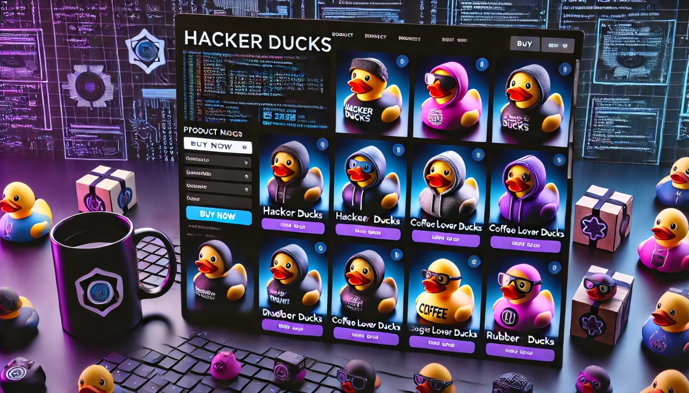
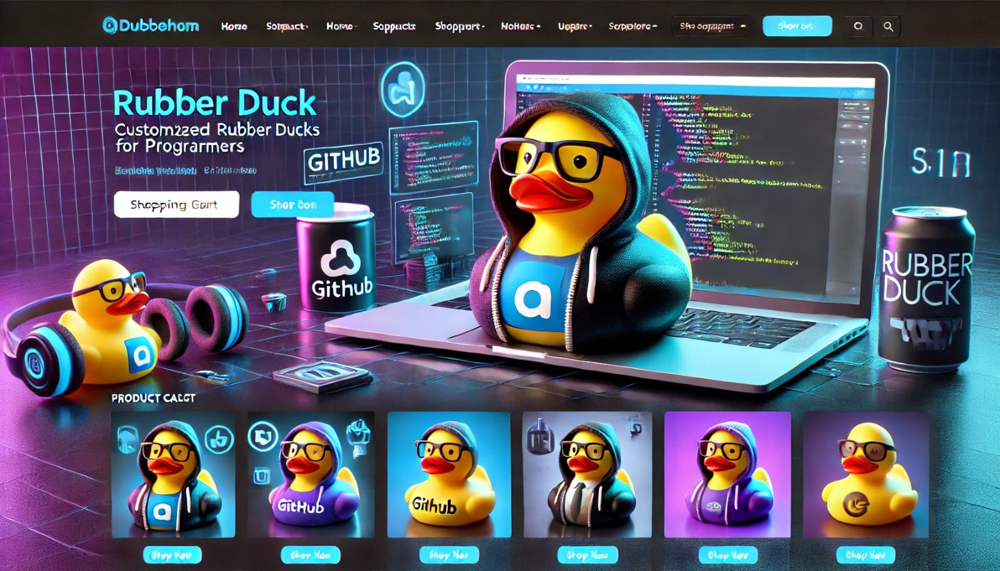
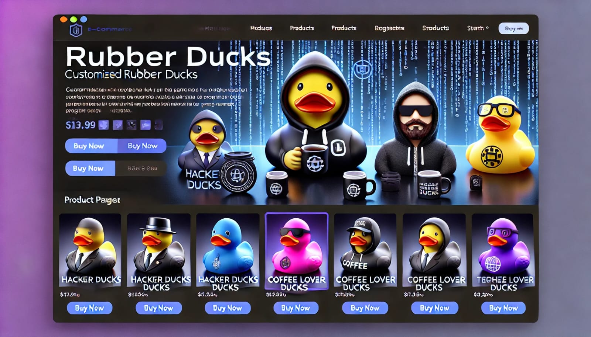
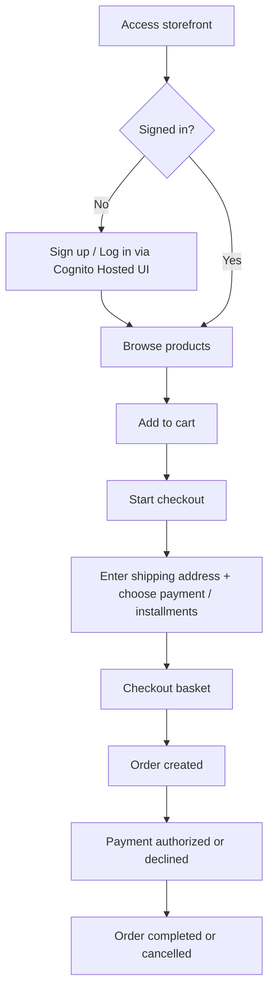
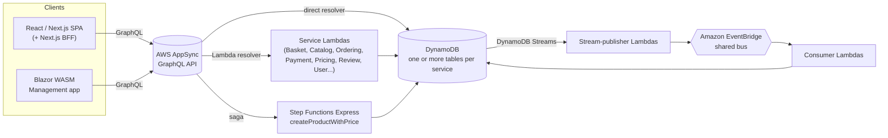

# DuckStore

DuckStore is a **serverless-first AWS** .NET microservices e-commerce sample, built to showcase
advanced, production-shaped architecture: Vertical Slice Architecture, CQRS, event-driven
integration via Change Data Capture, and a fully serverless AWS runtime. It's a learning/reference
project, not production software — every non-trivial decision is recorded as an
[Architecture Decision Record](./docs/adr) (40+ and counting) rather than left implicit in code.

---

## 📜 Concept

An e-commerce sample that lets users browse a catalog, manage a shopping cart, and complete a
checkout end-to-end — with real asynchronous order/payment processing behind it, not a mocked
happy path.

#### 🖼️ Design Inspirations





#### 🔄 Business Flow



Each arrow after **Checkout basket** is a CDC integration event on the shared EventBridge bus
(`BasketCheckout` → `OrderCreated` → `PaymentAuthorized`/`PaymentDeclined`), not a synchronous
call — see [Architecture](#-architecture) below.

---

## 📐 Architecture

Compute is **AWS Lambda**, one function per use case. Persistence is **DynamoDB** — no ORM, no
`SaveChanges`/change-tracker pipeline, repositories talk to `IAmazonDynamoDB` directly.
Cross-service communication is **event-driven, never synchronous HTTP/gRPC**: a committed DynamoDB
write is captured by DynamoDB Streams, published to Amazon EventBridge by a dedicated
stream-publisher Lambda, and consumed by whichever service cares. The only exception is a handful
of direct Lambda-to-Lambda invocations for calls that are genuinely synchronous by nature (e.g.
Payment → PaymentGateway).

**AWS AppSync is the only client entry point**, in every environment — there is no self-hosted HTTP
API gateway. Most fields resolve straight to DynamoDB (APPSYNC_JS, no Lambda in the hot path);
Lambda resolvers are an explicit escalation for fields with real business logic; one saga
(`createProductWithPrice`) runs through a Step Functions Express workflow with compensation.



### Services

| Service | Responsibility |
|---|---|
| **[Basket](./src/Services/Basket/README.md)** | Shopping cart (guest + authenticated owners), checkout initiation. Zero discount logic. |
| **[Catalog](./src/Services/Catalog/README.md)** | Product and category management. |
| **[CatalogView](./src/Services/CatalogView/README.md)** | Read-model/search, fed by CDC from Catalog, Review, and Pricing. |
| **[Challenges](./src/Services/Challenges/README.md)** | Server-side code-challenge grading, progression, and point redemption. |
| **[Ordering](./src/Services/Ordering/README.md)** | Order lifecycle (`Pending` → `Completed`/`Cancelled`), one DynamoDB item per order. |
| **[Payment](./src/Services/Payment/README.md)** | Simulated payment authorization, orchestrates `PaymentGateway`. |
| **PaymentGateway** | Simulated external payment processor. |
| **[Pricing](./src/Services/Pricing/README.md)** | Product pricing, promotional campaigns, installment plans, gateway-cost tracking. |
| **[Review](./src/Services/Review/README.md)** | Product reviews/ratings. |
| **[User](./src/Services/User/README.md)** | User profile, backed by Cognito as the identity provider. |
| **ProductImages** | TypeScript/Node — presigned S3 uploads, Sharp-based resize pipeline, CloudFront delivery. |
| **[Notification](./src/Services/Notification/README.md)** | Go — consumes domain events, writes notifications to DynamoDB. |

Every `.NET` service ships as a **Native AOT, self-contained ZIP** on the `provided.al2023` custom
runtime (arm64) — no container images, no managed .NET Lambda runtime (`net10.0` predates one).
See [ADR-0042](./docs/adr/0042-lambda-native-aot-zip-provided-al2023.md).

---

## 🛠️ Technologies Used

- **.NET 10 / C#** — all backend services, Vertical Slice Architecture, CQRS via a source-generated
  mediator (no reflection-based scanning — required for Native AOT).
- **AWS Lambda** — one function per use case, Native AOT ZIP on `provided.al2023`.
- **Amazon DynamoDB** — persistence for every service, plus DynamoDB Streams as the CDC source.
- **Amazon EventBridge** — the shared event bus every service publishes to and consumes from.
- **AWS AppSync** — GraphQL API, the sole client entry point (direct DynamoDB resolvers by default,
  Lambda resolvers for business logic, Step Functions Express for one multi-step saga).
- **Amazon Cognito** — identity provider (IdP-only, lazy user provisioning).
- **Amazon S3 + CloudFront** — product image storage and delivery.
- **.NET Aspire** — local orchestration: DynamoDB Local, the Lambda service emulator, and
  Elasticsearch/Kibana, wiring every service together for `F5`-style local development.
- **React / Next.js** — the customer-facing storefront SPA, with its own Next.js BFF (opaque
  server-side sessions in front of Cognito — [ADR-0041](./docs/adr/0041-bff-opaque-server-side-session-centralized-cognito-refresh.md)).
- **Blazor WebAssembly** — the admin/management app (product CRUD).
- **Go** — the Notification service.
- **AWS CDK v2 (TypeScript)** — real-AWS deployment infrastructure, one stack per service.
- **OpenTelemetry, Serilog, Elasticsearch/Kibana** — observability, local and in Lambda.
- **xUnit, Moq, Moq.AutoMock** — unit testing; Aspire-driven functional tests for Ordering.
- **GitHub Actions (OIDC)** — per-service CI/CD, `cdk deploy` on push to `development`.

---

## 🚀 Getting Started

### Prerequisites

- **.NET 10 SDK**
- **Docker** — Aspire runs DynamoDB Local, the Lambda service emulator, and Elasticsearch/Kibana as
  containers
- **Node.js + pnpm** — only needed to run the React SPA (`src/WebApps/Shopping.Web.SPA.React`)
- **Go 1.23+** — only needed to run/test the Notification service directly
- Visual Studio Code with the **C# Dev Kit** extension, or Visual Studio / Rider

### Run everything locally

```bash
git clone https://github.com/KeveenMenezes/DuckStore.git
cd DuckStore

# Aspire provisions DynamoDB Local, the Lambda emulator, and Elasticsearch/Kibana,
# registers every Lambda function, and wires the dev environment between them.
dotnet run --project src/AppHost/AppHost.csproj
```

Or press `F5` in VS Code / Visual Studio and select the `AppHost` launch profile.

### Other common commands

```bash
# Build the whole solution
dotnet build DuckStore.slnx

# Run all .NET tests
dotnet test

# Run a single test project
dotnet test tests/Services/Catalog/Catalog.UnitTests/Catalog.UnitTests.csproj

# Validate CDK infra changes before pushing
cd infra && npx cdk synth <StackName>   # e.g. OrderingStack
```

---

## 💡 Tips & Tools

- **Product image pipeline ([ADR-0034](./docs/adr/0034-product-image-pipeline-presigned-post-sqs-sharp-cloudfront.md))**:
  product images upload straight from the admin browser to S3 (presigned POST), are processed into
  AVIF/WebP/JPEG variants by a Node.js/Sharp Lambda, and are served from a dedicated CloudFront
  distribution. The API only carries image metadata (`imageId`) — clients build URLs from
  configuration:
  - React SPA: `NEXT_PUBLIC_IMAGE_CDN_URL` (in `.env.local` for dev; set by `sst.config.ts` when
    deployed). Local dev also needs `IMAGE_ORIGINALS_BUCKET` plus real AWS credentials for the
    upload mutation, since there is no local S3 — dev/test run against the real AWS dev environment.
  - Blazor management app: `ImageCdn:BaseUrl` in `wwwroot/appsettings*.json`.
- **Orphan image cleanup**: uploads whose product form was abandoned leave unreferenced objects in
  the image buckets. Clean them with the manual sweep script (dry-run by default; add `--delete` to
  actually remove):
  ```bash
  cd src/Services/ProductImages
  npx tsx scripts/sweep-orphan-images.ts --originals <originals-bucket> --processed <processed-bucket>
  ```

---

## 📚 Documentation

Every cross-cutting architectural decision — from the serverless migration itself to session
management, CDC event naming, and Lambda packaging — is recorded under [`docs/adr/`](./docs/adr),
numbered sequentially and never deleted, even when superseded. Start with
[ADR-0004](./docs/adr/0004-aws-first-eventbridge-over-masstransit-rabbitmq.md) (why EventBridge,
not RabbitMQ/MassTransit), [ADR-0005](./docs/adr/0005-remove-domain-events-cdc-via-dynamodb-streams.md)
(CDC via DynamoDB Streams), and [ADR-0019](./docs/adr/0019-module-oriented-service-structure-and-rule-based-stream-publishers.md)
(the module structure every service follows) for the foundations.

---

## 📧 Contact

For questions or suggestions, reach out on [Linkedin](https://www.linkedin.com/in/keveen-menezes-52592162/)

---
