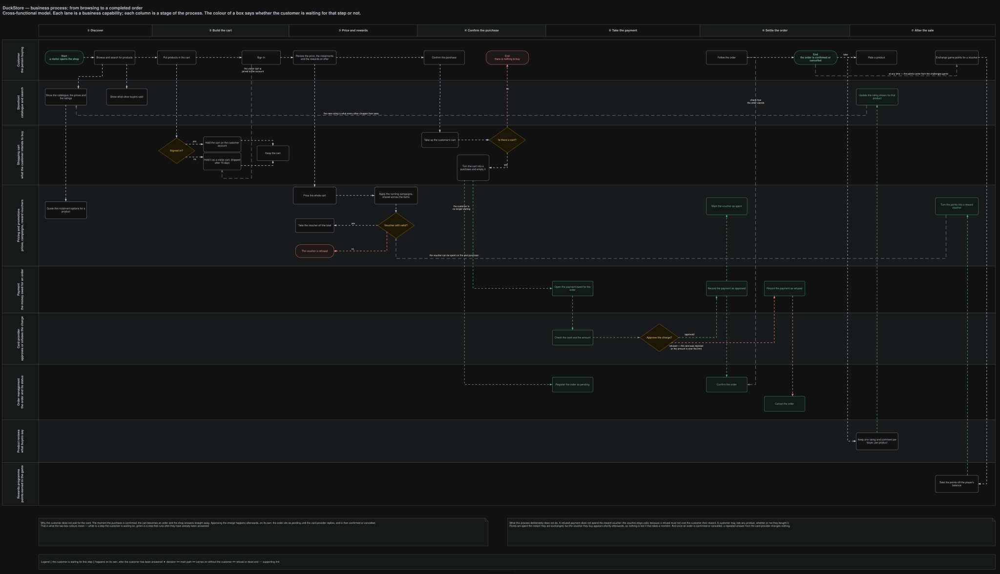
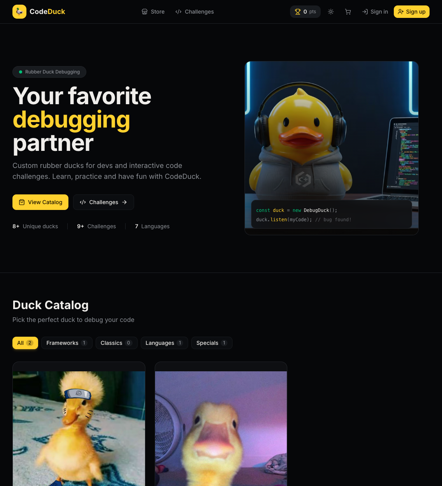
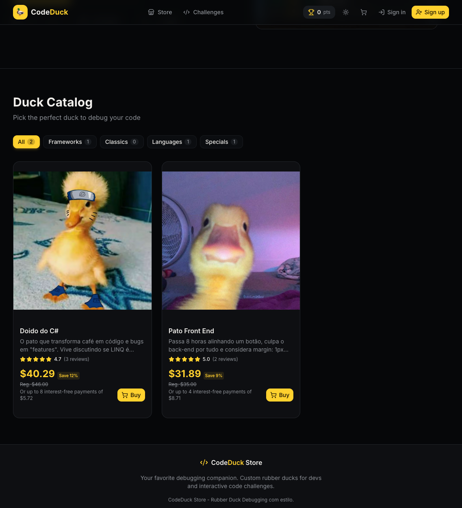
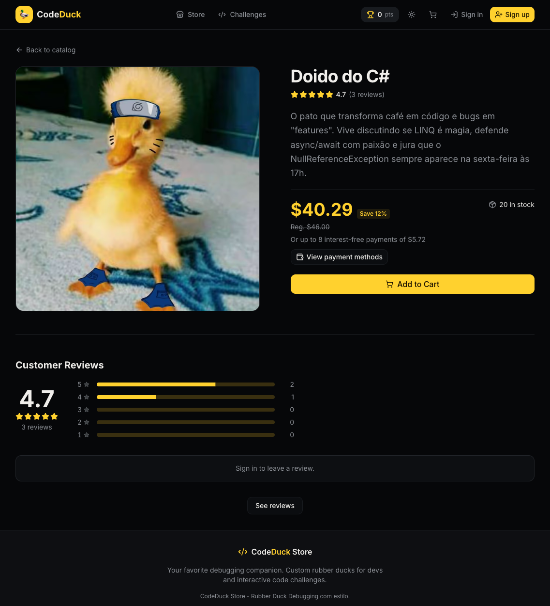
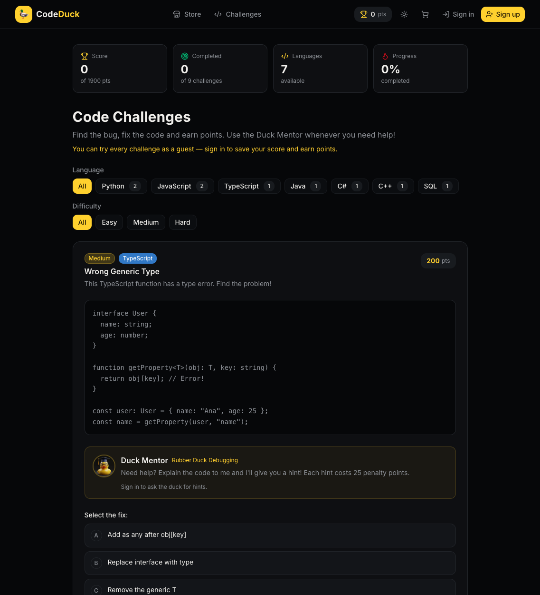
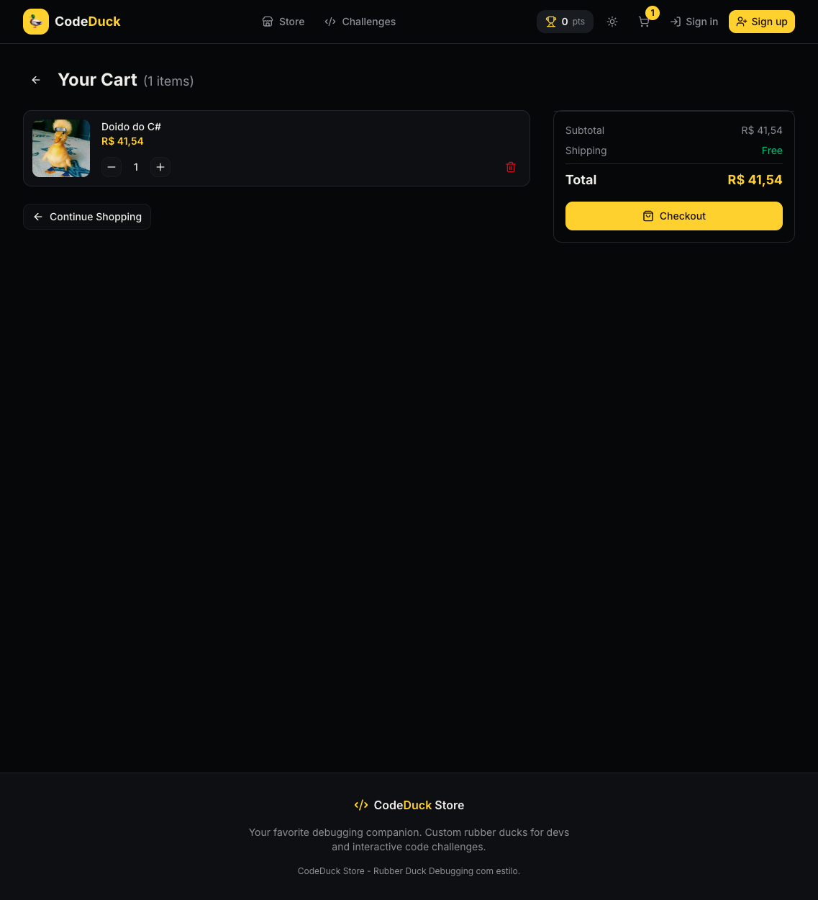
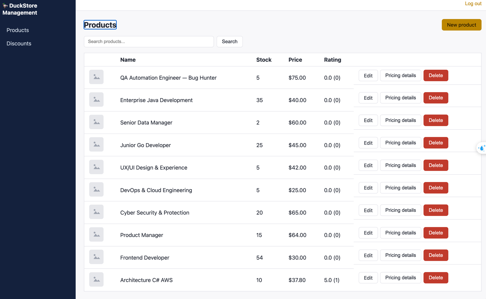
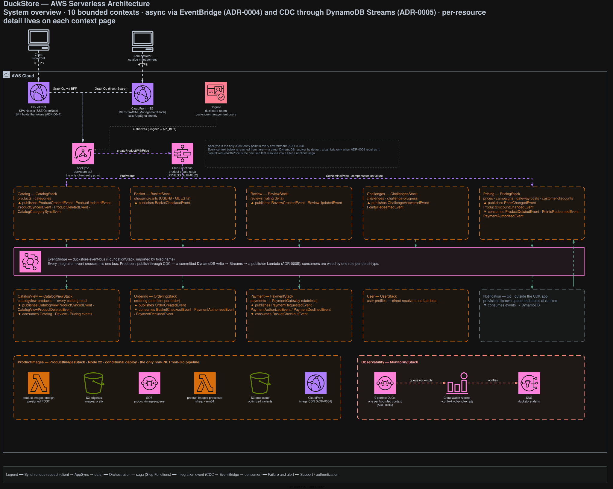
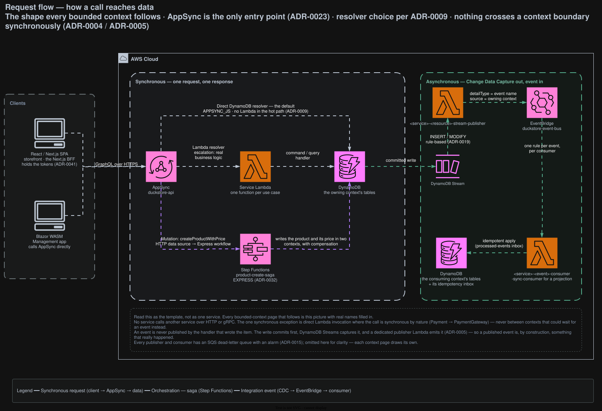
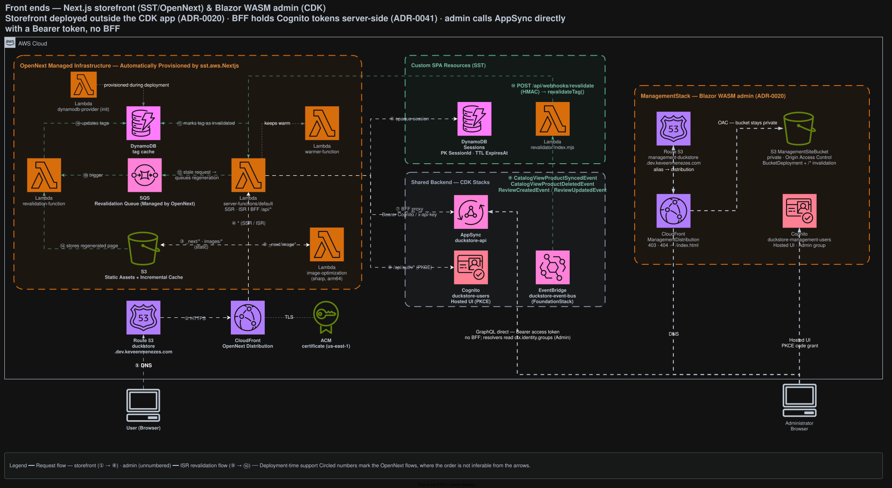

# DuckStore

DuckStore is a **serverless-first AWS** .NET microservices e-commerce sample, built to showcase
advanced, production-shaped architecture: Vertical Slice Architecture, CQRS, event-driven
integration via Change Data Capture, and a fully serverless AWS runtime. It's a learning/reference
project, not production software — every non-trivial decision is recorded as an
[Architecture Decision Record](./docs/adr) (47+ and counting) rather than left implicit in code.

Six principles shape every decision here: **infrastructure as code**, **serverless-first**,
**AWS-first**, **performance**, **low cost**, and being **built to be developed alongside AI** —
primarily [Claude](#-built-to-be-developed-with-ai). See
[Design principles](#-design-principles) for how each one is actually enforced in the repo.

> **The thesis.** An architect who knows how to work with Claude doesn't just code faster — they
> can afford an architecture a traditional team would call "too expensive to maintain". Explicit
> **bounded contexts**, one Lambda per use case, an ADR behind every decision and a README per
> context are exactly the practices that get cut first under delivery pressure, precisely because
> they cost discipline rather than cleverness. That discipline is the part an AI companion absorbs
> best. The result is not a trade-off between rigour and speed: **developer experience, security,
> observability and performance all improve at once**, because each of them is a property of the
> structure — not something bolted on at the end. See
> [Built to be developed with AI](#-built-to-be-developed-with-ai).

**Live demo → [duckstore.dev.keveenmenezes.com](https://duckstore.dev.keveenmenezes.com)** —
*CodeDuck Store*, a rubber-duck shop with interactive code challenges.

[](https://dotnet.microsoft.com/)
[](https://aws.amazon.com/)
[](https://nextjs.org/)
[](https://learn.microsoft.com/dotnet/aspire/)
[](./infra)
[](./CLAUDE.md)

---

## 📑 Table of contents

- [Concept](#-concept)
- [Screenshots](#-screenshots)
- [Design principles](#-design-principles)
- [Architecture](#-architecture)
- [Bounded contexts](#-bounded-contexts)
- [Domain-Driven Design](#-domain-driven-design)
- [Front end](#-front-end)
- [Security & observability](#-security--observability)
- [Technologies Used](#-technologies-used)
- [Built to be developed with AI](#-built-to-be-developed-with-ai)
- [Getting Started](#-getting-started)
- [Tips & Tools](#-tips--tools)
- [Documentation](#-documentation)
- [Contact](#-contact)

---

## 📜 Concept

An e-commerce sample that lets users browse a catalog, manage a shopping cart, and complete a
checkout end-to-end — with real asynchronous order/payment processing behind it, not a mocked
happy path. On top of the store sits a gamified layer: server-graded code challenges whose points
are redeemed as a real discount at checkout.

#### 🔄 Business Flow

[](./docs/diagrams/business-process.svg)

<sub>Click to open full size. Source: [`docs/duckstore-process-flow.drawio`](./docs/duckstore-process-flow.drawio), page **Business process**. Regenerate with [`./scripts/export-diagrams.sh`](./scripts/export-diagrams.sh).</sub>

A cross-functional model of the purchase journey: each lane is a business capability, each column a
stage of the process. Box colour carries the load-bearing rule — **white means the customer is
waiting for that step, green means it runs on its own after they have already been answered.**

That split is the whole architecture in one picture. The moment the purchase is confirmed, the cart
becomes an order and the shop answers immediately; taking the payment happens afterwards, with the
order sitting as `Pending` until the card provider replies. Every green step is reached by a CDC
integration event on the shared EventBridge bus (`BasketCheckout` → `OrderCreated` →
`PaymentAuthorized`/`PaymentDeclined`), never by a synchronous call — see
[Architecture](#-architecture) below.

---

## 📸 Screenshots

Captured from the live environment at
[duckstore.dev.keveenmenezes.com](https://duckstore.dev.keveenmenezes.com).

| Storefront | Duck catalog |
|---|---|
| [](https://duckstore.dev.keveenmenezes.com) | [](https://duckstore.dev.keveenmenezes.com/#catalog) |
| Hero and entry points, rendered by the Next.js SPA through its own BFF. | Product grid with category facets. Ratings come from **Review** and price/discount from **Pricing**, but the page reads a single denormalized item from **CatalogView**. |

| Product detail | Code challenges |
|---|---|
| [](https://duckstore.dev.keveenmenezes.com) | [](https://duckstore.dev.keveenmenezes.com/challenges) |
| Price, installment plan, stock and the aggregated rating histogram — one read, no fan-out across services. | Server-side graded challenges: the answer key is structurally unreachable from the public read path, and points redeem into a customer-scoped Pricing discount. |

<details>
<summary><strong>Cart</strong> — guest baskets work without signing in</summary>



Carts are identified by a server-resolved `OwnerId` — `USER#<cognito-sub>` when authenticated,
`GUEST#<guestId>` otherwise (TTL-expirable in DynamoDB). See
[ADR-0016](./docs/adr/0016-guest-basket-owner-id-identity-api-key-and-ttl.md).

</details>

<details>
<summary><strong>Product management</strong> — the Blazor admin app</summary>



The `Managment.Web.Blazor` admin app calls AppSync GraphQL directly (no BFF), gated by Cognito
sign-in. Product create/edit runs through the `createProductWithPrice` saga
([ADR-0032](./docs/adr/0032-create-product-with-price-step-functions-express-saga.md)) so the product and
its price are written with compensation on failure.

</details>

---

## 🎯 Design principles

Six constraints the project holds itself to. They're listed here because they explain *why* the
architecture below looks the way it does — each one is enforced by something concrete in the repo,
not just stated as an intention.

| Principle | What it means here |
|---|---|
| 🏗️ **Infrastructure as code** | Every AWS resource is declared in code and created by a pipeline. |
| ⚡ **Serverless-first** | Nothing is always on. No servers, no containers, no VPC in AWS. |
| ☁️ **AWS-first** | A managed AWS primitive is preferred over a self-hosted equivalent. |
| 🚀 **Performance** | Cold starts and round-trips are treated as design inputs, not afterthoughts. |
| 💸 **Low cost** | An idle environment should cost close to nothing. |
| 🤖 **AI-native development** | The repo is written to be *read and extended by an AI agent*, mainly Claude. |

### 🏗️ Infrastructure as code

There is **no manual console clicking** in this project. [`infra/`](./infra) is an AWS CDK v2
(TypeScript) app with one stack per service — each pairing an
`infra/constructs/<service>-dynamodb.ts` (tables, GSIs, streams, TTL) with an
`infra/constructs/<service>-lambdas.ts` (functions, EventBridge rules, IAM grants, DLQs and their
alarms). The React SPA is the one exception: it deploys via SST/OpenNext
([ADR-0020](./docs/adr/0020-migrate-spa-deploy-to-sst.md)), still fully declarative.

Deployment is per-service GitHub Actions using **OIDC** (no long-lived AWS keys), triggered by push
to `development` when `infra/**`, that service's `src/Services/<X>/**`, or `src/BuildingBlocks/**`
changes. Stacks share resources **by fixed physical name** (`EventBus.fromEventBusName`,
`Table.fromTableName`, `Function.fromFunctionName`) rather than CloudFormation exports, so one
service's deploy can never block another's — that's also why every Lambda keeps a stable
`functionName`. Local validation before pushing:

```bash
cd infra && npx cdk diff <StackName>    # e.g. OrderingStack
cd infra && npx cdk synth <StackName>
```

The only non-codified step is the one-time account bootstrap, itself written down in
[`docs/one-time-account-setup.md`](./docs/one-time-account-setup.md).

### ⚡ Serverless-first

Compute is **AWS Lambda, one function per use case** — there is no ASP.NET host, no ECS/Fargate
task, no Kubernetes, and **no VPC or NAT gateway** anywhere in `infra/`. Persistence is DynamoDB
on-demand; messaging is EventBridge; the API is AppSync; identity is Cognito; static assets are
S3 + CloudFront. Every one of those scales to zero when nobody is shopping.

The containers you *do* see (DynamoDB Local, the Lambda service emulator, Elasticsearch/Kibana)
exist **only for local development**, orchestrated by .NET Aspire. They never ship to AWS.

### ☁️ AWS-first

The codebase was deliberately migrated *away* from a classic self-hosted stack, replacing each
third-party component with the managed AWS primitive that does the same job:

| Was | Is now | Why |
|---|---|---|
| RabbitMQ + MassTransit | Amazon EventBridge | [ADR-0004](./docs/adr/0004-aws-first-eventbridge-over-masstransit-rabbitmq.md) |
| PostgreSQL/Marten + EF Core | DynamoDB (+ Streams for CDC) | [ADR-0005](./docs/adr/0005-remove-domain-events-cdc-via-dynamodb-streams.md) |
| Self-hosted API gateway (YARP/Carter) + gRPC | AWS AppSync | [ADR-0007](./docs/adr/0007-appsync-graphql-with-direct-dynamodb-resolvers.md) · [ADR-0023](./docs/adr/0023-decommission-yarp-gateway-and-angular-spa.md) |
| Redis distributed cache | dropped — DynamoDB single-digit-ms reads | [ADR-0013](./docs/adr/0013-remove-basket-caching-redis-and-dax.md) |
| Custom identity | Amazon Cognito (IdP-only, lazy provisioning) | [ADR-0017](./docs/adr/0017-user-bounded-context-cognito-idp-only-lazy-provisioning.md) |

The trade-off is explicit and accepted: **portability is not a goal**, leverage is. Vendor
primitives are used directly instead of behind abstraction layers that would erase their strengths.

### 🚀 Performance

- **Native AOT, self-contained ZIP on `provided.al2023` (arm64)** — no JIT warm-up and no container
  image pull on cold start ([ADR-0042](./docs/adr/0042-lambda-native-aot-zip-provided-al2023.md)).
  CQRS uses a **source-generated** mediator: no reflection-based assembly scanning at startup.
- **No Lambda in the hot read path.** Most AppSync fields resolve straight to DynamoDB
  (APPSYNC_JS), so a product page never pays a cold start
  ([ADR-0009](./docs/adr/0009-appsync-resolver-selection-direct-first-lambda-for-complex-logic.md)).
- **Reads are single-shot by design.** A product page reads one denormalized **CatalogView** item —
  no fan-out to Catalog + Review + Pricing. An order is one DynamoDB item with its items embedded:
  one `GetItem`, no N+1, and customer history comes from a GSI with `ProjectionType.ALL`.
- **The customer never waits on the slow half.** Checkout answers as soon as the order exists;
  payment settles asynchronously over EventBridge (the white/green split in the
  [business flow](#-business-flow) above).
- **The storefront is mostly static.** Next.js pages use ISR invalidated **by CDC events, never by
  TTL** ([ADR-0035](./docs/adr/0035-catalogview-owned-cdc-events-drive-spa-revalidation.md)), so
  pages are served from cache and refreshed only when the data actually changed.

### 💸 Low cost

An idle DuckStore environment costs approximately nothing, and that is a design constraint rather
than a happy accident:

- **Scale-to-zero everywhere** — no idle compute, no provisioned concurrency, no always-on cluster.
- **No VPC, therefore no NAT gateway** — the single most common "$32/month before any traffic" line
  item in serverless AWS bills simply doesn't exist here.
- **DynamoDB on-demand (`PAY_PER_REQUEST`)** on every table — zero provisioned capacity.
- **arm64/Graviton at 512 MB** for every .NET Lambda (`DOTNET_ARCH`/`DOTNET_MEMORY_MB` in
  [`infra/constructs/dotnet-lambda-code.ts`](./infra/constructs/dotnet-lambda-code.ts)) — cheaper
  per GB-second than x86, and Native AOT keeps the billed duration short.
- **Direct DynamoDB resolvers** mean the highest-traffic operations are billed as AppSync requests
  with no Lambda invocation behind them at all.
- **TTL instead of cleanup jobs** — guest carts and expired campaign discounts self-delete via
  DynamoDB TTL (free) rather than a scheduled sweeper.
- **Dropped Redis** ([ADR-0013](./docs/adr/0013-remove-basket-caching-redis-and-dax.md)) — a cache in
  front of a single-digit-millisecond key-value store was pure cost with no latency win.
- **Right-sized search** — OpenSearch was adopted and then removed for CatalogView
  ([ADR-0030](./docs/adr/0030-catalogview-dynamodb-drop-opensearch.md)): a permanently-running
  cluster couldn't justify itself against a DynamoDB read model for this catalog size.

The one place cost is *modelled in the domain* is Pricing's `GatewayCosts` module, which tracks
what each simulated payment method costs to process
([ADR-0028](./docs/adr/0028-gateway-cost-table-and-payment-highlights.md)).

### 🤖 AI-native development

Conventions are only useful if they're written down where a collaborator — human or model — reads
them before acting. So the repo carries its own agent context ([`CLAUDE.md`](./CLAUDE.md), also
exposed as `AGENTS.md`), eight executable [skills](./.claude/skills), four
[subagents](./.claude/agents), one README per bounded context, and 47+ ADRs recording the *why*.
Full breakdown in [Built to be developed with AI](#-built-to-be-developed-with-ai).

---

## 📐 Architecture



<sub>Source: [`docs/duckstore-process-flow.drawio`](./docs/duckstore-process-flow.drawio), page **Main**. Regenerate with [`./scripts/export-diagrams.sh`](./scripts/export-diagrams.sh).</sub>

Compute is **AWS Lambda**, one function per use case. Persistence is **DynamoDB** — no ORM, no
`SaveChanges`/change-tracker pipeline, repositories talk to `IAmazonDynamoDB` directly.
Cross-service communication is **event-driven, never synchronous HTTP/gRPC**: a committed DynamoDB
write is captured by DynamoDB Streams, published to Amazon EventBridge by a dedicated
stream-publisher Lambda, and consumed by whichever service cares. The only exception is a handful
of direct Lambda-to-Lambda invocations for calls that are genuinely synchronous by nature (e.g.
Payment → PaymentGateway).

**AWS AppSync is the only client entry point**, in every environment — there is no self-hosted HTTP
API gateway. Most fields resolve straight to DynamoDB (APPSYNC_JS, no Lambda in the hot path);
Lambda resolvers are an explicit escalation for fields with real business logic; one saga
(`createProductWithPrice`) runs through a Step Functions Express workflow with compensation.



<sub>Source: [`docs/duckstore-process-flow.drawio`](./docs/duckstore-process-flow.drawio), page **Request flow**. Regenerate with [`./scripts/export-diagrams.sh`](./scripts/export-diagrams.sh).</sub>

Every `.NET` service ships as a **Native AOT, self-contained ZIP** on the `provided.al2023` custom
runtime (arm64) — no container images, no managed .NET Lambda runtime (`net10.0` predates one).
See [ADR-0042](./docs/adr/0042-lambda-native-aot-zip-provided-al2023.md).

CDC naming is the contract: `<service>-<resource>-stream-publisher` for CDC-out,
`<service>-<resource>-consumer` / `-sync-consumer` for CDC-in. Every publisher and consumer has an
SQS dead-letter queue with an alarm
([ADR-0015](./docs/adr/0015-sqs-dlq-for-cdc-publishers-and-eventbridge-consumers.md)).

---

## 🧩 Bounded contexts

Each context owns its tables, its Lambdas and its events. Every README below covers the same
ground: architecture diagram, responsibilities, data model, AppSync surface, integration events and
failure handling.

| Context | Responsibility | Docs |
|---|---|---|
| **Catalog** | Product and category management — the write model. | [README](./src/Services/Catalog/README.md) · [diagram](./docs/diagrams/catalog.svg) |
| **CatalogView** | Read-model/search, fed by CDC from Catalog, Review, and Pricing. | [README](./src/Services/CatalogView/README.md) · [diagram](./docs/diagrams/catalogview.svg) |
| **Basket** | Shopping cart (guest + authenticated owners), checkout initiation. Zero discount logic. | [README](./src/Services/Basket/README.md) · [diagram](./docs/diagrams/basket.svg) |
| **Ordering** | Order lifecycle (`Pending` → `Completed`/`Cancelled`), one DynamoDB item per order. | [README](./src/Services/Ordering/README.md) · [diagram](./docs/diagrams/ordering.svg) |
| **Payment** | Simulated payment authorization, orchestrates `PaymentGateway`. | [README](./src/Services/Payment/README.md) · [diagram](./docs/diagrams/payment.svg) |
| **Pricing** | Product pricing, promotional campaigns, installment plans, gateway-cost tracking. | [README](./src/Services/Pricing/README.md) · [diagram](./docs/diagrams/pricing.svg) |
| **Review** | Product reviews/ratings, aggregated downstream via CDC. | [README](./src/Services/Review/README.md) · [diagram](./docs/diagrams/review.svg) |
| **Challenges** | Server-side code-challenge grading, progression, and point redemption. | [README](./src/Services/Challenges/README.md) · [diagram](./docs/diagrams/challenges.svg) |
| **User** | User profile, backed by Cognito as the identity provider. | [README](./src/Services/User/README.md) · [diagram](./docs/diagrams/user.svg) |
| **Notification** | Go — consumes events, writes notifications to DynamoDB. | [README](./src/Services/Notification/README.md) · [diagram](./docs/diagrams/notification.svg) |

Two supporting services have no bounded context of their own:

- **PaymentGateway** (`src/Services/PaymentGateway`) — the simulated external payment processor,
  invoked synchronously by Payment.
- **ProductImages** (`src/Services/ProductImages`) — TypeScript/Node: presigned S3 uploads, a
  Sharp-based resize pipeline, CloudFront delivery, and an orphan-image sweeper.

### Shared code (`src/BuildingBlocks`)

| Package | Contents |
|---|---|
| `BuildingBlocks.Core` | `ICommand`/`IQuery` + handler interfaces, DDD base types, shared exception types |
| `BuildingBlocks.Messaging` | `IntegrationEvent` and the EventBridge publisher |
| `BuildingBlocks.ServiceDefaults` | Service discovery, resilience, health checks, OpenTelemetry, Serilog, MediatR behaviors |
| `BuildingBlocks.ServiceDefaults.Lambda` | The Lambda-shaped subset: structured logging + OTLP tracing ([ADR-0022](./docs/adr/0022-lambda-production-observability.md)) |

---

## 🧱 Domain-Driven Design

The table above isn't a list of microservices — it's a **context map**. Boundaries were drawn from
the *business capability*, not from the database schema, and the code layout mirrors them all the
way down.

### Strategic design

- **Bounded contexts** own their data outright. There is no shared database, no cross-context
  foreign key, and no service reaching into another's tables. Pricing owning price and campaigns
  ([ADR-0026](./docs/adr/0026-pricing-bounded-context-price-and-campaign-ownership.md)) is what
  forced Basket to have *zero* discount logic — a boundary correction, not a refactor.
- **Ubiquitous language** is visible in the code: `ShoppingCart`, `Order`, `Campaign`,
  `CustomerDiscount`, `PlayerProgress`, `AnswerKey`. Integration events are named after the
  **domain occurrence**, never after the mechanics of the change
  ([ADR-0031](./docs/adr/0031-cdc-events-named-after-domain-occurrence-no-changetype-discriminator.md))
  — `PaymentAuthorized`, not `PaymentRowUpdated`.
- **Anti-corruption at the edges.** A context never consumes another's model directly: inbound CDC
  consumers translate foreign events into local terms, grouped per producing context with a
  strategy dispatcher
  ([ADR-0040](./docs/adr/0040-catalogview-consumers-consolidated-by-producer-strategy-dispatch.md)),
  so an upstream change stays contained in one translation layer.
- **CQRS with a real read model.** CatalogView is a separate context, not a cache: Catalog, Review
  and Pricing feed it by CDC, and it serves the storefront a single denormalized item.

### Tactical design

| Pattern | In this codebase |
|---|---|
| **Aggregate root** | `Order`, `ShoppingCart`, `Product`, `Payment`, `Campaign`, `PlayerProgress`, … — the consistency boundary, and also the DynamoDB item boundary. |
| **Entity** | `OrderItem`, `Question` — identity that persists through state change. |
| **Value object** | `OwnerId`, `ProductId`, `CardDetails`, `AnswerKey`, `Language` — immutable, self-validating, equality by value. |
| **Domain service** | `CartDiscountAllocation` — logic that belongs to no single aggregate ([ADR-0043](./docs/adr/0043-cart-discount-allocation-policy.md)). |
| **Repository** | One per aggregate, hiding DynamoDB access behind a domain-shaped interface. |
| **Domain invariant** | Enforced inside the aggregate — a handler that "validates then saves" is a bug ([`thin-handlers-rich-domain`](./.claude/skills/thin-handlers-rich-domain)). |

**Thin handlers, rich domain** is the rule that holds it together: a handler decides *who* handles
the request (load, delegate, save); business rules live in the model. The more complex the logic,
the less of it belongs in the handler.

One deliberate departure from textbook DDD: **in-process domain events were removed**
([ADR-0005](./docs/adr/0005-remove-domain-events-cdc-via-dynamodb-streams.md)). Integration events
are derived from committed writes via Change Data Capture, so an event can never be published for a
transaction that didn't commit — the guarantee an outbox exists to provide, obtained from the
platform instead of from application code.

### Architecture practices at a glance

<sub>Domain-Driven Design · Vertical Slice Architecture · CQRS · Event-Driven Architecture ·
Change Data Capture · Eventual Consistency · Saga with compensation · Idempotency (inbox pattern) ·
Single-table design · Context mapping · Anti-corruption layer · Clean Code · SOLID ·
Twelve-Factor · Cloud-Native · Serverless · Infrastructure as Code · Zero Trust · Least Privilege ·
Observability (traces, metrics, structured logs) · Resilience & DLQ strategy · Cost optimization ·
DevOps / CI-CD · Automated testing · Documentation as code (ADRs)</sub>

---

## 🖥️ Front end



- **[`Shopping.Web.SPA.React`](./src/WebApps/Shopping.Web.SPA.React)** — the customer-facing
  storefront (Next.js), fronting AppSync through its own BFF: Cognito tokens live server-side in a
  `duckstore-sessions` table and the browser only ever sees an opaque `__Host-sid` cookie
  ([ADR-0041](./docs/adr/0041-bff-opaque-server-side-session-centralized-cognito-refresh.md)).
  Deployed with SST/OpenNext ([ADR-0020](./docs/adr/0020-migrate-spa-deploy-to-sst.md)).
- **[`Managment.Web.Blazor`](./src/WebApps/Managment.Web.Blazor)** — Blazor WebAssembly admin app
  (product CRUD), calling AppSync directly, with no BFF. It's the client for the
  `createProductWithPrice` saga.

The GraphQL contract is owned at the repository root
([ADR-0033](./docs/adr/0033-graphql-contract-owned-at-monorepo-root.md)):
[`graphql/schema.graphql`](./graphql/schema.graphql) plus the JS resolvers under
[`graphql/resolvers/`](./graphql/resolvers), wired into the API by
[`infra/constructs/appsync-api.ts`](./infra/constructs/appsync-api.ts).

---

## 🔐 Security & observability

Both are usually the first things a "we'll add it later" architecture never gets around to. Here
they're consequences of the structure, which is why they arrived early and cheap.

### Security — Zero Trust, by construction

[ADR-0003](./docs/adr/0003-adoption-of-zero-trust-security-model.md) sets the posture: **no
implicit trust**, in the network or in the client.

- **One authenticated entry point.** AppSync is the only door, in every environment
  ([ADR-0023](./docs/adr/0023-decommission-yarp-gateway-and-angular-spa.md)) — authorized by
  **Cognito user pools** (a separate pool for the storefront and for the admin app), with an API
  key restricted to the guest-browsable surface. There is no self-hosted gateway and no public
  service endpoint to forget to protect.
- **Identity is server-resolved, never client-supplied.** A cart's `OwnerId` is derived from the
  Cognito subject, not from the request body
  ([ADR-0016](./docs/adr/0016-guest-basket-owner-id-identity-api-key-and-ttl.md)); a review is
  keyed by the Cognito user id rather than a client-provided username
  ([ADR-0037](./docs/adr/0037-review-key-cognito-userid-not-client-username.md)).
- **Tokens never reach the browser.** The Next.js BFF keeps Cognito tokens server-side in DynamoDB
  and hands out only an opaque `__Host-sid` cookie, with a single module allowed to touch auth
  state ([ADR-0041](./docs/adr/0041-bff-opaque-server-side-session-centralized-cognito-refresh.md))
  — no tokens in `localStorage`, no XSS token theft.
- **Least privilege is granular because the functions are.** One Lambda per use case means IAM
  grants are per use case: a read function gets `grantReadData` on one table, not a role that can
  write to everything. This is a *structural* security dividend of the serverless decomposition.
- **Data minimization.** Ordering never stores card data — payment details are the Payment
  context's alone ([ADR-0038](./docs/adr/0038-order-drops-card-data-payment-sources-basketcheckout.md)).
  Challenge answer keys sit behind a sparse GSI that makes them **structurally unreachable** from
  the public read path ([ADR-0045](./docs/adr/0045-challenges-bounded-context-server-side-grading.md)),
  and grading happens server-side — an unreachable secret beats a guarded one.
- **No standing credentials.** CI/CD authenticates to AWS via **OIDC**; federation client secrets
  are `NoEcho` parameters fed from GitHub Secrets
  ([ADR-0036](./docs/adr/0036-federation-client-secrets-noecho-parameters-github-secrets.md)).
- **Reduced attack surface.** No VPC, no bastion, no SSH, no long-lived host to patch — managed
  services handle the runtime, and every deployed artefact is reproducible from `infra/`.

### Observability — the same picture locally and in production

- **Distributed tracing end to end.** AppSync has **X-Ray enabled**, and every .NET Lambda runs with
  `Tracing.ACTIVE` so the trace AppSync starts continues into the function and its AWS SDK calls
  ([ADR-0022](./docs/adr/0022-lambda-production-observability.md)). `AddLambdaDefaults()` exports
  **OpenTelemetry** spans over OTLP whenever an endpoint is configured.
- **Structured logs, not `Console.WriteLine`.** The same `BuildingBlocks.ServiceDefaults.Lambda`
  emits JSON to CloudWatch on AWS and human-readable output locally; a MediatR `LoggingBehavior`
  logs every command/query uniformly, so correlation isn't per-developer improvisation.
- **Local observability is first-class.** Aspire provisions **Elasticsearch + Kibana** and wires
  Serilog and OpenTelemetry into them ([ADR-0001](./docs/adr/0001-elasticsearch-integration-guideline.md)
  · [ADR-0002](./docs/adr/0002-elasticsearch-index-lifecycle-management.md)) — you debug an
  event-driven flow on your laptop with the same telemetry you'd read in production.
- **Failure is observable, not silent.** Every CDC publisher and EventBridge consumer has an SQS
  **dead-letter queue with a CloudWatch alarm**
  ([ADR-0015](./docs/adr/0015-sqs-dlq-for-cdc-publishers-and-eventbridge-consumers.md)), all wired
  to one shared `duckstore-alerts` SNS topic owned by `MonitoringStack`. A poisoned event pages
  someone instead of disappearing.
- **Async doesn't mean unaccountable.** Because integration events come from committed writes
  (CDC), the event stream *is* an audit log of what actually happened — reconstructing "why did
  this order get cancelled?" is reading events, not guessing.

---

## 🛠️ Technologies Used

- **.NET 10 / C#** — all backend services, Vertical Slice Architecture, CQRS via a source-generated
  mediator (no reflection-based scanning — required for Native AOT).
- **AWS Lambda** — one function per use case, Native AOT ZIP on `provided.al2023`.
- **Amazon DynamoDB** — persistence for every service, plus DynamoDB Streams as the CDC source.
- **Amazon EventBridge** — the shared event bus every service publishes to and consumes from.
- **AWS AppSync** — GraphQL API, the sole client entry point (direct DynamoDB resolvers by default,
  Lambda resolvers for business logic, Step Functions Express for one multi-step saga).
- **Amazon Cognito** — identity provider (IdP-only, lazy user provisioning).
- **Amazon S3 + CloudFront** — product image storage and delivery.
- **.NET Aspire** — local orchestration: DynamoDB Local, the Lambda service emulator, and
  Elasticsearch/Kibana, wiring every service together for `F5`-style local development.
- **React / Next.js** — the customer-facing storefront SPA, with its own Next.js BFF (opaque
  server-side sessions in front of Cognito — [ADR-0041](./docs/adr/0041-bff-opaque-server-side-session-centralized-cognito-refresh.md)).
- **Blazor WebAssembly** — the admin/management app (product CRUD).
- **Go** — the Notification service.
- **AWS CDK v2 (TypeScript)** — real-AWS deployment infrastructure, one stack per service.
- **OpenTelemetry, Serilog, Elasticsearch/Kibana** — observability, local and in Lambda.
- **xUnit, Moq, Moq.AutoMock** — unit testing; Aspire-driven functional tests for Ordering.
- **GitHub Actions (OIDC)** — per-service CI/CD, `cdk deploy` on push to `development`.
- **Claude Code** — the primary development companion; the repo ships its own agent context,
  skills and subagents (see below).

---

## 🤖 Built to be developed with AI

DuckStore is written on the assumption that **a coding agent is a first-class contributor**, and
that agent is primarily **[Claude](https://claude.com/claude-code)**. That isn't a badge — it's a
set of files checked into the repository whose only job is to make an AI collaborator produce code
that looks like the rest of the codebase.

The bet behind it: an LLM is excellent at *applying* a convention and terrible at *inventing a
consistent one across 10 bounded contexts*. So the conventions are written down, close to the code,
in a form an agent reads before acting.

### What changes when the architect designs *for* the AI

The interesting claim isn't "AI writes the code faster". It's that **an architect who understands
how Claude consumes a repository will choose a different architecture** — and that architecture
happens to be a better one on the axes teams actually get measured on:

| | Traditional layered service | DuckStore, designed for AI collaboration |
|---|---|---|
| **Boundaries** | A shared database and a "we'll split it later" monolith, because splitting is expensive in people-hours. | Ten bounded contexts, each owning its data. The cost of maintaining them is mostly repetition — which is exactly what an agent absorbs. |
| **Development flow** | Onboarding means asking a senior why a class exists. | The *why* is in 47+ ADRs and per-context READMEs; an agent (or a new hire) reads it before touching anything. |
| **Consistency** | Enforced by code review, i.e. by whoever is awake. | Encoded as [skills](./.claude/skills) an agent executes, and checked by the [`adr-guardian`](./.claude/agents) subagent before the PR. |
| **Security** | Coarse roles, because per-endpoint IAM is tedious. | One Lambda per use case ⇒ per-use-case least-privilege grants — tedium is no longer the constraint. |
| **Observability** | Added after the first production incident. | `AddLambdaDefaults()` on every function from day one: X-Ray traces, structured logs, DLQ alarms. |
| **Performance** | Optimized late, once a profiler says so. | Native AOT, arm64, direct DynamoDB resolvers and denormalized read models are the *default* path, not a later project. |
| **Documentation** | Drifts, then gets deleted. | Diagrams are validated against the code by [a script](./scripts/validate-diagrams.py); drift fails loudly. |

The pattern repeats: **the practices that make an architecture good are the same practices that
make it legible to an AI collaborator** — explicit boundaries, one job per unit, stable naming,
written rationale, automated verification. Design for one and you get the other. That's why the
architect's job here got *more* valuable, not less: the model applies conventions relentlessly, but
someone still has to decide that Pricing owns discounts and Basket owns none of it.

### The context layer

| File / folder | Role |
|---|---|
| [`CLAUDE.md`](./CLAUDE.md) | The project brief every session starts from: architecture, conventions, commands, service-by-service map. |
| [`AGENTS.md`](./AGENTS.md) | A **symlink to `CLAUDE.md`** — Codex and other agent tooling read the same single source, so the guidance can never fork. |
| [`docs/adr/`](./docs/adr) | 47+ ADRs — the *why* that source code structurally cannot carry, including why removed things were removed. |
| [`src/Services/*/README.md`](./src/Services) | One README per bounded context: diagram, data model, AppSync surface, events, failure handling. |

### Skills — conventions an agent can execute

[`.claude/skills/`](./.claude/skills) (mirrored under `.agents/skills/` for other agent runtimes)
holds procedural rules that would otherwise live only in the author's head:

| Skill | Encodes |
|---|---|
| `adr` | The mandatory ADR-0000 format, numbering and status lifecycle. |
| `service-architecture` | The Ordering reference shape — module-per-aggregate, rule-based stream publishers. |
| `resolver-selection` | ADR-0009's rule: direct DynamoDB by default, Lambda only as a justified escalation. |
| `thin-handlers-rich-domain` | Handlers orchestrate; business rules belong in entities and domain services. |
| `rendering-strategy` | SSR / SSG / ISR choice for Next.js pages — ISR invalidated by events, never TTL. |
| `architecture-diagrams` | How to edit the `.drawio` source, re-export SVGs and keep the READMEs in sync. |
| `comments` | Comment only non-obvious business rules; every Lambda gets a summary header; English only. |
| `readme-docs` | How a dictated note becomes a properly placed README entry (this section included). |

### Subagents — repeatable jobs

[`.claude/agents/`](./.claude/agents) (with TOML equivalents in [`.codex/agents/`](./.codex/agents)):

- **`adr-guardian`** — reviews a diff against the Accepted ADRs and flags violations, including the
  resurrection of patterns an ADR already superseded. Effectively an architectural linter.
- **`cdc-integration-scaffold`** — generates a new EventsIntegration consumer/publisher from the
  reference shape, plus the CDK rule/DLQ wiring checklist.
- **`appsync-resolver-scaffold`** — writes a classified field's resolver and wires it into
  `schema.graphql` and `appsync-api.ts`.
- **`handler-test-backfill`** — writes the missing xUnit/Moq test for a handler and runs it.

### Guardrails that keep generated code honest

Written context guides an agent; automated checks verify it. Three run without anyone remembering
to ask:

- [`.githooks/pre-commit`](./.githooks) runs `dotnet format` on staged `.cs` files and re-stages
  them — style is never a review topic. Don't bypass it with `--no-verify`.
- [`scripts/validate-diagrams.py`](./scripts/validate-diagrams.py) checks the architecture diagrams
  against the actual code (Lambda names, EventBridge rules, tables), so documentation drift fails
  loudly instead of silently.
- Unit tests per service ([ADR-0024](./docs/adr/0024-testing-strategy-minimum-coverage.md)) plus
  Aspire-driven functional tests for Ordering.

**Working on this repo with Claude Code?** `cd` into the project and run `claude` — `CLAUDE.md`,
the skills and the subagents load automatically. Ask for an ADR before a cross-cutting change, and
run the `adr-guardian` agent before opening a PR.

---

## 🚀 Getting Started

### Repository layout

```
src/
  AppHost/                    .NET Aspire composition root (local orchestration only)
  BuildingBlocks/             Shared cross-cutting code
  Services/<Context>/         One folder per bounded context (+ its README)
  WebApps/                    React SPA (storefront) and Blazor WASM (admin)
infra/                        AWS CDK v2 app — one stack per service
graphql/                      schema.graphql + AppSync JS resolvers
docs/
  adr/                        Architecture Decision Records
  diagrams/                   Exported SVGs (main + one per bounded context)
  duckstore-process-flow.drawio
tests/                        xUnit unit tests per service + functional tests
scripts/                      Diagram export & validation helpers
CLAUDE.md (= AGENTS.md)       Agent context: architecture, conventions, commands
.claude/                      Claude Code skills + subagents (.agents/, .codex/ mirror them)
```

### Prerequisites

- **.NET 10 SDK**
- **Docker** — Aspire runs DynamoDB Local, the Lambda service emulator, and Elasticsearch/Kibana as
  containers
- **Node.js + pnpm** — only needed to run the React SPA (`src/WebApps/Shopping.Web.SPA.React`)
- **Go 1.23+** — only needed to run/test the Notification service directly
- Visual Studio Code with the **C# Dev Kit** extension, or Visual Studio / Rider

### Run everything locally

```bash
git clone https://github.com/KeveenMenezes/DuckStore.git
cd DuckStore

# Aspire provisions DynamoDB Local, the Lambda emulator, and Elasticsearch/Kibana,
# registers every Lambda function, and wires the dev environment between them.
dotnet run --project src/AppHost/AppHost.csproj
```

Or press `F5` in VS Code / Visual Studio and select the `AppHost` launch profile.

### Other common commands

```bash
# Build the whole solution
dotnet build DuckStore.slnx

# Run all .NET tests
dotnet test

# Run a single test project
dotnet test tests/Services/Catalog/Catalog.UnitTests/Catalog.UnitTests.csproj

# Validate CDK infra changes before pushing
cd infra && npx cdk synth <StackName>   # e.g. OrderingStack
```

---

## 💡 Tips & Tools

- **Product image pipeline ([ADR-0034](./docs/adr/0034-product-image-pipeline-presigned-post-sqs-sharp-cloudfront.md))**:
  product images upload straight from the admin browser to S3 (presigned POST), are processed into
  AVIF/WebP/JPEG variants by a Node.js/Sharp Lambda, and are served from a dedicated CloudFront
  distribution. The API only carries image metadata (`imageId`) — clients build URLs from
  configuration:
  - React SPA: `NEXT_PUBLIC_IMAGE_CDN_URL` (in `.env.local` for dev; set by `sst.config.ts` when
    deployed). Local dev also needs `IMAGE_ORIGINALS_BUCKET` plus real AWS credentials for the
    upload mutation, since there is no local S3 — dev/test run against the real AWS dev environment.
  - Blazor management app: `ImageCdn:BaseUrl` in `wwwroot/appsettings*.json`.
- **Orphan image cleanup**: uploads whose product form was abandoned leave unreferenced objects in
  the image buckets. Clean them with the manual sweep script (dry-run by default; add `--delete` to
  actually remove):
  ```bash
  cd src/Services/ProductImages
  npx tsx scripts/sweep-orphan-images.ts --originals <originals-bucket> --processed <processed-bucket>
  ```

---

## 📚 Documentation

Every cross-cutting architectural decision — from the serverless migration itself to session
management, CDC event naming, and Lambda packaging — is recorded under [`docs/adr/`](./docs/adr),
numbered sequentially and never deleted, even when superseded. The
[ADR index](./docs/adr/README.md) lists them all; start with the foundations:

| ADR | Decision |
|---|---|
| [0004](./docs/adr/0004-aws-first-eventbridge-over-masstransit-rabbitmq.md) | EventBridge replaces MassTransit/RabbitMQ |
| [0005](./docs/adr/0005-remove-domain-events-cdc-via-dynamodb-streams.md) | No in-process domain events — integration events come from DynamoDB Streams (CDC) |
| [0007](./docs/adr/0007-appsync-graphql-with-direct-dynamodb-resolvers.md) · [0009](./docs/adr/0009-appsync-resolver-selection-direct-first-lambda-for-complex-logic.md) | AppSync with direct DynamoDB resolvers; Lambda only as an escalation |
| [0019](./docs/adr/0019-module-oriented-service-structure-and-rule-based-stream-publishers.md) | Module-oriented service structure + rule-based stream publishers |
| [0026](./docs/adr/0026-pricing-bounded-context-price-and-campaign-ownership.md) | Pricing owns price and campaigns; Basket owns none of it |
| [0027](./docs/adr/0027-catalogview-opensearch-product-search-and-rating-sync.md) · [0030](./docs/adr/0030-catalogview-dynamodb-drop-opensearch.md) | CatalogView as the read side, on DynamoDB |

> The codebase is mid-evolution — it was migrated from PostgreSQL/Marten, EF Core, RabbitMQ, gRPC
> and Carter. If something looks like it *should* be there and isn't, an ADR probably explains why
> it was removed.

Diagrams are authored in
[`docs/duckstore-process-flow.drawio`](./docs/duckstore-process-flow.drawio) — one page per bounded
context, plus the system overview, the request flow and the purchase journey — exported to
`docs/diagrams/*.svg` with
[`scripts/export-diagrams.sh`](./scripts/export-diagrams.sh) and checked against the code by
[`scripts/validate-diagrams.py`](./scripts/validate-diagrams.py). The SVGs are generated artefacts —
re-export after editing the `.drawio`, since a stale diagram is worse than none.

See also: [Contributing guide](./CONTRIBUTING.md) · [Code of conduct](./CODE_OF_CONDUCT.md) ·
[Security policy](./SECURITY.md) · [First-time AWS account setup](./docs/one-time-account-setup.md) ·
[Agent context (`CLAUDE.md`)](./CLAUDE.md)

---

## 📧 Contact

For questions or suggestions, reach out on [Linkedin](https://www.linkedin.com/in/keveen-menezes-52592162/)

---
