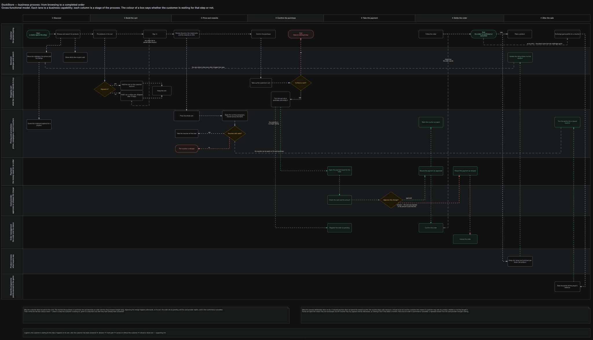
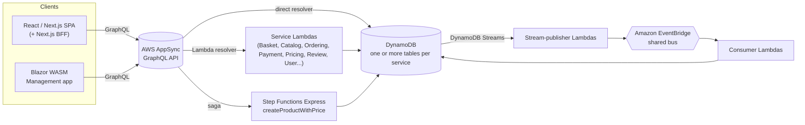

# DuckStore

DuckStore is a **serverless-first AWS** .NET microservices e-commerce sample, built to showcase
advanced, production-shaped architecture: Vertical Slice Architecture, CQRS, event-driven
integration via Change Data Capture, and a fully serverless AWS runtime. It's a learning/reference
project, not production software — every non-trivial decision is recorded as an
[Architecture Decision Record](./docs/adr) (47+ and counting) rather than left implicit in code.

**Live demo → [duckstore.dev.keveenmenezes.com](https://duckstore.dev.keveenmenezes.com)** —
*CodeDuck Store*, a rubber-duck shop with interactive code challenges.

[](https://dotnet.microsoft.com/)
[](https://aws.amazon.com/)
[](https://nextjs.org/)
[](https://learn.microsoft.com/dotnet/aspire/)

---

## 📑 Table of contents

- [Concept](#-concept)
- [Screenshots](#-screenshots)
- [Architecture](#-architecture)
- [Bounded contexts](#-bounded-contexts)
- [Front end](#-front-end)
- [Technologies Used](#-technologies-used)
- [Getting Started](#-getting-started)
- [Tips & Tools](#-tips--tools)
- [Documentation](#-documentation)
- [Contact](#-contact)

---

## 📜 Concept

An e-commerce sample that lets users browse a catalog, manage a shopping cart, and complete a
checkout end-to-end — with real asynchronous order/payment processing behind it, not a mocked
happy path. On top of the store sits a gamified layer: server-graded code challenges whose points
are redeemed as a real discount at checkout.

#### 🔄 Business Flow

[](./docs/diagrams/business-process-flow.svg)

<sub>Click to open full size. Source: [`docs/business-process-flow.drawio`](./docs/business-process-flow.drawio). Regenerate with `./scripts/export-diagrams.sh docs/business-process-flow.drawio`.</sub>

A cross-functional model of the purchase journey: each lane is a business capability, each column a
stage of the process. Box colour carries the load-bearing rule — **white means the customer is
waiting for that step, green means it runs on its own after they have already been answered.**

That split is the whole architecture in one picture. The moment the purchase is confirmed, the cart
becomes an order and the shop answers immediately; taking the payment happens afterwards, with the
order sitting as `Pending` until the card provider replies. Every green step is reached by a CDC
integration event on the shared EventBridge bus (`BasketCheckout` → `OrderCreated` →
`PaymentAuthorized`/`PaymentDeclined`), never by a synchronous call — see
[Architecture](#-architecture) below.

---

## 📸 Screenshots

Captured from the live environment at
[duckstore.dev.keveenmenezes.com](https://duckstore.dev.keveenmenezes.com).

| Storefront | Duck catalog |
|---|---|
| [](https://duckstore.dev.keveenmenezes.com) | [](https://duckstore.dev.keveenmenezes.com/#catalog) |
| Hero and entry points, rendered by the Next.js SPA through its own BFF. | Product grid with category facets. Ratings come from **Review** and price/discount from **Pricing**, but the page reads a single denormalized item from **CatalogView**. |

| Product detail | Code challenges |
|---|---|
| [](https://duckstore.dev.keveenmenezes.com) | [](https://duckstore.dev.keveenmenezes.com/challenges) |
| Price, installment plan, stock and the aggregated rating histogram — one read, no fan-out across services. | Server-side graded challenges: the answer key is structurally unreachable from the public read path, and points redeem into a customer-scoped Pricing discount. |

<details>
<summary><strong>Cart</strong> — guest baskets work without signing in</summary>


Carts are identified by a server-resolved `OwnerId` — `USER#<cognito-sub>` when authenticated,
`GUEST#<guestId>` otherwise (TTL-expirable in DynamoDB). See
[ADR-0016](./docs/adr/0016-guest-basket-owner-id-identity-api-key-and-ttl.md).

</details>

---

## 📐 Architecture


<sub>Source: [`docs/duckstore-backend-improved.drawio`](./docs/duckstore-backend-improved.drawio), page **Main**. Regenerate with [`./scripts/export-diagrams.sh`](./scripts/export-diagrams.sh).</sub>

Compute is **AWS Lambda**, one function per use case. Persistence is **DynamoDB** — no ORM, no
`SaveChanges`/change-tracker pipeline, repositories talk to `IAmazonDynamoDB` directly.
Cross-service communication is **event-driven, never synchronous HTTP/gRPC**: a committed DynamoDB
write is captured by DynamoDB Streams, published to Amazon EventBridge by a dedicated
stream-publisher Lambda, and consumed by whichever service cares. The only exception is a handful
of direct Lambda-to-Lambda invocations for calls that are genuinely synchronous by nature (e.g.
Payment → PaymentGateway).

**AWS AppSync is the only client entry point**, in every environment — there is no self-hosted HTTP
API gateway. Most fields resolve straight to DynamoDB (APPSYNC_JS, no Lambda in the hot path);
Lambda resolvers are an explicit escalation for fields with real business logic; one saga
(`createProductWithPrice`) runs through a Step Functions Express workflow with compensation.



Every `.NET` service ships as a **Native AOT, self-contained ZIP** on the `provided.al2023` custom
runtime (arm64) — no container images, no managed .NET Lambda runtime (`net10.0` predates one).
See [ADR-0042](./docs/adr/0042-lambda-native-aot-zip-provided-al2023.md).

CDC naming is the contract: `<service>-<resource>-stream-publisher` for CDC-out,
`<service>-<resource>-consumer` / `-sync-consumer` for CDC-in. Every publisher and consumer has an
SQS dead-letter queue with an alarm
([ADR-0015](./docs/adr/0015-sqs-dlq-for-cdc-publishers-and-eventbridge-consumers.md)).

---

## 🧩 Bounded contexts

Each context owns its tables, its Lambdas and its events. Every README below covers the same
ground: architecture diagram, responsibilities, data model, AppSync surface, integration events and
failure handling.

| Context | Responsibility | Docs |
|---|---|---|
| **Catalog** | Product and category management — the write model. | [README](./src/Services/Catalog/README.md) · [diagram](./docs/diagrams/catalog.svg) |
| **CatalogView** | Read-model/search, fed by CDC from Catalog, Review, and Pricing. | [README](./src/Services/CatalogView/README.md) · [diagram](./docs/diagrams/catalogview.svg) |
| **Basket** | Shopping cart (guest + authenticated owners), checkout initiation. Zero discount logic. | [README](./src/Services/Basket/README.md) · [diagram](./docs/diagrams/basket.svg) |
| **Ordering** | Order lifecycle (`Pending` → `Completed`/`Cancelled`), one DynamoDB item per order. | [README](./src/Services/Ordering/README.md) · [diagram](./docs/diagrams/ordering.svg) |
| **Payment** | Simulated payment authorization, orchestrates `PaymentGateway`. | [README](./src/Services/Payment/README.md) · [diagram](./docs/diagrams/payment.svg) |
| **Pricing** | Product pricing, promotional campaigns, installment plans, gateway-cost tracking. | [README](./src/Services/Pricing/README.md) · [diagram](./docs/diagrams/pricing.svg) |
| **Review** | Product reviews/ratings, aggregated downstream via CDC. | [README](./src/Services/Review/README.md) · [diagram](./docs/diagrams/review.svg) |
| **Challenges** | Server-side code-challenge grading, progression, and point redemption. | [README](./src/Services/Challenges/README.md) · [diagram](./docs/diagrams/challenges.svg) |
| **User** | User profile, backed by Cognito as the identity provider. | [README](./src/Services/User/README.md) · [diagram](./docs/diagrams/user.svg) |
| **Notification** | Go — consumes events, writes notifications to DynamoDB. | [README](./src/Services/Notification/README.md) · [diagram](./docs/diagrams/notification.svg) |

Two supporting services have no bounded context of their own:

- **PaymentGateway** (`src/Services/PaymentGateway`) — the simulated external payment processor,
  invoked synchronously by Payment.
- **ProductImages** (`src/Services/ProductImages`) — TypeScript/Node: presigned S3 uploads, a
  Sharp-based resize pipeline, CloudFront delivery, and an orphan-image sweeper.

### Shared code (`src/BuildingBlocks`)

| Package | Contents |
|---|---|
| `BuildingBlocks.Core` | `ICommand`/`IQuery` + handler interfaces, DDD base types, shared exception types |
| `BuildingBlocks.Messaging` | `IntegrationEvent` and the EventBridge publisher |
| `BuildingBlocks.ServiceDefaults` | Service discovery, resilience, health checks, OpenTelemetry, Serilog, MediatR behaviors |
| `BuildingBlocks.ServiceDefaults.Lambda` | The Lambda-shaped subset: structured logging + OTLP tracing ([ADR-0022](./docs/adr/0022-lambda-production-observability.md)) |

---

## 🖥️ Front end


- **[`Shopping.Web.SPA.React`](./src/WebApps/Shopping.Web.SPA.React)** — the customer-facing
  storefront (Next.js), fronting AppSync through its own BFF: Cognito tokens live server-side in a
  `duckstore-sessions` table and the browser only ever sees an opaque `__Host-sid` cookie
  ([ADR-0041](./docs/adr/0041-bff-opaque-server-side-session-centralized-cognito-refresh.md)).
  Deployed with SST/OpenNext ([ADR-0020](./docs/adr/0020-migrate-spa-deploy-to-sst.md)).
- **[`Managment.Web.Blazor`](./src/WebApps/Managment.Web.Blazor)** — Blazor WebAssembly admin app
  (product CRUD), calling AppSync directly, with no BFF. It's the client for the
  `createProductWithPrice` saga.

The GraphQL contract is owned at the repository root
([ADR-0033](./docs/adr/0033-graphql-contract-owned-at-monorepo-root.md)):
[`graphql/schema.graphql`](./graphql/schema.graphql) plus the JS resolvers under
[`graphql/resolvers/`](./graphql/resolvers), wired into the API by
[`infra/constructs/appsync-api.ts`](./infra/constructs/appsync-api.ts).

---

## 🛠️ Technologies Used

- **.NET 10 / C#** — all backend services, Vertical Slice Architecture, CQRS via a source-generated
  mediator (no reflection-based scanning — required for Native AOT).
- **AWS Lambda** — one function per use case, Native AOT ZIP on `provided.al2023`.
- **Amazon DynamoDB** — persistence for every service, plus DynamoDB Streams as the CDC source.
- **Amazon EventBridge** — the shared event bus every service publishes to and consumes from.
- **AWS AppSync** — GraphQL API, the sole client entry point (direct DynamoDB resolvers by default,
  Lambda resolvers for business logic, Step Functions Express for one multi-step saga).
- **Amazon Cognito** — identity provider (IdP-only, lazy user provisioning).
- **Amazon S3 + CloudFront** — product image storage and delivery.
- **.NET Aspire** — local orchestration: DynamoDB Local, the Lambda service emulator, and
  Elasticsearch/Kibana, wiring every service together for `F5`-style local development.
- **React / Next.js** — the customer-facing storefront SPA, with its own Next.js BFF (opaque
  server-side sessions in front of Cognito — [ADR-0041](./docs/adr/0041-bff-opaque-server-side-session-centralized-cognito-refresh.md)).
- **Blazor WebAssembly** — the admin/management app (product CRUD).
- **Go** — the Notification service.
- **AWS CDK v2 (TypeScript)** — real-AWS deployment infrastructure, one stack per service.
- **OpenTelemetry, Serilog, Elasticsearch/Kibana** — observability, local and in Lambda.
- **xUnit, Moq, Moq.AutoMock** — unit testing; Aspire-driven functional tests for Ordering.
- **GitHub Actions (OIDC)** — per-service CI/CD, `cdk deploy` on push to `development`.

---

## 🚀 Getting Started

### Repository layout

```
src/
  AppHost/                    .NET Aspire composition root (local orchestration only)
  BuildingBlocks/             Shared cross-cutting code
  Services/<Context>/         One folder per bounded context (+ its README)
  WebApps/                    React SPA (storefront) and Blazor WASM (admin)
infra/                        AWS CDK v2 app — one stack per service
graphql/                      schema.graphql + AppSync JS resolvers
docs/
  adr/                        Architecture Decision Records
  diagrams/                   Exported SVGs (main + one per bounded context)
  duckstore-backend-improved.drawio
tests/                        xUnit unit tests per service + functional tests
scripts/                      Diagram export & validation helpers
```

### Prerequisites

- **.NET 10 SDK**
- **Docker** — Aspire runs DynamoDB Local, the Lambda service emulator, and Elasticsearch/Kibana as
  containers
- **Node.js + pnpm** — only needed to run the React SPA (`src/WebApps/Shopping.Web.SPA.React`)
- **Go 1.23+** — only needed to run/test the Notification service directly
- Visual Studio Code with the **C# Dev Kit** extension, or Visual Studio / Rider

### Run everything locally

```bash
git clone https://github.com/KeveenMenezes/DuckStore.git
cd DuckStore

# Aspire provisions DynamoDB Local, the Lambda emulator, and Elasticsearch/Kibana,
# registers every Lambda function, and wires the dev environment between them.
dotnet run --project src/AppHost/AppHost.csproj
```

Or press `F5` in VS Code / Visual Studio and select the `AppHost` launch profile.

### Other common commands

```bash
# Build the whole solution
dotnet build DuckStore.slnx

# Run all .NET tests
dotnet test

# Run a single test project
dotnet test tests/Services/Catalog/Catalog.UnitTests/Catalog.UnitTests.csproj

# Validate CDK infra changes before pushing
cd infra && npx cdk synth <StackName>   # e.g. OrderingStack
```

---

## 💡 Tips & Tools

- **Product image pipeline ([ADR-0034](./docs/adr/0034-product-image-pipeline-presigned-post-sqs-sharp-cloudfront.md))**:
  product images upload straight from the admin browser to S3 (presigned POST), are processed into
  AVIF/WebP/JPEG variants by a Node.js/Sharp Lambda, and are served from a dedicated CloudFront
  distribution. The API only carries image metadata (`imageId`) — clients build URLs from
  configuration:
  - React SPA: `NEXT_PUBLIC_IMAGE_CDN_URL` (in `.env.local` for dev; set by `sst.config.ts` when
    deployed). Local dev also needs `IMAGE_ORIGINALS_BUCKET` plus real AWS credentials for the
    upload mutation, since there is no local S3 — dev/test run against the real AWS dev environment.
  - Blazor management app: `ImageCdn:BaseUrl` in `wwwroot/appsettings*.json`.
- **Orphan image cleanup**: uploads whose product form was abandoned leave unreferenced objects in
  the image buckets. Clean them with the manual sweep script (dry-run by default; add `--delete` to
  actually remove):
  ```bash
  cd src/Services/ProductImages
  npx tsx scripts/sweep-orphan-images.ts --originals <originals-bucket> --processed <processed-bucket>
  ```

---

## 📚 Documentation

Every cross-cutting architectural decision — from the serverless migration itself to session
management, CDC event naming, and Lambda packaging — is recorded under [`docs/adr/`](./docs/adr),
numbered sequentially and never deleted, even when superseded. The
[ADR index](./docs/adr/README.md) lists them all; start with the foundations:

| ADR | Decision |
|---|---|
| [0004](./docs/adr/0004-aws-first-eventbridge-over-masstransit-rabbitmq.md) | EventBridge replaces MassTransit/RabbitMQ |
| [0005](./docs/adr/0005-remove-domain-events-cdc-via-dynamodb-streams.md) | No in-process domain events — integration events come from DynamoDB Streams (CDC) |
| [0007](./docs/adr/0007-appsync-graphql-with-direct-dynamodb-resolvers.md) · [0009](./docs/adr/0009-appsync-resolver-selection-direct-first-lambda-for-complex-logic.md) | AppSync with direct DynamoDB resolvers; Lambda only as an escalation |
| [0019](./docs/adr/0019-module-oriented-service-structure-and-rule-based-stream-publishers.md) | Module-oriented service structure + rule-based stream publishers |
| [0026](./docs/adr/0026-pricing-bounded-context-price-and-campaign-ownership.md) | Pricing owns price and campaigns; Basket owns none of it |
| [0027](./docs/adr/0027-catalogview-opensearch-product-search-and-rating-sync.md) · [0030](./docs/adr/0030-catalogview-dynamodb-drop-opensearch.md) | CatalogView as the read side, on DynamoDB |

> The codebase is mid-evolution — it was migrated from PostgreSQL/Marten, EF Core, RabbitMQ, gRPC
> and Carter. If something looks like it *should* be there and isn't, an ADR probably explains why
> it was removed.

Diagrams are authored in
[`docs/duckstore-backend-improved.drawio`](./docs/duckstore-backend-improved.drawio) (one page per
context) and [`docs/business-process-flow.drawio`](./docs/business-process-flow.drawio) (the
purchase journey), exported to `docs/diagrams/*.svg` with
[`scripts/export-diagrams.sh`](./scripts/export-diagrams.sh) and checked against the code by
[`scripts/validate-diagrams.py`](./scripts/validate-diagrams.py). The SVGs are generated artefacts —
re-export after editing the `.drawio`, since a stale diagram is worse than none.

See also: [Contributing guide](./CONTRIBUTING.md) · [Code of conduct](./CODE_OF_CONDUCT.md) ·
[Security policy](./SECURITY.md) · [First-time AWS account setup](./docs/one-time-account-setup.md)

---

## 📧 Contact

For questions or suggestions, reach out on [Linkedin](https://www.linkedin.com/in/keveen-menezes-52592162/)

---
