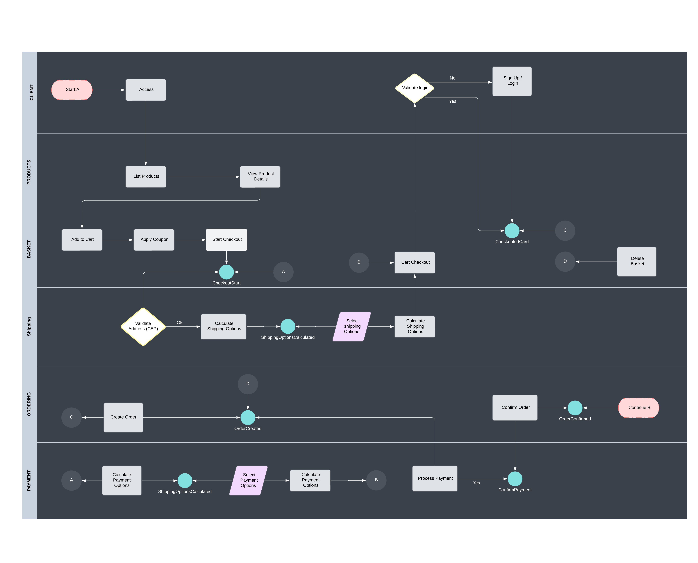
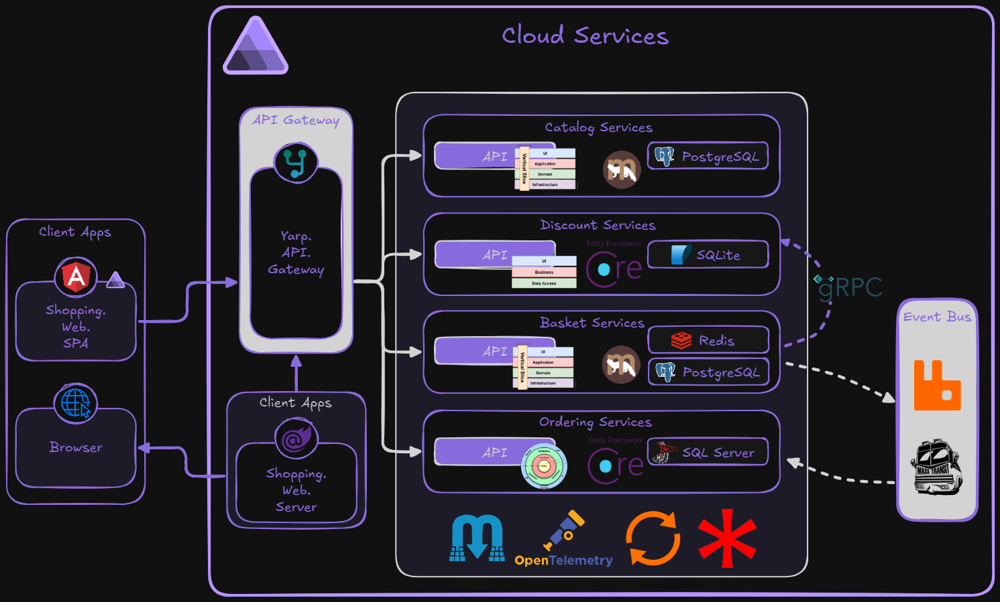

# DuckStore

DuckStore is a modern, scalable e-commerce application designed to showcase advanced software architecture concepts and technology integration. The project follows a microservices-based approach to deliver a robust and flexible solution.

---

## 📜 Concept

It is an e-commerce sample that lets users manage shopping carts, apply discounts, and complete transactions efficiently. It simulates a real-world e-commerce environment, integrating services such as databases, cache, messaging, and external APIs.

#### 🖼️ Design Inspirations


#### 🔄 Business Flow

The diagram below shows the end-to-end purchase flow across all domain lanes:



| Lane | Steps |
|---|---|
| **Client** | Access → Validate login → Sign Up / Login |
| **Products** | List Products → View Product Details |
| **Basket** | Add to Cart → Apply Coupon → Start Checkout → Cart Checkout → Delete Basket |
| **Shipping** | Validate Address (CEP) → Calculate Shipping Options → Select Shipping Options |
| **Ordering** | Create Order → Confirm Order |
| **Payment** | Calculate Payment Options → Select Payment Options → Process Payment |

Key integration events connecting the lanes: `CheckoutStart`, `ShippingOptionsCalculated`, `OrderCreated`, `OrderConfirmed`, `ConfirmPayment`, `CheckoutedCard`.

---

## 📐 Architecture

DuckStore's architecture is based on microservices with asynchronous communication between services. Each service follows the principles of **Vertical Slice Architecture**, **Ports and Adapters**, **Clean Architecture**, and **three-layer architecture**.

Communication between services is handled with **RabbitMQ** as the message broker, ensuring asynchronous and decoupled integration. This approach enables greater scalability, flexibility, and ease of maintenance.

Below is an overview of the architecture:



Each service is responsible for a specific capability — such as cart management, discounts, and order processing — following the principles of modularity and separation of concerns.

---

## 🛠️ Technologies Used

- **C# and .NET**: Main language and framework for development.
- **Aspire**: Framework that simplifies building APIs and services.
- **Angular**: Framework for front-end development.
- **Blazor**: Framework for building interactive web interfaces.
- **YARP**: Reverse proxy for request routing.
- **Entity Framework Core**: ORM for data manipulation.
- **SQLite**: Lightweight database for local persistence.
- **SQL Server**: Robust relational database for data persistence.
- **RabbitMQ**: Messaging for asynchronous communication between microservices.
- **PostgreSQL**: Relational database for data persistence.
- **Redis**: Distributed cache to improve performance.
- **Marten**: Library for handling data in PostgreSQL.
- **MassTransit**: Framework for RabbitMQ integration.
- **FluentValidation**: Data validation.
- **Carter**: Minimalist framework for APIs.
- **gRPC**: Efficient communication between services.
- **OpenTelemetry**: Observability and distributed tracing.
- **Mapster**: Object mapping library.

---

## 🚀 Getting Started

### Prerequisites

- .NET SDK 9.0 or higher
- Docker (optional, for services such as RabbitMQ, PostgreSQL, and Redis)
- Visual Studio Code with the **C# Dev Kit** extension

### Steps to Run

Clone the repository:
   ```bash
   git clone [Github](https://github.com/KeveenMenezes/DuckStore.git)
   cd DuckStore
   ```

Use the **C# Dev Kit** extension to start the project:
   - Press `F5` and select the `C#` folder.
   - Choose the `C#: AppHost` project to start.

## 📧 Contact

For questions or suggestions, reach out on [Linkedin](https://www.linkedin.com/in/keveen-menezes-52592162/)

---