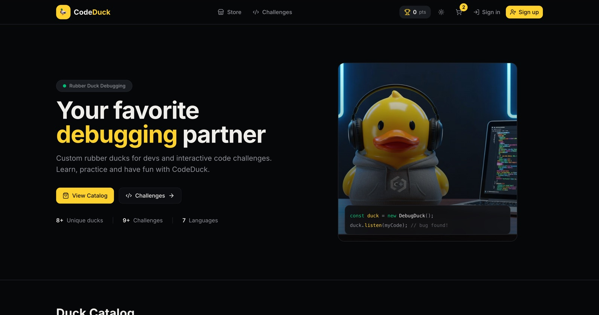
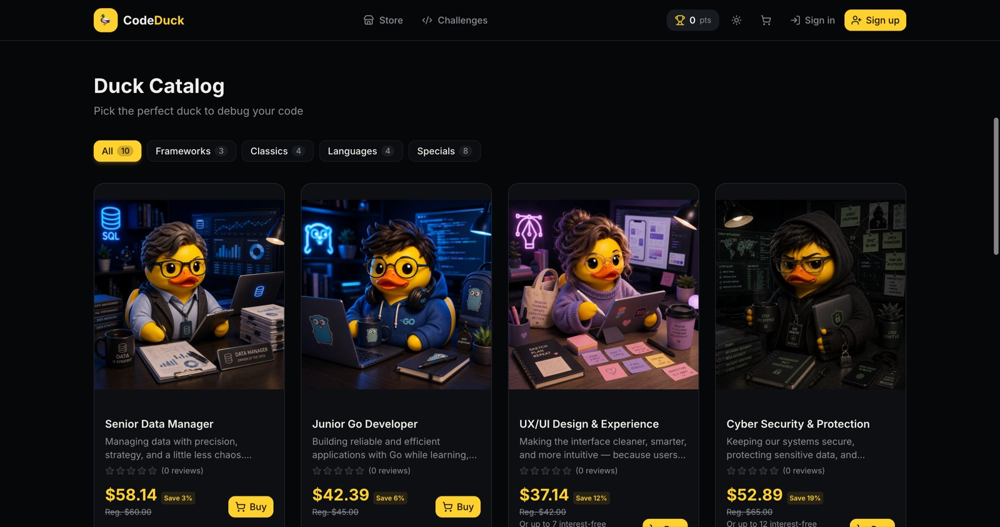
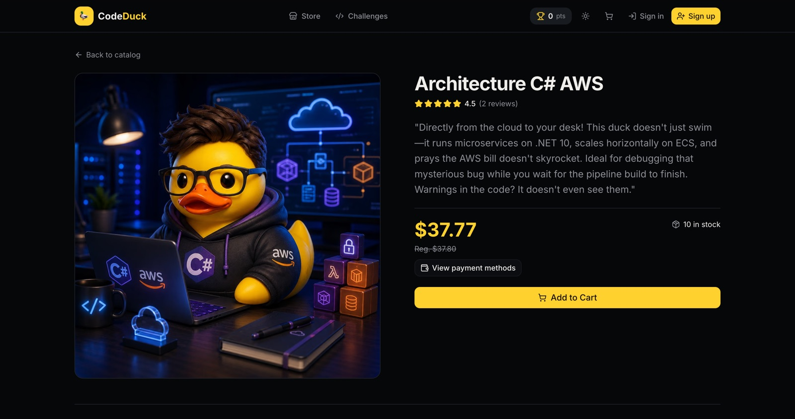
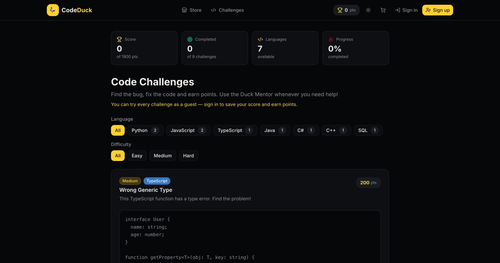
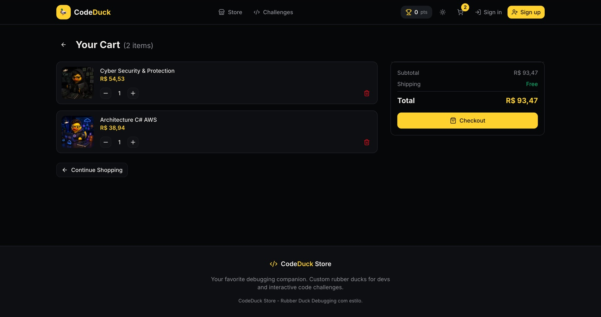
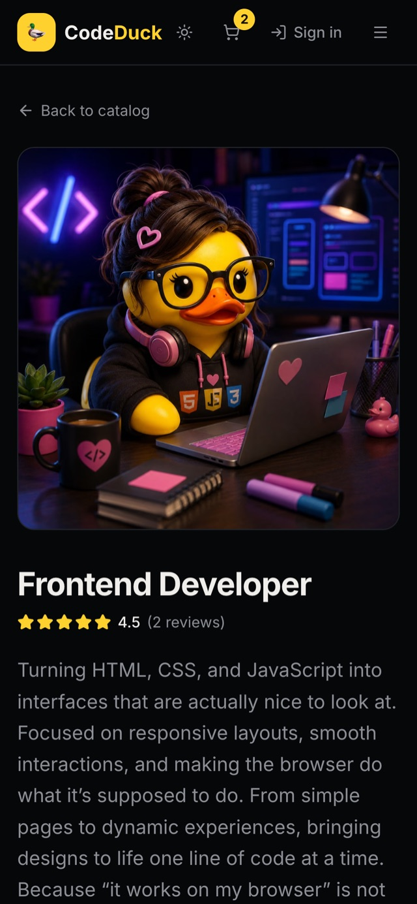
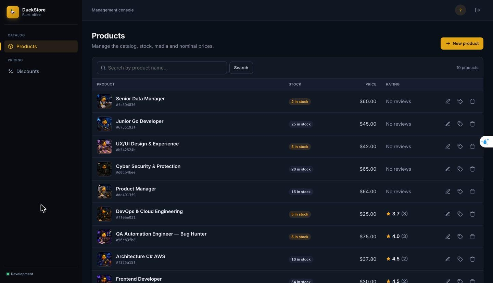
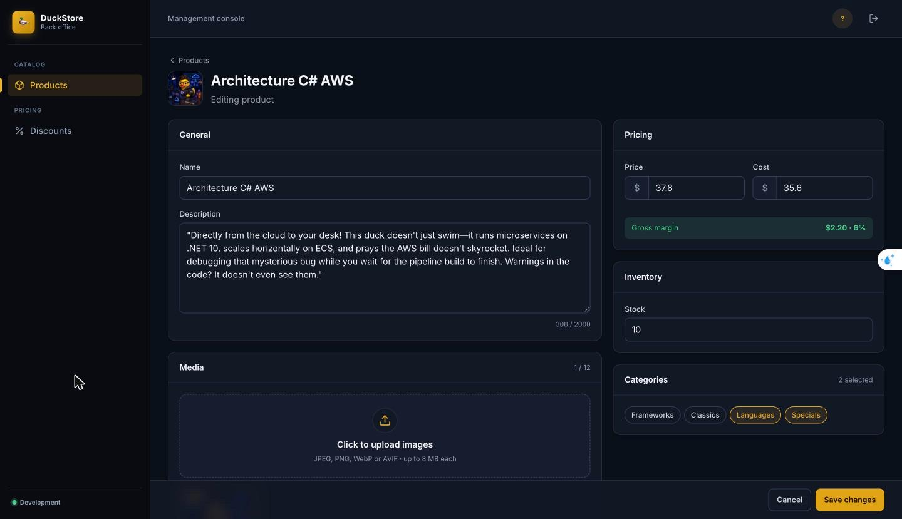
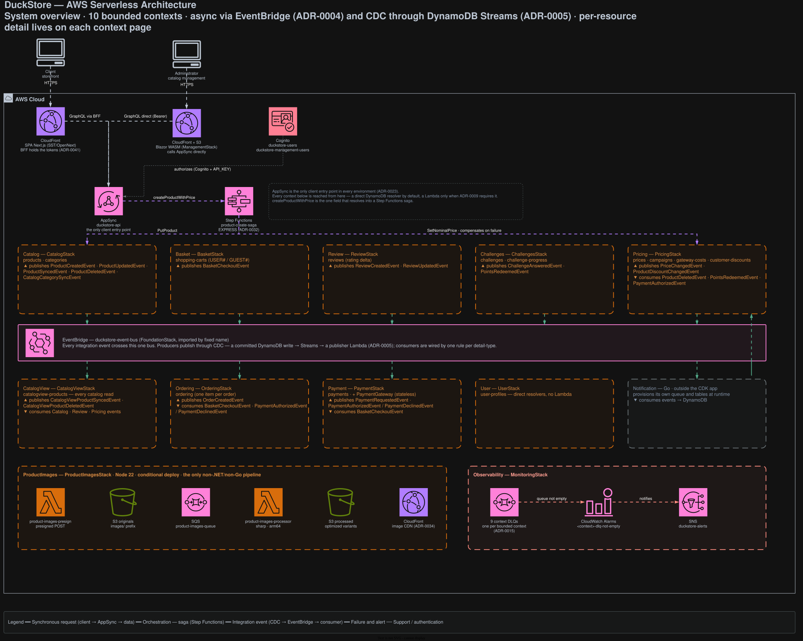

<div align="center">

# 🦆 DuckStore

**A production-shaped, serverless e-commerce on AWS — built with .NET 10, event-driven by design, and developed alongside AI.**

### [🛒 Try the live demo →](https://duckstore.dev.keveenmenezes.com)

[](https://dotnet.microsoft.com/)
[](https://aws.amazon.com/)
[](https://nextjs.org/)
[](./infra)
[](./docs/ai-native-development.md)
[](./LICENSE)

[](https://duckstore.dev.keveenmenezes.com)

</div>

## 👋 What is it?

**CodeDuck Store** is a rubber-duck shop for developers, with interactive code challenges on top.
Behind the storefront is a real distributed system: an order is processed asynchronously across
services, payment settles in the background, and the points you earn in the challenges come back
as a real discount at checkout.

It's a reference project: every part is something you would ship to production, and every
decision is written down.

<table>
<tr>
<td align="center" width="25%">⚡<br><b>100% serverless</b><br><sub>No servers, no containers, no VPC</sub></td>
<td align="center" width="25%">🔄<br><b>Event-driven</b><br><sub>Services talk through events, never direct calls</sub></td>
<td align="center" width="25%">💸<br><b>~$0 when idle</b><br><sub>Everything scales to zero</sub></td>
<td align="center" width="25%">🚀<br><b>Native AOT</b><br><sub>Fast cold starts on arm64</sub></td>
</tr>
<tr>
<td align="center">🔐<br><b>Zero Trust</b><br><sub>Tokens never reach the browser</sub></td>
<td align="center">🧩<br><b>10 bounded contexts</b><br><sub>Each owns its own data</sub></td>
<td align="center">📜<br><b>47+ ADRs</b><br><sub>Every decision explained</sub></td>
<td align="center">🤖<br><b>AI-native</b><br><sub>Skills, subagents and guardrails for Claude</sub></td>
</tr>
</table>

---

## 📸 A quick tour

| 🛍️ Catalog | 🦆 Product page |
|:---:|:---:|
| [](https://duckstore.dev.keveenmenezes.com/#catalog) | [](https://duckstore.dev.keveenmenezes.com/products/f325a15f-c60e-4b94-83c3-b091e8c6fbfd) |
| Filter by category and see live prices and discounts | Rating, price and stock, all in one fast read |

| 🧠 Code challenges | 🛒 Cart |
|:---:|:---:|
| [](https://duckstore.dev.keveenmenezes.com/challenges) | [](https://duckstore.dev.keveenmenezes.com/cart) |
| Find the bug, earn points and spend them as a discount | Works as a guest; no account needed |

<table>
<tr>
<td width="35%" align="center">
<br>
<sub>📱 Responsive on mobile</sub>
</td>
<td width="65%">

**What the storefront shows off**

- ⚡ **Pages served from cache.** Product pages are pre-rendered and refreshed only when the data
  actually changes.
- 🖼️ **Optimized images.** Every photo ships as AVIF, WebP and JPEG in 5 sizes, from a CDN.
- 🔐 **Secure sessions.** Login goes through Cognito, and tokens stay on the server.
- 🛒 **Guest cart.** Shop without an account; when you sign in, your cart comes with you.
- 🌗 **Dark and light themes.**

</td>
</tr>
</table>

---

## 🛠️ Back office

A separate admin app where the team manages the catalog: products, stock, photos, prices and
discount campaigns.

| 📦 Product list | ✏️ Edit a product |
|:---:|:---:|
| [](https://management-duckstore.dev.keveenmenezes.com) | [](https://management-duckstore.dev.keveenmenezes.com) |
| Stock, price and rating for every duck at a glance | Price, cost and live gross margin, stock, categories and photo upload |

<sub>Built with Blazor WebAssembly, behind its own Cognito login. Creating a product saves it
together with its price in one step, and undoes everything if any part fails.</sub>

---

## 🏗️ How it works



1. **The browser talks to a single API**: AWS AppSync (GraphQL), behind the storefront's own BFF.
2. **Each use case is its own Lambda function**, and each service keeps its data in DynamoDB.
3. **Services never call each other directly.** A saved change becomes an event on Amazon
   EventBridge, and whoever cares reacts to it.
4. **The customer never waits for the slow part.** Checkout answers right away, and payment is
   settled in the background.

👉 Want the details? Read the **[architecture deep dive](./docs/architecture.md)**: design
principles, the business flow, bounded contexts, DDD, security and observability.

---

## 🧰 Tech stack

| | |
|---|---|
| **Backend** | .NET 10 · C# · CQRS · Vertical Slice Architecture · Go |
| **AWS** | Lambda · DynamoDB · EventBridge · AppSync · Cognito · Step Functions · S3 · CloudFront |
| **Frontend** | React · Next.js (SSR/ISR + BFF) · Tailwind CSS · Blazor WebAssembly |
| **Infra & DevOps** | AWS CDK · SST · GitHub Actions (OIDC) · .NET Aspire for local dev |
| **Quality** | xUnit · Moq · OpenTelemetry · X-Ray · DLQ alarms |
| **AI** | Claude Code: project context, 8 skills, 4 subagents |

---

## 🚀 Run it locally

You need the **.NET 10 SDK** and **Docker**.

```bash
git clone https://github.com/KeveenMenezes/DuckStore.AWS.git
cd DuckStore.AWS
dotnet run --project src/AppHost/AppHost.csproj
```

.NET Aspire starts everything for you: local DynamoDB, the Lambda emulator, Elasticsearch/Kibana
and every service.

👉 More commands, the repository layout and tips are in the **[developer guide](./docs/developer-guide.md)**.

---

## 📚 Learn more

| | |
|---|---|
| 🏛️ **[Architecture](./docs/architecture.md)** | Principles, diagrams, bounded contexts, DDD, security, observability |
| 🤖 **[Built with AI](./docs/ai-native-development.md)** | How the repo is designed so Claude can work on it safely |
| 🛠️ **[Developer guide](./docs/developer-guide.md)** | Setup, commands, tips and key decisions |
| 📜 **[Decision records](./docs/adr/README.md)** | The *why* behind every architectural choice |
| 🧩 **[Services](./src/Services)** | One README per bounded context |

---

<div align="center">

Made by **Keveen Menezes** · [LinkedIn](https://www.linkedin.com/in/keveen-menezes-52592162/)

<sub>[Contributing](./CONTRIBUTING.md) · [Code of conduct](./CODE_OF_CONDUCT.md) · [Security](./SECURITY.md) · [MIT License](./LICENSE)</sub>

</div>
