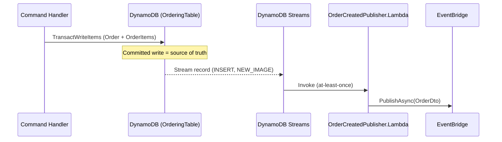

---
tags:
  - status/accepted
  - domain/cross-cutting
---

# ADR-0005: Remove In-Process Domain Events — Integration Events via DynamoDB Streams (CDC)

## Status
**Accepted** — June 2026

---

## Context

In the previous architecture (EF Core + PostgreSQL + MassTransit), **domain events** played a concrete infrastructural role: an aggregate raised them via `AddDomainEvent(...)`, a `DispatchDomainEventsInterceptor` flushed them during `SaveChanges`, and their handlers turned them into **integration events** published to RabbitMQ. The MassTransit **outbox** made that publication reliable by committing the outbox rows in the **same database transaction** as the aggregate change.

[ADR-0004](./0004-aws-first-eventbridge-over-masstransit-rabbitmq.md) removed that stack: persistence moved to **DynamoDB**, MassTransit/RabbitMQ were replaced by **EventBridge**, and the transactional outbox was replaced by **DynamoDB Streams** — the persisted write itself is the source of truth, and a Stream-triggered Lambda (`Ordering.OrderCreatedPublisher.Lambda`) publishes the integration event to EventBridge.

After that migration, the domain-event machinery became **dead code** across the solution:

- There is no longer a `SaveChanges`/`ChangeTracker`/interceptor pipeline in any service — DynamoDB writes go through the SDK (`TransactWriteItems`). **`ClearDomainEvents()` is never called anywhere**, so events accumulated in aggregates are never dispatched.
- **Ordering** still raises `OrderCreatedEvent`/`OrderUpdatedEvent`, but the only handlers (`OrderCreateEventHandler`/`OrderUpdateEventHandler`) just call `LogInformation` — no behavior, no integration publishing.
- **Catalog** raises `ProductCreatedEvent`/`ProductUpdatedEvent`, but there is **no `INotificationHandler` at all** — nothing consumes them.
- Re-wiring domain events to publish integration events in-process would be a **reliability regression**: without `SaveChanges` + outbox there is no atomic "save aggregate + enqueue event". A best-effort `IPublisher.Publish` after a DynamoDB write can be lost if the process dies between the write and the publish — exactly the failure mode that DynamoDB Streams (at-least-once delivery driven by the committed write) already eliminates.

The machinery left behind is misleading: `AddDomainEvent(...)` calls and `INotificationHandler` classes imply a dispatch mechanism that no longer exists.

---

## Decision

**Remove the in-process domain-event mechanism from the entire solution.** Cross-service integration events are published exclusively via **DynamoDB Streams → publisher Lambda → EventBridge** (Change Data Capture), as established by ADR-0004.

### 1. Integration events MUST be published via DynamoDB Streams (CDC)

The committed DynamoDB write is the single source of truth for "something happened". A Stream-triggered Lambda reads the change and publishes the `IntegrationEvent` to EventBridge. No in-process domain-event hop participates in cross-service publication.

### 2. The domain-event machinery is removed, NOT replaced

- `BuildingBlocks.Core.DomainModel`: delete `IDomainEvent`; strip `DomainEvents`/`AddDomainEvent`/`ClearDomainEvents` from `Aggregate<TId>` and `IAggregate`. `Aggregate<TId>`/`IAggregate` are kept as **empty aggregate-root markers** (preserving DDD intent with minimal churn).
- `Ordering` and `Catalog`: remove all `AddDomainEvent(...)` calls, the `*CreatedEvent`/`*UpdatedEvent` records, and the (logging-only / nonexistent) handlers.
- **MediatR stays** — it is still the transport for `ICommand`/`IQuery` (`ISender`/`IRequest`). Only `INotification`-based domain events are removed. No DI changes are required.

### 3. Constraints going forward

- New cross-service events MUST NOT be implemented as in-process `INotification` domain events. They are added as a Stream-driven publisher (handle the relevant `INSERT`/`MODIFY`/`REMOVE` record types) emitting an `IntegrationEvent`.
- If a genuine **in-process, same-bounded-context** reaction is ever needed (not integration), it MAY be added explicitly at that time — but it MUST be justified as non-critical, since in-process dispatch after a DynamoDB write is best-effort and not transactional. It is NOT ALLOWED to reintroduce domain events as the integration-publishing path.

---

## Applies To

- `src/BuildingBlocks/BuildingBlocks.Core` (`DomainModel/IDomainEvent.cs`, `Aggregate.cs`, `IAggregate.cs`)
- `src/Services/Catalog/Catalog.Function` (`Models/Product.cs`, `Data/IdentifiableAggregate.cs`, `Events/*`)
- `src/Services/Ordering` (`Ordering.Domain/.../OrderAggregate/{Models/Order.cs,Events/*}`, `Ordering.Application/Orders/EventHandlers/Domain/*`)

`Basket` and `Discount` do not use the aggregate/domain-event machinery and are unaffected.

---

## Consequences

### Positive
- Removes misleading dead code: no `AddDomainEvent`/handlers implying a dispatch pipeline that no longer exists.
- Integration publication is **more reliable** than the old in-process path: delivery is driven by the committed DynamoDB write via Streams (at-least-once), not by an in-process best-effort publish.
- One clear, consistent eventing model across services (CDC → EventBridge), reinforcing ADR-0004.
- Less surface to maintain in `BuildingBlocks.Core` and per-service domain models.

### Negative / Costs
- Loses the in-process domain-event extensibility point; a future genuine in-process reaction must be reintroduced deliberately.
- Reduces the project's value as a "classic DDD domain events" reference sample (a deliberate trade for serverless-native accuracy).
- Coupling to DynamoDB Streams as the eventing backbone deepens (already implied by ADR-0004).

### Mitigation Strategies
- Keep `Aggregate<TId>`/`IAggregate` as aggregate-root markers so the DDD boundary and a reintroduction point remain documented in the type system.
- Today the publisher only handles `INSERT` (order creation). If status-change (`OrderUpdated`) integration events are later required, extend the **Stream publisher** to handle `MODIFY` records — this is the sanctioned path, replacing what `OrderUpdatedEvent` would have done.

---

## References
- [ADR-0004: AWS-First Messaging — Replace MassTransit/RabbitMQ with Amazon EventBridge](./0004-aws-first-eventbridge-over-masstransit-rabbitmq.md)
- [ADR-0000: Official Architecture Decision Records Standard](./0000-official-architecture-decisios-records-standard.md)
- `Ordering.OrderCreatedPublisher.Lambda` (DynamoDB Streams → EventBridge publisher)
- Commit `2661251` — migrate DuckStore to serverless-first AWS architecture
