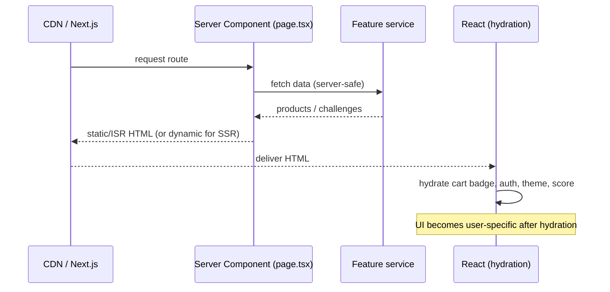

---
tags:
  - status/accepted
  - domain/spa
---

# ADR-0006: Adopt React/Next.js as the Primary SPA, Replacing Angular

## Status
**Accepted** — June 2026

---

## Context

DuckStore currently carries **two** SPA frontends under `src/WebApps/`, plus a Blazor Server app:

- `Shopping.Web.SPA` — an **Angular** app (Angular Material, RxJS, `angular-auth-oidc-client`). It is intentionally minimal: only product browsing (shop list, product details), error pages and Cognito/OIDC login. It has **no** cart, checkout, orders, profile, theme toggle, or the gamified "Desafios" feature.
- `Shopping.Web.SPA.React` — a **React 19 / Next.js 16** app that is **feature-complete**: catalog, cart, checkout, mock auth, orders, profile, theme (dark/light) and the React-only "Desafios" (code-challenge) feature.
- `Shopping.Web.Server` — Blazor Server (Refit clients through the YARP gateway), unaffected by this decision.

Maintaining two parallel SPAs is wasteful for a learning/demo project and forces every UI feature to be built twice. A direction must be chosen. The concrete pains:

- **Duplicated effort & drift** — the Angular app lags far behind the React app in features; keeping both in sync is unrealistic with a single maintainer.
- **Support / maintenance** — the React + Next.js ecosystem (App Router, Server Components, Turbopack) is where the team has momentum and where the broader community/library support and hiring pool are strongest for this project's goals.
- **Rendering strategy** — the e-commerce surface benefits from per-page rendering control (static marketing, periodically-revalidated catalog, per-user dynamic pages). Angular's SPA model (and the current setup) renders everything client-side; Next.js offers SSG/ISR/SSR as a first-class, per-route concern.
- **Architecture maturity** — the React app was just refactored into a clean **feature-based** structure (`features/*` with `types/services/hooks/context/components`, a shared `shared/{constants,lib,layout}` foundation), giving it a sturdier base to grow on than the Angular app.

This ADR follows a refactor (see *Related Documentation*) that finished migrating the React app to feature-based architecture, moved the app-shell into `shared/layout/`, applied the per-page rendering strategy below, and removed dead/duplicated code. A production `next build` confirmed the routing strategy works end to end.

---

## Decision

Adopt **`Shopping.Web.SPA.React` (React 19 / Next.js 16, App Router)** as the **primary and only actively developed SPA** for DuckStore. The Angular app `Shopping.Web.SPA` is **frozen** (no new features) and slated for removal once parity is no longer a concern.

### 1️⃣ React/Next.js is the canonical SPA

- New SPA features MUST be built in `Shopping.Web.SPA.React`.
- `Shopping.Web.SPA` (Angular) MUST NOT receive new features. It MAY remain in the repo for reference until explicitly removed by a follow-up change.
- This decision does **not** affect `Shopping.Web.Server` (Blazor) or any backend service.

### 2️⃣ Feature-based architecture

The SPA is organized by **feature**, not by technical layer. Each feature owns its slice end to end:

```
features/<feature>/
  types/        # feature DTOs and unions
  services/     # data access + business logic (swappable data source)
  hooks/        # React hooks (state, derived data)
  context/      # providers + low-level context hook
  components/   # feature UI (decomposed, presentational where possible)
shared/
  constants/    # ROUTES, STORAGE_KEYS (single source of truth)
  lib/          # storage adapter, format/id helpers
  layout/       # app-shell: providers, header, footer, user-dropdown, hero
```

- Cross-feature primitives live in `shared/*`; shadcn/ui primitives stay in `components/ui/*`.
- Imports MUST target `@/features/*` and `@/shared/*`. Importing the (removed) root-level duplicate components/contexts is NOT ALLOWED.

### 3️⃣ Rendering strategy (SSG / ISR / SSR) per route

The rendering mode is a **per-page** decision driven by data ownership: **AWS defines the backend → Next.js defines the rendering strategy → React defines the dynamic experience (hydration).**

| Surface | Routes | Strategy | Segment config |
|---------|--------|----------|----------------|
| 🟢 Static marketing / fixed content | hero/landing sections | **SSG** | (default static) |
| 🟡 Catalog / product content | `/`, `/desafios` | **ISR** | `export const revalidate = 300` |
| 🔵 Per-user dynamic | `/checkout`, `/meu-perfil`, `/meus-pedidos` | **SSR** | `export const dynamic = "force-dynamic"` |

Pattern for every page: `page.tsx` is a **Server Component** that exports `metadata` plus its segment config, fetches server-safe data via a feature service, and renders a **client view** that hydrates per-user state (cart badge, auth, theme, score) on top of the server-rendered HTML.

**Correct** — ISR page delegates interactivity to a client view:

```tsx
// app/page.tsx  (Server Component)
export const revalidate = 300
export const metadata: Metadata = { title: "CodeDuck Store - Catalogo de Patos" }

export default function HomePage() {
  const products = getProducts()      // server-safe service (ISR-cached)
  const categories = getCategories()
  return (
    <>
      <HeroSection />
      <ProductCatalog initialProducts={products} initialCategories={categories} />
    </>
  )
}
```

**Incorrect** — forcing the whole page client-side, losing ISR/SSR:

```tsx
"use client"            // ⛔ page-level: no segment config, no Server Component data fetch
export default function HomePage() {
  const { products } = useProducts()  // everything client-rendered
  return <ProductCatalog products={products} />
}
```

### 4️⃣ Swappable data layer (future AWS/AppSync)

Feature services (e.g. `products.service.ts`, `challenges.service.ts`) are the **only** data boundary and currently return mock/static data with `localStorage` persistence via the `shared/lib/storage` adapter. Services accept an optional data source so a Server Component can pass server-fetched data into client hooks. This keeps the migration path open: replacing the mock source with an **AppSync (GraphQL)** backend later must not require touching views or hooks.

### 5️⃣ Render data flow



---

## Applies To

- `src/WebApps/Shopping.Web.SPA.React` — canonical SPA (this decision's subject).
- `src/WebApps/Shopping.Web.SPA` — Angular app, frozen / to be removed.
- Not affected: `src/WebApps/Shopping.Web.Server` (Blazor), `src/ApiGateways/YarpApiGateway`, and all `src/Services/*`.

---

## Consequences

### Positive

- **Single SPA to maintain** — no more building each feature twice; the React app is already feature-complete (cart, checkout, auth, orders, profile, theme, challenges).
- **Per-route rendering control** — SSG/ISR/SSR is a first-class, per-page concern; the catalog gets cheap CDN delivery with periodic freshness while per-user pages stay correct.
- **Strong ecosystem support** — Next.js App Router, Server Components and Turbopack give the project access to a large, actively-maintained ecosystem and hiring pool.
- **Clean architecture** — feature-based structure with a shared foundation reduces coupling and makes the data layer swappable for a real AWS/AppSync backend.
- **Better hydration story** — static/ISR HTML from the CDN with React layering in user-specific state (cart badge, auth, theme) is the standard modern e-commerce pattern.

### Negative / Costs

- **Wasted Angular investment** — the existing Angular app (including its working Cognito/OIDC login) is set aside; that authentication flow is not yet reproduced in the React app (which still uses mock auth).
- **Real backend integration still pending** — the React app currently runs on mock/static data and `localStorage`; wiring it to the live Catalog/Basket/Ordering services (and the future AppSync layer) is outstanding work.
- **Discipline required** — the SSG/ISR/SSR-per-page and feature-based import rules only pay off if consistently applied; a stray page-level `"use client"` silently collapses the rendering strategy.
- **Two frameworks linger temporarily** — until the Angular app is deleted, the repo still contains two SPAs, which can confuse onboarding.

### Mitigation Strategies

- Track the Angular removal as an explicit follow-up so the freeze does not become permanent dead weight.
- Reproduce the Cognito/OIDC authentication in the React app before decommissioning Angular, so no capability is lost.
- Keep all data access behind feature `services/*` so the mock-to-AppSync swap is localized.
- Use the `next build` route summary (○ Static / ƒ Dynamic + Revalidate column) as a check in review to confirm each route's intended rendering mode.

### Future Constraints

- New SPA features are only valid in `Shopping.Web.SPA.React`; reviving Angular for new work requires a new ADR.
- The real backend/data integration (and AppSync GraphQL adoption) is expected to be its own ADR, building on the swappable-service boundary defined here.

---

## Related Documentation

- Feature-based refactor + rendering-strategy plan (React SPA), June 2026.
- `next build` route report confirming `/` and `/desafios` as ISR (revalidate 5m) and `/checkout`, `/meu-perfil`, `/meus-pedidos` as Dynamic (SSR).

## References

- [ADR-0000: Official Architecture Decision Records Standard](./0000-official-architecture-decisios-records-standard.md)
- [ADR-0003: Adoption of Zero Trust Security Model](./0003-adoption-of-zero-trust-security-model.md)
- [ADR-0004: AWS-First Messaging — EventBridge over MassTransit/RabbitMQ](./0004-aws-first-eventbridge-over-masstransit-rabbitmq.md)
- Next.js App Router — Rendering: Static (SSG), Incremental Static Regeneration (ISR), Dynamic (SSR), Server Components
