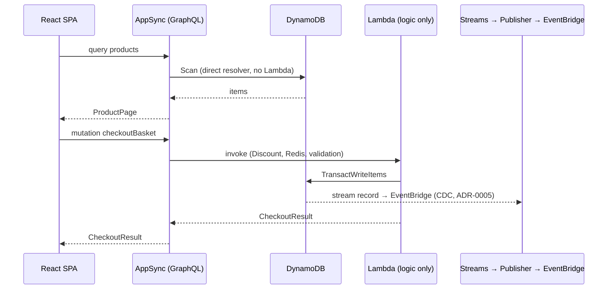

# ADR-0007: AWS AppSync (GraphQL) as the Client-Facing API — Direct DynamoDB Resolvers for Reads, Lambda for Business Logic

## Status
**Proposed** — June 2026

---

## Context

The React SPA ([ADR-0006](./0006-react-nextjs-spa-over-angular.md)) currently runs on mock/static data behind a swappable feature-service boundary (`features/*/services/*`). ADR-0006 §4 and its *Future Constraints* explicitly defer the real backend wiring — and AppSync adoption — to its own ADR. This is that ADR.

The current backend exposes each use case as an **AWS Lambda** with an `[HttpApi(...)]` attribute, fronted locally by the **YARP gateway** (`src/ApiGateways/YarpApiGateway`) and intended to sit behind **API Gateway** on AWS. The concrete pains and observations that motivate revisiting the client-facing API:

- **A Lambda for every read is overkill.** Catalog reads (`GetProducts`, `GetProduct`, `GetCategories`) are the most frequent client calls and the simplest — they do nothing but read DynamoDB and shape a DTO. Each one still pays a Lambda cold start and carries a full `.NET` handler + MediatR pipeline for what is effectively a `Query`/`Scan`.
- **The frontend over-fetches.** A REST surface forces multiple round-trips (or one fat endpoint) when a screen needs product + categories + stock together. The SPA already wants nested, screen-shaped data.
- **The data boundary is already isolated.** ADR-0006 made `features/*/services/*` the *only* data access point, precisely so the mock source can be swapped for a real backend without touching hooks or views.
- **AWS-First direction.** ADR-0004 established a preference for managed AWS-native services over self-hosted glue. AppSync is the AWS-native managed GraphQL layer with first-class **direct DynamoDB resolvers** (no Lambda in the path) and native Lambda resolvers where logic is needed.

The team evaluated keeping **REST (Lambda HTTP API + API Gateway/YARP)** vs adopting **AppSync (GraphQL)** for the client-facing read/command API. AppSync was preferred for the learning value, the elimination of Lambda for trivial reads, and the flexible screen-shaped fetching — accepting the cost of a GraphQL schema becoming the central client contract and weaker local-emulation fidelity.

> **Scope.** This decision concerns only the **client-facing API** consumed by the React SPA. The **write → persist → CDC → EventBridge** path ([ADR-0004](./0004-aws-first-eventbridge-over-masstransit-rabbitmq.md), [ADR-0005](./0005-remove-domain-events-cdc-via-dynamodb-streams.md)) is **unchanged**: integration events are still produced by DynamoDB Streams, never by AppSync.

---

## Decision

Adopt **AWS AppSync (GraphQL)** as the client-facing API for the React SPA. A single GraphQL schema is the contract; resolvers are chosen per field by a clear rule:

### 1. AppSync is the single client-facing API endpoint

- The React SPA's feature services (`products.service.ts`, `challenges.service.ts`, `basket.service.ts`, …) MUST target the AppSync GraphQL endpoint, replacing the mock source behind the ADR-0006 §4 boundary. Views and hooks MUST NOT change to accommodate this swap.
- A **single GraphQL schema** (`schema.graphql`) is the **canonical client contract**. REST `[HttpApi]` endpoints are no longer the client-facing surface; they MAY remain only for internal/diagnostic use.

### 2. Resolver selection rule — **DynamoDB-direct for reads, Lambda for logic**

The resolver kind is a **per-field** decision driven by whether the field needs business logic:

| GraphQL field | Resolver | Rationale |
|---------------|----------|-----------|
| `products`, `product(id)`, `categories` | **Direct DynamoDB** (JS resolver, `Query`/`GetItem`/`Scan`) | Pure read + shape; no logic, no cold start, no .NET |
| `basket(userName)` | **Direct DynamoDB** *(or Lambda if cache-aside is required)* | Read-through is acceptable direct; Redis cache-aside needs Lambda |
| `storeBasket`, `checkoutBasket` | **Lambda** | Redis cache, Discount Lambda invoke, EventBridge publish, validation |
| `couponFor(productName)` | **Lambda** | Discount domain logic |

- A field MUST use a **direct DynamoDB resolver** when it only reads/writes DynamoDB and shapes the result — no domain rules, no external calls, no caching, no transaction spanning multiple aggregates.
- A field MUST use a **Lambda resolver** when it involves any of: business validation, FluentValidation/MediatR pipeline, Redis cache-aside, a cross-service Lambda invoke (e.g. Basket → Discount), `TransactWriteItems` across aggregates, or publishing/side effects.

### 3. Direct DynamoDB resolver pattern

Direct resolvers are **APPSYNC_JS** (JavaScript) unit resolvers — no VTL, no Lambda. The committed table schema (`CatalogTable`, etc.) is unchanged.

```js
// resolvers/Query.products.js  — AppSync resolves DynamoDB directly (no Lambda)
import { util } from '@aws-appsync/utils'

export function request(ctx) {
  const { pageSize = 10, nextToken } = ctx.args
  return { operation: 'Scan', limit: pageSize, nextToken }
}

export function response(ctx) {
  if (ctx.error) util.error(ctx.error.message, ctx.error.type)
  return { items: ctx.result.items, nextToken: ctx.result.nextToken }
}
```

```graphql
# schema.graphql (excerpt)
type Product { id: ID!, name: String!, price: Float!, category: String!, stock: Int! }
type ProductPage { items: [Product!]!, nextToken: String }

type Query {
  products(pageSize: Int, nextToken: String): ProductPage!   # direct DynamoDB
  product(id: ID!): Product                                   # direct DynamoDB
}

type Mutation {
  checkoutBasket(input: CheckoutInput!): CheckoutResult!      # Lambda resolver
}
```

**Correct** — a trivial read resolved directly against DynamoDB (no Lambda in the path):

```graphql
type Query { product(id: ID!): Product }   # → GetItem unit resolver
```

**Incorrect** — wrapping a pure read in a Lambda just to keep the .NET handler:

```graphql
# ⛔ Lambda cold start + MediatR pipeline for what is a single GetItem
type Query { product(id: ID!): Product }   # → Lambda resolver (no logic inside)
```

### 4. The CDC / EventBridge path is untouched

AppSync resolvers (direct or Lambda) write to DynamoDB exactly as today. Integration events are still emitted by **DynamoDB Streams → publisher Lambda → EventBridge** (ADR-0005). AppSync MUST NOT be made an integration-event source, and resolvers MUST NOT publish integration events inline — that remains a CDC responsibility.



---

## Applies To

- `src/WebApps/Shopping.Web.SPA.React` — feature services repointed to AppSync (the ADR-0006 §4 boundary).
- `src/Services/Catalog/Catalog.Function` — read use cases (`GetProducts`, `GetProduct`, categories) become **direct DynamoDB resolvers**; their Lambda HTTP endpoints are demoted from the client surface.
- `src/Services/Basket/Basket.Function`, `src/Services/Discount/Discount.Function` — remain **Lambda resolvers** (cache-aside, cross-Lambda invoke, validation).
- `src/ApiGateways/YarpApiGateway` — no longer the client-facing entry point for SPA traffic once AppSync is live; retained for Blazor/Server (`Shopping.Web.Server`) and internal routing.
- Not affected: `src/Services/Ordering/*` write/CDC path, `BuildingBlocks.Messaging` (EventBridge), and all DynamoDB table schemas.

---

## Consequences

### Positive

- **No Lambda for trivial reads** — catalog queries (the highest-volume client calls) hit DynamoDB directly: no cold start, no .NET handler, lower latency and cost.
- **Screen-shaped fetching** — the SPA requests exactly the fields a view needs in one round-trip; nested data (product + categories + stock) no longer requires multiple REST calls.
- **Lambda concentrated on real logic** — `.NET` handlers remain only where there is genuine domain logic (checkout, discount, cache-aside), matching the boundary already drawn by ADR-0005 (logic) vs CDC (events).
- **AWS-native and educational** — AppSync + direct DynamoDB resolvers + selective Lambda resolvers is a mainstream serverless pattern, reinforcing the AWS-First direction of ADR-0004.
- **Clean swap** — the ADR-0006 §4 service boundary means repointing from mock to AppSync does not touch hooks or views.

### Negative / Costs

- **GraphQL schema becomes the central contract** — a single `schema.graphql` must be owned and versioned with discipline; schema drift breaks all clients at once.
- **Weak local emulation** — Aspire/LocalStack do not emulate AppSync with the fidelity of the current Lambda-HTTP-API + YARP local setup; local development of resolvers (especially APPSYNC_JS) is harder to exercise end-to-end without deploying.
- **Two resolver runtimes** — the team now maintains both APPSYNC_JS resolvers (for direct DynamoDB) and .NET Lambda resolvers, plus the `AppSyncResolverEvent` adaptation for the Lambda ones.
- **Resolver-rule discipline** — the "direct for reads, Lambda for logic" boundary only pays off if applied consistently; wrapping pure reads in Lambda silently reintroduces cold starts.
- **Two client surfaces temporarily** — Blazor (`Shopping.Web.Server`) still consumes REST via YARP while the SPA moves to AppSync, so REST endpoints linger until/unless Blazor is also migrated.

### Mitigation Strategies

- Treat `schema.graphql` as a reviewed artifact (PR-gated, like an ADR); generate TypeScript types for the SPA from it so the contract is enforced at compile time on the client.
- Keep all SPA data access behind `features/*/services/*` (ADR-0006 §4) so a future change of API shape stays localized.
- Use a deployed dev AppSync API (or a thin local GraphQL stub honoring the same schema) for local SPA work, rather than expecting full LocalStack parity.
- Add new fields by first classifying them against the §2 rule (read-only → direct; logic → Lambda) before implementing, to keep the boundary clean.

### Future Constraints

- New client-facing read fields with no business logic MUST be added as **direct DynamoDB resolvers**, not new Lambdas.
- Reintroducing a REST `[HttpApi]` endpoint as a *client-facing* surface (rather than internal) requires revisiting this ADR.
- AppSync resolvers MUST NOT become a cross-service integration-event source; that path remains DynamoDB Streams → EventBridge (ADR-0005).
- Authentication for AppSync (Cognito user pools / IAM) is expected to align with the Zero Trust model (ADR-0003) and the pending React auth work noted in ADR-0006; the concrete authorizer choice is left to a follow-up.

---

## Related Documentation

- ADR-0006 §4 *Swappable data layer (future AWS/AppSync)* and *Future Constraints* — the deferral this ADR fulfills.
- AWS AppSync — JavaScript (APPSYNC_JS) resolvers, direct DynamoDB data sources, Lambda data sources.

## References

- [ADR-0000: Official Architecture Decision Records Standard](./0000-official-architecture-decisios-records-standard.md)
- [ADR-0003: Adoption of Zero Trust Security Model](./0003-adoption-of-zero-trust-security-model.md)
- [ADR-0004: AWS-First Messaging — EventBridge over MassTransit/RabbitMQ](./0004-aws-first-eventbridge-over-masstransit-rabbitmq.md)
- [ADR-0005: Remove In-Process Domain Events — Integration Events via DynamoDB Streams (CDC)](./0005-remove-domain-events-cdc-via-dynamodb-streams.md)
- [ADR-0006: Adopt React/Next.js as the Primary SPA, Replacing Angular](./0006-react-nextjs-spa-over-angular.md)
