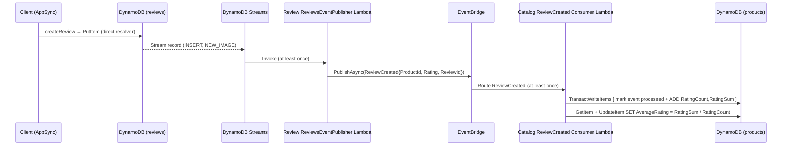

# ADR-0011: Review Bounded Context — Product Ratings Aggregated into Catalog via CDC

## Status
**Proposed** — June 2026

**Superseded** — July 2026 — for §4 (rating aggregation living in Catalog's DynamoDB item) only,
by [ADR-0027](./0027-catalogview-opensearch-product-search-and-rating-sync.md), which moves the
aggregate rating to the new CatalogView service (OpenSearch). §1–3 of this ADR (the `Review`
bounded context, its `reviews` table, and the `ReviewCreated` CDC publisher) remain in effect
unchanged — ADR-0027 consumes the same `ReviewCreatedEvent` this ADR defines.

**Extended** — July 2026 — the "Future Constraints" note below (MODIFY/REMOVE handling, negative
deltas) is fulfilled by [ADR-0029](./0029-review-upsert-composite-key-and-rating-delta.md), which
also changes the `reviews` table's `Id` from a random GUID to a deterministic composite key.

---

## Context

DuckStore has no product-review capability. Customers cannot rate or comment on products, and the storefront has no aggregate rating to display. Adding this touches three architectural concerns that ADR-0000 considers ADR-worthy: a new **bounded context** (DDD structural change), a **cross-service integration flow**, and the **AppSync resolver classification** for the new fields.

The constraints established by prior ADRs shape the available design space:

- **[ADR-0005](./0005-remove-domain-events-cdc-via-dynamodb-streams.md) / [ADR-0008](./0008-extend-cdc-event-publishing-basket-shoppingcarts-stream-publisher.md)** — cross-service integration events MUST be published via DynamoDB Streams → publisher Lambda → EventBridge (CDC). In-process direct publishes are not allowed.
- **[ADR-0009](./0009-appsync-resolver-selection-direct-first-lambda-for-complex-logic.md)** — every new AppSync field starts as a direct DynamoDB resolver; Lambda is an escalation that requires a documented criterion.
- **Each bounded context owns its table.** Catalog owns `products`; another context MUST NOT write to it directly.

The specific design tensions to resolve:

- **Where does a review live?** Reviews are a distinct concept with their own lifecycle, not an attribute of a product — they need their own table and context.
- **Who computes the aggregate rating, and how does it reach the product?** The product's `AverageRating`/`RatingCount` are derived from review data owned by another context. A naive cross-table write from the Review context would violate context ownership.
- **How is the average kept correct and idempotent?** CDC/EventBridge delivery is at-least-once, so a redelivered event must not double-count a review. A stored average that is incremented non-idempotently corrupts on retry.

---

## Decision

Introduce a **`Review` bounded context** with its own `reviews` table. Customers create and read reviews through **direct AppSync DynamoDB resolvers**. The product's aggregate rating is maintained in the Catalog context, fed by a **CDC flow**: a review INSERT triggers a Review-owned Streams publisher Lambda that emits a `ReviewCreated` integration event to EventBridge; a Catalog-owned consumer Lambda applies an **idempotent, incremental** update to the product.

### 1. New bounded context: `Review`

- New `reviews` DynamoDB table, owned exclusively by the Review context.
  - PK `Id` (review GUID); attributes `ProductId`, `UserName`, `Rating` (1–5), `Comment`, `CreatedAt` (ISO-8601).
  - **GSI1** for "reviews of a product": `GSI1PK = ProductId`, `GSI1SK = CreatedAt`, `ProjectionType.ALL` — mirrors the `DynamoOrderRepository` GSI convention.
  - DynamoDB Streams enabled with `StreamViewType = NEW_IMAGE`.
- New `Review.Function` project holds **only** the Streams publisher Lambda (no HTTP/MediatR surface), plus a `Review.DevelopmentDataSeeder` that provisions the table. Reviews are written/read via AppSync (§2), so no command/query Lambda is needed.

### 2. Read/write surface — direct DynamoDB resolvers (ADR-0009)

Both new AppSync fields are classified **Direct** — neither meets an ADR-0009 escalation criterion:

| Field | Direct or Lambda? | Escalation criterion |
|---|---|---|
| `createReview(input)` | **Direct** | — single `PutItem` (writes `Id`, `ProductId`, `UserName`, `Rating`, `Comment`, `CreatedAt`, `GSI1PK`, `GSI1SK`) |
| `reviewsByProduct(productId, pageSize, nextToken)` | **Direct** | — single `Query` on GSI1 by `GSI1PK = productId` |

`createReview` MUST NOT publish an integration event inline — that is the publisher Lambda's job (§3), per ADR-0005/ADR-0009 §5. The product's `averageRating`/`ratingCount` fields are added to the `Product` GraphQL type and default to `0` for products with no reviews yet.

### 3. Rating aggregation — CDC, not cross-context write

The Review context MUST NOT write to the `products` table. Instead the aggregate flows through EventBridge and is applied by Catalog:

- The publisher Lambda (`Review.Function`, plain class triggered by the `reviews` Stream) processes only `INSERT` records, reads `NewImage` `ProductId`/`Rating`/`Id`, and calls `IEventPublisher.PublishAsync(ReviewCreated)`. This follows the table-scoped CDC intent of ADR-0008 while matching the in-project plain-class publisher pattern already used by `Ordering.OrderCreatedPublisherFunction` and `Catalog.CatalogStreamEventPublisherFunction`.
- `ReviewCreated` is defined in the shared `BuildingBlocks.Messaging/Events` (alongside `BasketCheckoutEvent`) so publisher and consumer share one contract.

### 4. Incremental, idempotent aggregation in Catalog

The `products` item carries three derived attributes: `RatingCount`, `RatingSum` (**internal** — never exposed in the GraphQL schema), and the materialized `AverageRating`. The Catalog consumer Lambda:

1. Calls `IIdempotentEventConsumer.ConsumeAsync(evt.Id, [...])` — a `TransactWriteItems` that atomically (a) records the EventBridge event id in `catalog-processed-events` with `attribute_not_exists(PK)`, and (b) `ADD RatingCount :one, RatingSum :rating` on the product (condition `attribute_exists(Id)`). A redelivered event fails the condition and is a no-op, so **counts never double**.
2. Reads the product back and writes `AverageRating = RatingSum / RatingCount` via `UpdateItem SET`. This recompute is idempotent: re-running it rewrites the same value.

This is why `RatingSum` is stored: a DynamoDB update expression cannot compute a running average, but it can atomically accumulate a sum and a count from which the average is derived. Average-on-read was rejected because the requirement is a **materialized** `AverageRating` attribute on the product.

> Product writes MUST preserve the rating attributes. `createProduct` (PutItem) omits them (defaulting to absent → `0`); `updateProduct` uses a partial `UpdateItem SET` of business fields only. The Catalog `DynamoProductRepository.ToItem` MUST NOT write `RatingCount`/`RatingSum`/`AverageRating`, so a full-item write never clobbers the counters maintained by the consumer.

### 5. AppHost wiring

- `Review.DevelopmentDataSeeder` provisions `reviews` (GSI1 + Stream); `review-reviews-event-publisher` Lambda attaches `WithDynamoDBStreamsEventSource("reviews")` and publishes to `duckstore-event-bus`.
- `catalog-review-created-consumer` Lambda is registered under the Catalog wiring; `Catalog.DevelopmentDataSeeder` additionally provisions `catalog-processed-events`.

---

## Applies To

- `src/Services/Review/Review.Function` — new project: Streams publisher Lambda + table schema constants.
- `src/Services/Review/Review.DevelopmentDataSeeder` — new project: provisions `reviews`.
- `src/Services/Catalog/Catalog.Function` — new `ReviewCreatedConsumerFunction`; `Product` + `DynamoProductRepository` gain rating attributes.
- `src/Services/Catalog/Catalog.DevelopmentDataSeeder` — provisions `catalog-processed-events`.
- `src/BuildingBlocks/BuildingBlocks.Messaging/Events/ReviewCreatedEvent.cs` — new shared contract.
- `src/AppHost` — `ReviewExtensions.cs`, `CatalogExtensions.cs`, `Program.cs`, `AppHost.csproj`.
- `src/WebApps/Shopping.Web.SPA.React/graphql` — `schema.graphql`, `resolvers/`, `types.ts`, dev `app/api/graphql/local.ts`.

---

## Consequences

### Positive

- **Context ownership preserved** — Catalog remains the only writer of `products`; Review never reaches across the boundary. Aggregation is decoupled via EventBridge.
- **At-least-once reliable** — the aggregate is driven by CDC (ADR-0005/0008), not an in-process best-effort publish.
- **Idempotent by construction** — the processed-events transaction makes redelivery safe; the average recompute is naturally idempotent.
- **No Lambda sprawl for the write/read path** — `createReview`/`reviewsByProduct` are direct resolvers (ADR-0009), incurring no cold start.

### Negative / Costs

- **Eventual consistency** — `AverageRating`/`RatingCount` lag the review insert by the Stream + EventBridge propagation delay. Acceptable for a storefront rating in a learning project.
- **Two-step consumer write** — the average is materialized by a `GetItem` + `UpdateItem` after the atomic increment; a crash between the increment and the recompute leaves `AverageRating` one review stale until the next event for that product.
- **Extra stored attribute** — `RatingSum` exists only to enable atomic averaging; it must be kept out of the public schema.
- **EventBridge has no local emulation** — the end-to-end aggregation only runs on AWS; local Aspire validates each leg in isolation (same limitation as the existing BasketCheckout → Ordering flow).

### Mitigation Strategies

- The staleness window is self-healing: any subsequent `ReviewCreated` for the same product recomputes `AverageRating` from the authoritative `RatingSum`/`RatingCount`. A periodic reconciliation job could backfill if ever needed, but is out of scope.
- Keep the average computation in a pure, unit-tested function so correctness is verified without the AWS event path.

### Future Constraints

- Review mutation/query fields that exceed a single DynamoDB operation MUST be reclassified against ADR-0009 §2 before implementation.
- Edits/deletions of reviews (not in this ADR) would require the consumer to handle `MODIFY`/`REMOVE` and adjust `RatingSum`/`RatingCount` accordingly; the incremental model already supports negative deltas.

---

## References

- [ADR-0005: Remove In-Process Domain Events — Integration Events via DynamoDB Streams (CDC)](./0005-remove-domain-events-cdc-via-dynamodb-streams.md)
- [ADR-0008: Extend CDC Integration Event Publishing — Basket ShoppingCarts Stream Publisher](./0008-extend-cdc-event-publishing-basket-shoppingcarts-stream-publisher.md)
- [ADR-0009: AppSync Resolver Selection — Direct DynamoDB Resolvers as Default](./0009-appsync-resolver-selection-direct-first-lambda-for-complex-logic.md)
- [ADR-0007: AWS AppSync (GraphQL) as the Client-Facing API](./0007-appsync-graphql-with-direct-dynamodb-resolvers.md)
- [ADR-0004: AWS-First Messaging — EventBridge over MassTransit/RabbitMQ](./0004-aws-first-eventbridge-over-masstransit-rabbitmq.md)
- [ADR-0000: Official Architecture Decision Records Standard](./0000-official-architecture-decisios-records-standard.md)
- `Ordering.OrderCreatedPublisherFunction`, `BasketCheckoutConsumerFunction` — reference implementations for the publisher/consumer Lambda pattern
- `BuildingBlocks.Messaging.Idempotency.DynamoIdempotentEventConsumer` — idempotency primitive
