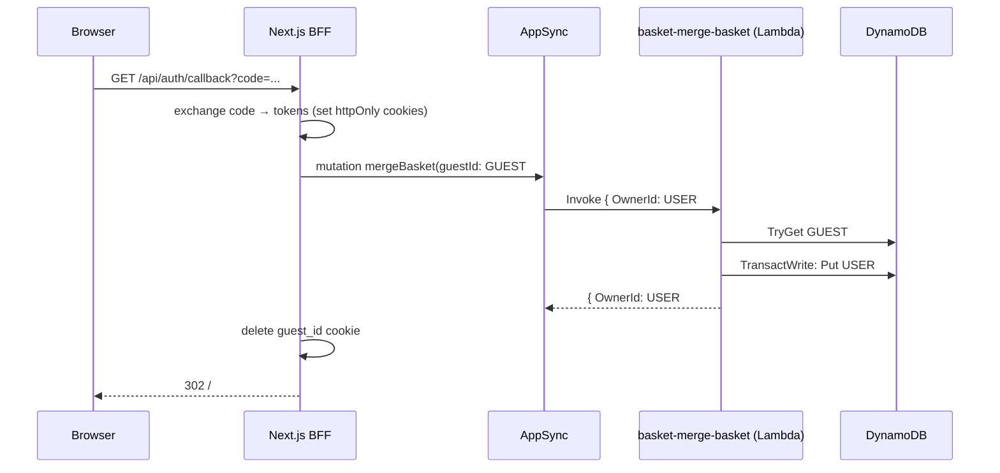

---
tags:
  - status/accepted
  - domain/basket
---

# ADR-0016: Guest Shopping Carts — Unified `ownerId` Identity, API_KEY for Basket Operations, and TTL

## Status
**Accepted** — July 2026. §2's authenticated-branch mechanism amended by [ADR-0041](./0041-bff-opaque-server-side-session-centralized-cognito-refresh.md).

---

## Context

The Basket cart was keyed by `UserName`, a value the client sent in the request payload and that became the `shopping-carts` DynamoDB partition key. This carried three problems:

- **No visitor carts.** Every basket AppSync field required Cognito ([ADR-0007](./0007-appsync-graphql-with-direct-dynamodb-resolvers.md)). An unauthenticated visitor could not persist a cart server-side. The React SPA worked around this by minting a `guest-<uuid>` identity in **`localStorage`** and sending it as `UserName` — exposed to JavaScript and trivially spoofable.
- **Identity logic was scattered.** The decision "authenticated vs guest / Bearer vs API key" lived independently in `api/auth-provider.ts`, the GraphQL route handlers, `cart-context`, and `checkout.service`. Each place re-derived "who is the caller" its own way.
- **No expiry.** Guest carts, once written, lived forever. There was no `TimeToLiveSpecification` on the table, so abandoned visitor carts accumulated indefinitely.

The store needs the standard e-commerce behaviour: a visitor builds a cart before signing in, and that cart follows them into their account at login.

---

## Decision

Introduce a single, server-resolved **`ownerId`** as the cart's identity, resolved only in the Backend-for-Frontend (BFF), and allow basket operations under Cognito **or** API_KEY.

### 1. `ownerId` is the cart identity

The `shopping-carts` partition key is renamed `UserName` → **`OwnerId`**, prefixed by identity type:

| Caller | `ownerId` |
|---|---|
| Authenticated | `USER#<cognito-sub>` |
| Visitor | `GUEST#<guestId>` |

The prefix makes the identity type self-describing in the stored item and prevents collisions between the two namespaces. `OwnerId` propagates through the .NET domain (`ShoppingCart.OwnerId`), the DTOs, the serialized `Data` blob, and the GraphQL schema (`ShoppingCart.ownerId`).

### 2. The BFF is the only place that resolves identity

`resolveOwner()` (`lib/identity.ts`, server-only) is the single source of truth. It reads the httpOnly `access_token` cookie (→ `USER#<sub>`), else the httpOnly `guest_id` cookie (→ `GUEST#<guestId>`), minting a new guest id when absent. The browser NEVER holds or sends an `ownerId`.

- The `/api/graphql` BFF (`app/api/graphql/appsync.ts` for prod, `local.ts` for dev) MUST inject the resolved `ownerId` into the GraphQL variables of basket operations that declare `$ownerId` (`basket`, `storeBasket`, `deleteBasket`) before forwarding. The browser sends the query with no `ownerId`.
- The `guest_id` cookie MUST be `httpOnly`, `SameSite=Lax`, `Secure` in production, `Max-Age` 15 days. It is set on new guest carts and its window slid on guest **writes**.

### 3. Auth mode per basket field

The AppSync API keeps its existing dual auth (Cognito default + API_KEY additional — [ADR-0007](./0007-appsync-graphql-with-direct-dynamodb-resolvers.md)). Basket fields are classified:

| Field | Auth | Owner resolution |
|---|---|---|
| `basket`, `storeBasket`, `deleteBasket` | Cognito **or** API_KEY | Resolver derives `USER#<sub>` from `ctx.identity`; for API_KEY it validates the BFF-injected `GUEST#`-prefixed `ownerId` |
| `checkoutBasket` | Cognito **only** | Resolver derives `USER#<sub>` and `CustomerId` from `ctx.identity` |
| `mergeBasket` | Cognito **only** | Resolver derives `USER#<sub>`; the BFF supplies the `GUEST#<guestId>` |

The identity rule is enforced in the **resolver**, not by AppSync's native auth. AppSync only answers "is the token/key valid?" — the `USER#`↔Cognito / `GUEST#`↔API_KEY binding is resolver logic:

**Correct** — derive for Cognito, validate the prefix for API_KEY guests:

```js
// graphql/resolvers/Query.basket.js
function resolveOwnerId(ctx) {
  if (ctx.identity && ctx.identity.sub) return `USER#${ctx.identity.sub}`
  const ownerId = ctx.args.ownerId
  if (!ownerId || !ownerId.startsWith('GUEST#')) util.unauthorized()
  return ownerId
}
```

**Incorrect** — trusting a client-supplied ownerId for an authenticated caller (lets a user read another user's cart):

```js
// ⛔ never key on ctx.args.ownerId when ctx.identity is present
return { operation: 'GetItem', key: { OwnerId: util.dynamodb.toDynamoDB(ctx.args.ownerId) } }
```

### 4. Guest carts expire; user carts do not

The `shopping-carts` table enables DynamoDB TTL on an **`ExpiresAt`** attribute (epoch seconds). `StoreCart` writes `ExpiresAt = now + 15 days` **only** when `OwnerId` starts with `GUEST#`; user carts omit the attribute, so TTL never reaps them. Expiry is **sliding**: renewed on each guest write, never by a fixed TTL clock, and never on reads.

### 5. Login triggers an idempotent merge

Checkout is Cognito-only, so a visitor MUST log in to check out — which is exactly when the merge runs. After the PKCE callback exchanges tokens, the BFF calls the `mergeBasket` mutation with the `guest_id` cookie, then deletes that cookie.



The merge is idempotent: it combines items by `ProductId`+`Color` (no duplicate lines) and deletes the guest cart in one `TransactWriteItems` conditioned on `attribute_exists(OwnerId)`. A retry after a partial failure (guest cart already gone) cancels the transaction and is treated as already-merged. A missing guest cart is a no-op.

### 6. Trust model

The API_KEY is a server-only secret held exclusively by the BFF; it is never shipped to the browser. For a guest request, AppSync cannot independently verify that the `GUEST#<guestId>` belongs to the caller — it trusts that the BFF resolved it from the httpOnly cookie. This is acceptable because: (a) the key is a BFF secret, (b) the BFF is a trusted component, and (c) guest carts hold no sensitive data (no payment, no address — those enter only at Cognito-authenticated checkout). **Anyone holding the API_KEY can read/write any `GUEST#` cart.**

---

## Applies To

- `src/Services/Basket/Basket.Function` — `OwnerId` rename, guest TTL in `BasketRepository`, new `Features/MergeBasket` (Lambda `basket-merge-basket`), `TryGetBasket`.
- `src/BuildingBlocks/BuildingBlocks.Messaging` — `BasketCheckoutEvent.OwnerId`; the Ordering consumer maps `OrderName` from `EmailAddress` (OwnerId is now a technical id).
- `src/WebApps/Shopping.Web.SPA.React` — `lib/identity.ts`, `lib/basket-bff.ts`, the `/api/graphql` BFF, the auth callback merge, and removal of the `localStorage` guest identity.
- `infra/constructs/basket-dynamodb.ts` — PK `OwnerId` + `timeToLiveAttribute: 'ExpiresAt'`.
- `infra/constructs/appsync-api.ts` — `basket-merge-basket` data source + resolver.

---

## Consequences

### Positive

- **Visitor carts work** and survive across sessions via the httpOnly guest cookie — no `localStorage`, no JS-exposed identity.
- **One identity boundary.** Every basket path resolves the owner in `resolveOwner()`; no route/service re-derives it.
- **Abandoned carts self-clean** via TTL at no compute cost; user carts are never touched.
- **Seamless login** — the guest cart merges into the account with no duplicate lines, idempotently.
- **Semantically correct naming** — `ownerId` reflects that the value is a prefixed identity, not a username.

### Negative / Costs

- **API_KEY widens the guest trust boundary** — anyone with the key can access any guest cart (see §6). Mitigated by keeping the key server-only and storing no sensitive data in guest carts.
- **BFF variable injection is a new responsibility** — the `/api/graphql` handlers now parse and rewrite request bodies; a bug there breaks basket auth. Mitigated by centralizing it in `prepareBasketRequest`.
- **Two owner-resolution mechanisms** — prod injects `ownerId` into variables (AppSync API_KEY has no identity); dev passes the owner via Yoga context. Both are driven by the same `resolveOwner()`.
- **Sliding TTL adds a write only on modification** — reads never write, so the cost is bounded to cart changes.

### Mitigation Strategies

- Keep all identity resolution in `lib/identity.ts` and injection in `lib/basket-bff.ts`; resolvers only derive/validate, never trust a client `ownerId` when `ctx.identity` is present.
- Review the §3 auth table at PR time: any new basket field must state its auth mode and owner-resolution rule.
- Guest carts must never store payment/address data; that remains gated behind Cognito-only `checkoutBasket`.

### Future Constraints

- New basket fields MUST resolve `ownerId` through the BFF/resolver pattern; a field that accepts a client-trusted `ownerId` under Cognito is a policy violation.
- If guest carts ever need to hold sensitive data, this ADR's trust model (§6) must be revisited — likely replacing API_KEY with a signed, per-guest token.

---

## Related Documentation

- [ADR-0007: AppSync GraphQL — Direct DynamoDB Resolvers, Lambda for Business Logic](./0007-appsync-graphql-with-direct-dynamodb-resolvers.md)
- [ADR-0009: AppSync Resolver Selection — Direct-First, Lambda for Complex Logic](./0009-appsync-resolver-selection-direct-first-lambda-for-complex-logic.md)
- [ADR-0008: Extend CDC Event Publishing — Basket ShoppingCarts Stream Publisher](./0008-extend-cdc-event-publishing-basket-shoppingcarts-stream-publisher.md)
- [ADR-0012: Merge Discount into Basket — Coupon as In-Process Entity](./0012-merge-discount-into-basket-coupon-as-in-process-entity.md)
- [ADR-0003: Adoption of Zero-Trust Security Model](./0003-adoption-of-zero-trust-security-model.md)
- [ADR-0000: Official Architecture Decision Records Standard](./0000-official-architecture-decisios-records-standard.md)

## References

- AWS AppSync — multiple authorization modes (Cognito User Pools + API Key)
- Amazon DynamoDB — Time to Live (TTL)
