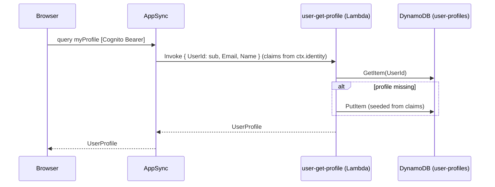

# ADR-0017: User Bounded Context — Cognito as IdP-Only, Profile Data Owned by the User Service, Lazy Provisioning

## Status
**Proposed** — July 2026

---

## Context

Authentication in the SPA is split between a real path and a fake one:

- The **Cognito Hosted UI PKCE flow already exists** end-to-end (`/api/auth/{login,callback,logout,me}` + `loginWithCognito()`), but no button is wired to it.
- The login/register buttons instead open a **local modal** (`auth-modal` → `login-form`/`register-form` → `auth.service`) that simulates accounts in `localStorage`. This is demo scaffolding, not authentication.

There is also **no owner of customer profile data**. Cognito holds only the essentials (email + password); there is no place for a display name, phone, or shipping address. The checkout form re-collects the address on every purchase, and `/my-profile` can only show the Cognito email/name.

We need: (1) real login/registration exclusively through the Hosted UI, deleting the simulated auth; and (2) a home for extended profile data that stays out of Cognito.

---

## Decision

Introduce a **`User` bounded context** that owns customer profile data, with **Cognito as an identity provider only**.

### 1. Ownership split

| Data | Owner |
|---|---|
| Credentials: email, password | **Cognito** (user pool `duckstore-users` — the customer/Shopping pool; staff sign in through a separate `duckstore-management-users` pool, out of scope for this ADR) |
| Profile: name, phone, addressLine, city, state, zipCode, country | **User service** (`user-profiles` table) |

Cognito holds only the sign-in credentials (email + password). Its schema is **left untouched** — Cognito does not allow modifying a live pool's standard attributes (an in-place add of a required `name` attribute is rejected with `Invalid AttributeDataType`), and standard attributes are fixed at pool creation. All profile data, **including the display name**, lives in the User service. `name` is seeded from the token's `email` claim on first access and is editable via `updateProfile`. Cognito MUST NOT be extended with custom profile attributes.

### 2. New service `src/Services/User/User.Function`

Mirrors `Catalog.Function` (Amazon.Lambda.Annotations + DynamoDB + MediatR). Table `user-profiles`, **partition key `UserId` = Cognito `sub` (raw, no prefix)** — the profile is always authenticated, exactly like Ordering's `CustomerId` ([ADR-0010](./0010-collapse-ordering-into-single-function-single-item-model.md)), and unlike the basket's prefixed `OwnerId` ([ADR-0016](./0016-guest-basket-owner-id-identity-api-key-and-ttl.md)) which must distinguish guests.

### 3. Lazy provisioning (no event pipeline)

The profile record is created **on first authenticated read** (`myProfile`), seeded from the token claims — NOT via a Cognito Post-Confirmation → EventBridge pipeline. The Post-Confirmation trigger keeps its single responsibility (add to the `Customer` group).



Why lazy over event-driven: no eventual-consistency window (the profile exists the moment it's first needed), no extra SQS/DLQ consumer to operate, and the trigger stays decoupled from the User service's schema. The trade-off — the record doesn't exist until first login/profile access — is irrelevant because nothing reads a profile before the user is authenticated.

### 4. Resolver classification (per [ADR-0009](./0009-appsync-resolver-selection-direct-first-lambda-for-complex-logic.md))

Both fields are **Cognito-only** (no `@aws_api_key`). Identity is always derived from `ctx.identity.sub` — the client never supplies a user id.

| Field | Resolver | Justification |
|---|---|---|
| `myProfile: UserProfile!` | **Lambda** (`user-get-profile`) | Criterion 1 — read then conditional create (GetItem → seed+Put if absent). Not a single DynamoDB operation. |
| `updateProfile(input): UserProfile!` | **Direct** DynamoDB `UpdateItem` | Single upsert keyed by `ctx.identity.sub`, `ReturnValues: ALL_NEW`. `email` is Cognito-owned and excluded from the input. |

**Correct** — the Lambda resolver passes the identity claims, never a client-supplied id:

```js
// graphql/resolvers/Query.myProfile.js
export function request(ctx) {
  if (!ctx.identity || !ctx.identity.sub) util.unauthorized()
  return {
    operation: 'Invoke',
    payload: {
      UserId: ctx.identity.sub,
      Email: ctx.identity.claims.email,
      Name: ctx.identity.claims.name ?? ctx.identity.claims.email,
    },
  }
}
```

### 5. Simulated auth is removed

The local `auth-modal`/`login-form`/`register-form`/`auth.service`/`auth-validation` are deleted. Login/registration go exclusively through the Hosted UI (`/api/auth/login`, with a `screen=signup` variant targeting the Cognito sign-up page). `AuthProvider` keeps only the Cognito path (`/api/auth/me`, `loginWithCognito`, `logout`).

---

## Applies To

- `src/Services/User/User.Function` + `src/Services/User/User.DevelopmentDataSeeder` (new).
- `src/AppHost` — `UserExtensions.cs`, `Program.cs`.
- `infra` — `constructs/user-dynamodb.ts`, `constructs/user-lambdas.ts`, `stacks/user-stack.ts`, `bin/app.ts`, `constructs/appsync-api.ts`, `constructs/appsync-auth.ts` (add `name` attribute).
- `src/WebApps/Shopping.Web.SPA.React` — delete simulated auth; wire Hosted UI login/signup; add `myProfile`/`updateProfile`; pre-fill checkout.

---

## Consequences

### Positive

- **Real authentication.** One code path (Cognito Hosted UI); the misleading `localStorage` simulation is gone.
- **Clear ownership.** Cognito = credentials; User service = profile. No profile data smeared into Cognito custom attributes.
- **Reusable profile.** Checkout pre-fills name/address; future features (saved addresses, preferences) have a home.
- **Simplest robust provisioning.** Lazy creation needs no event bus, no consumer, no idempotency ledger, and has no consistency gap.

### Negative / Costs

- **`myProfile` is a Lambda** (cold start on first call) — justified by the read-then-conditional-create shape.
- **A new service to operate** — another `.Function`, seeder, table, stack, and AppSync data sources.
- **Local dev parity is limited** — profile is Cognito-only, so locally (no real Cognito) it falls back to the BFF-resolved owner, same limitation as local checkout ([ADR-0016](./0016-guest-basket-owner-id-identity-api-key-and-ttl.md)).

### Mitigation Strategies

- Keep the `user-get-profile` Lambda minimal (GetItem → seed+Put → return); no MediatR sprawl beyond the single command.
- `email`/`name` stay Cognito-authoritative: `updateProfile` never edits `email`; `myProfile` reseeds only when the record is absent.

### Future Constraints

- If profile creation ever needs to happen **before** first login (e.g. welcome email at signup), revisit this ADR to add the Post-Confirmation → EventBridge → User consumer path (with SQS/DLQ per [ADR-0015](./0015-sqs-dlq-for-cdc-publishers-and-eventbridge-consumers.md)).
- New profile fields extend the `user-profiles` item and the `UpdateProfileInput`; the PK stays `UserId` = `sub`.

---

## Related Documentation

- [ADR-0016: Guest Shopping Carts — Unified ownerId Identity, API_KEY, and TTL](./0016-guest-basket-owner-id-identity-api-key-and-ttl.md)
- [ADR-0009: AppSync Resolver Selection — Direct-First, Lambda for Complex Logic](./0009-appsync-resolver-selection-direct-first-lambda-for-complex-logic.md)
- [ADR-0007: AppSync GraphQL — Direct DynamoDB Resolvers, Lambda for Business Logic](./0007-appsync-graphql-with-direct-dynamodb-resolvers.md)
- [ADR-0010: Collapse Ordering into a Single Function, Single-Item Model](./0010-collapse-ordering-into-single-function-single-item-model.md)
- [ADR-0000: Official Architecture Decision Records Standard](./0000-official-architecture-decisios-records-standard.md)

## References

- Amazon Cognito — Hosted UI, user pool standard attributes, OAuth `profile` scope
- AWS AppSync — `ctx.identity` for Cognito User Pools authorization
