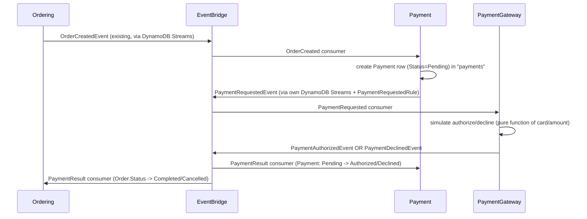

# ADR-0025: Payment Bounded Context — Simulated Gateway via Fully Async EventBridge/CDC

## Status
**Accepted** — July 2026

---

## Context

`Ordering.Function` creates an `Order` from a checked-out basket and publishes `OrderCreatedEvent`
via CDC ([ADR-0005](./0005-remove-domain-events-cdc-via-dynamodb-streams.md)), but nothing ever
advances the order past its initial status — there is no payment step. `Order.Status` today only
moves `Draft -> Pending`; `Completed`/`Cancelled` exist in the enum but nothing ever sets them.

We're introducing a new **Payment** bounded context to close that gap:

- `src/Services/Payment/Payment.Function` — orchestrates payment processing for an order.
- `src/Services/PaymentGateway/PaymentGateway.Function` — coordinates with a (simulated) payment
  gateway.

This is a structural domain (new bounded context) and service-to-service-communication decision,
so it warrants an ADR per [ADR-0000](./0000-official-architecture-decisios-records-standard.md).
No Payment code exists anywhere in the repo today — this is new ground, built by mirroring
`Ordering.Function` (the project's reference implementation) and reusing
`BuildingBlocks.Messaging`'s existing CDC/EventBridge/idempotency primitives as-is.

---

## Decision

### 1. Two-Lambda split, never merged

`Payment.Function` is a **stateful orchestrator** owning the `Payment` aggregate: its own DynamoDB
table (`payments`) and its own idempotency inbox (`payment-processed-events`), following the same
single-item-per-aggregate design as `DynamoOrderRepository`.

`PaymentGateway.Function` is a **stateless simulated gateway**: no DynamoDB table, no repository,
no idempotency inbox. The authorize/decline decision is a pure function of `(CardNumber, Amount)`,
so reprocessing a duplicate EventBridge delivery is harmless — `Payment.Function`'s own consumer is
the one with the idempotency guard against double-applying a result.

The two are never folded into one project. The Payment/PaymentGateway boundary is deliberately kept
a separate deployable Lambda project because it is the seam where a real payment provider
integration (Stripe, Adyen, etc.) would later slot in — keeping it a distinct unit, even simulated,
is the pedagogical point of this split.

### 2. Fully async EventBridge/CDC hand-off, no direct invoke

Payment.Function and PaymentGateway.Function communicate exclusively via EventBridge, never via
the AWS Lambda Invoke API. This follows
[ADR-0012](./0012-merge-discount-into-basket-coupon-as-in-process-entity.md)'s precedent: it
removed a synchronous Basket → Discount invoke specifically because per-call cross-service
invocation added latency and cold-start risk with no independent-scaling benefit. CDC/EventBridge
is this repo's established integration pattern
([ADR-0005](./0005-remove-domain-events-cdc-via-dynamodb-streams.md),
[ADR-0019](./0019-module-oriented-service-structure-and-rule-based-stream-publishers.md)), and the
same reasoning applies here — a synchronous Payment ↔ PaymentGateway call would reintroduce the
exact coupling ADR-0012 removed.

### 3. Event flow and contracts

- `Ordering` (DynamoDB Streams, `INSERT` on `Order`) publishes `OrderCreatedEvent` — **existing,
  unchanged**. `Payment.Function`'s `OrderCreated` consumer creates a `Payment` row
  (`Status=Pending`) in `payments`, idempotent via the inbox pattern (same
  `TransactWriteItems`-with-conditional-put shape as `Ordering`'s `BasketCheckoutConsumer`).
- `Payment.Function`'s own `payments` table has DynamoDB Streams enabled. A `PaymentRequestedRule`
  (`IStreamRule<PaymentStreamImage>`) matches `INSERT` of a `Pending` payment and publishes a new
  `PaymentRequestedEvent(PaymentId, OrderId, CustomerId, Amount, CardNumber, Expiration, Cvv,
  PaymentMethod)`.
- `PaymentGateway.Function` consumes `PaymentRequestedEvent`, runs a deterministic simulated
  decision (decline if `CardNumber` ends with `"0000"`, or `Amount > 10_000`; otherwise authorize
  with a fabricated `"SIM-{Guid}"` authorization code), and publishes directly — no persistence on
  the gateway side — either `PaymentAuthorizedEvent(PaymentId, OrderId, AuthorizationCode)` or
  `PaymentDeclinedEvent(PaymentId, OrderId, DeclineReason)`.
- Both result events are independently consumed by **two** separate subscribers, each with its own
  EventBridge rule and idempotency inbox: `Payment.Function`'s `PaymentResult` consumer (transitions
  the `Payment` row `Pending -> Authorized/Declined`) and `Ordering.Function`'s new `PaymentResult`
  consumer (transitions `Order.Status -> Completed/Cancelled` via new `Order.MarkCompleted()` /
  `Order.MarkCancelled()` methods). This "one event, N independent consumers" shape mirrors how
  `OrderCreatedEvent` itself could gain other subscribers — no new pattern is introduced.
- All three new event contracts are added to `BuildingBlocks.Messaging/Events/` as flat-property
  records deriving from `IntegrationEvent`, matching `OrderCreatedEvent`'s style (`int` for enums).

### 4. Simulated-gateway rationale

`PaymentGateway.Function` integrates with **no real payment provider** — no real credentials, no
PCI scope. This is appropriate for DuckStore, which `CLAUDE.md` describes explicitly as "a
learning/demo project, not production software." The decision rule is deterministic and documented
in code (`SimulatedGatewayDecision`), not configuration, since it exists purely to illustrate the
authorize/decline branch, not to model real fraud logic.

### 5. Non-binding observation (flagged for a future ADR)

`Ordering.Function`'s own `Domain/ValueObjects/Payment.cs` value object and
`Domain/Enums/PaymentMethod.cs` become redundant now that `Payment.Function` is the real owner of
payment lifecycle and card data. Simplifying or removing Ordering's copy is **out of scope** for
this ADR and left for a follow-up decision.

---

## Applies To

- New: `src/Services/Payment/Payment.Function`, `src/Services/Payment/Payment.DevelopmentDataSeeder`,
  `src/Services/PaymentGateway/PaymentGateway.Function`
- `src/BuildingBlocks/BuildingBlocks.Messaging/Events` (three new event records:
  `PaymentRequestedEvent`, `PaymentAuthorizedEvent`, `PaymentDeclinedEvent`)
- `src/Services/Ordering/Ordering.Function` (new `PaymentResult` consumer,
  `Order.MarkCompleted()`/`Order.MarkCancelled()`)
- `src/AppHost` (new `PaymentExtensions.cs`; edits to `OrderingExtensions.cs`, `Program.cs`,
  `AppHost.csproj`)
- `DuckStore.slnx`
- `infra/` (CDK stacks/constructs for Payment and PaymentGateway) — flagged as a follow-up pass,
  not landed in the same change as the local-dev (Aspire) wiring; see
  [ADR-0015](./0015-sqs-dlq-for-cdc-publishers-and-eventbridge-consumers.md) for this repo's
  history of infra-parity gaps being caught late.

---

## Consequences

### Positive
- The end-to-end order lifecycle now closes (`Pending -> Completed/Cancelled`) with no synchronous
  coupling between Ordering, Payment, and the gateway; each service can fail, scale, and deploy
  independently.
- The Payment/PaymentGateway boundary is realistic groundwork for swapping in a real provider later
  without touching `Payment.Function`'s orchestration logic.
- Reuses 100% of existing `BuildingBlocks.Messaging` primitives (`IStreamRule`,
  `StreamRuleDispatcher`, `IIdempotentEventConsumer`, `IEventPublisher`) with zero changes to that
  shared code.

### Negative / Costs
- More moving parts for a conceptually simple payment step — six new/changed Lambdas across three
  services for what a monolith would do in one transaction.
- Eventual consistency means an `Order` can sit in `Pending` for an observable (if short) window
  after checkout while payment is processed asynchronously.
- The simulated gateway's card-suffix/amount-threshold rules have no relation to real
  fraud/authorization logic and must not be mistaken for a template for production payment
  handling.

### Mitigation Strategies
- Keep the simulated decision rule isolated in one small, well-named class
  (`SimulatedGatewayDecision`) so it is obviously swappable.
- Keep `PaymentGateway.Function` stateless so a future real-provider integration only needs to
  change that one Lambda's internals, not the eventing topology.
- Document the Ordering/Payment `Payment` value-object redundancy explicitly (Decision §5) so it
  isn't forgotten in a future cleanup pass.

---

## References
- [ADR-0000: Official Architecture Decision Records Standard](./0000-official-architecture-decisios-records-standard.md)
- [ADR-0004: AWS-First — EventBridge over MassTransit/RabbitMQ](./0004-aws-first-eventbridge-over-masstransit-rabbitmq.md)
- [ADR-0005: Remove Domain Events — CDC via DynamoDB Streams](./0005-remove-domain-events-cdc-via-dynamodb-streams.md)
- [ADR-0009: AppSync Resolver Selection — Direct-First, Lambda for Complex Logic](./0009-appsync-resolver-selection-direct-first-lambda-for-complex-logic.md)
- [ADR-0011: Review Bounded Context — Rating Aggregation via CDC](./0011-review-bounded-context-rating-aggregation-via-cdc.md)
- [ADR-0012: Merge Discount into Basket — Coupon as an In-Process Entity](./0012-merge-discount-into-basket-coupon-as-in-process-entity.md)
- [ADR-0015: SQS DLQ for CDC Publishers and EventBridge Consumers](./0015-sqs-dlq-for-cdc-publishers-and-eventbridge-consumers.md)
- [ADR-0019: Module-Oriented Service Structure and Rule-Based Stream Publishers](./0019-module-oriented-service-structure-and-rule-based-stream-publishers.md)
- [ADR-0021: Fail-Fast EventBridge Publishing on AWS](./0021-fail-fast-eventbridge-publishing-on-aws.md)
- [ADR-0024: Testing Strategy and Minimum Coverage Standard](./0024-testing-strategy-minimum-coverage.md)
