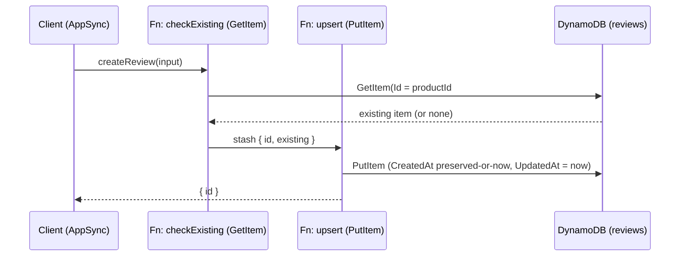

# ADR-0029: Review Upsert — Composite Key and Rating-Delta Aggregation

## Status
**Proposed** — July 2026

**Partially superseded** by [ADR-0037](./0037-review-key-cognito-userid-not-client-username.md)
(July 2026): §1's key-composition scheme, `${productId}#${base64(userName)}`, is replaced by
`${productId}#${ctx.identity.sub}` (no encoding) to close an authorization gap — `userName` was
client-supplied and unverified. Everything else below (upsert mechanics, sort-order stability,
pipeline-resolver shape, rule-based Streams publisher, CatalogView rating-delta aggregation)
remains in effect and is unaffected.

Fulfills [ADR-0011](./0011-review-bounded-context-rating-aggregation-via-cdc.md)'s own anticipated
"Future Constraint": *"Edits/deletions of reviews... would require the consumer to handle
MODIFY/REMOVE and adjust RatingSum/RatingCount accordingly; the incremental model already supports
negative deltas."* Adds a sibling Painless script/consumer to
[ADR-0027](./0027-catalogview-opensearch-product-search-and-rating-sync.md) without touching its
existing `ReviewCreated`/`ApplyRatingAsync` path. Clarifies
[ADR-0009](./0009-appsync-resolver-selection-direct-first-lambda-for-complex-logic.md) §2 criterion
1's scope (see §6 below).

Note on numbering: ADR-0028 is already claimed by an in-flight, uncommitted Pricing
(`PaymentHighlightsChangedEvent`) feature, so this decision is recorded as ADR-0029.

---

## Context

Today, `createReview` (an AppSync direct DynamoDB resolver in the `Review` bounded context,
ADR-0011) always inserts a brand-new row keyed by a random GUID. Nothing in the schema, resolver,
or `reviews` table prevents the same customer from submitting unlimited reviews for the same
product — there is no notion of "the customer's review" as a single, editable entity.

The business requirement: each customer gets exactly one active review per product. Resubmitting a
review for a product they've already reviewed must update (upsert) the existing rating/comment
rather than create a duplicate, and the CatalogView aggregate rating (ADR-0027) must reflect an
edit's rating delta immediately — a genuinely new review still does `ratingCount+1`,
`ratingSum += rating`; an edit does `ratingCount` unchanged, `ratingSum += (newRating - oldRating)`.

This touches the same three ADR-0000 concerns ADR-0011 did: a change to the `reviews` table's key
structure (structural), a new CDC event and OpenSearch aggregation path (cross-service
integration), and a genuinely new AppSync resolver pattern (resolver classification).

---

## Decision

Enforce the one-review-per-customer-per-product invariant **structurally**, at the DynamoDB key
level, rather than with an application-level uniqueness check — and drive CatalogView's rating
recompute off the DynamoDB Streams `MODIFY` record this produces, the same CDC mechanism ADR-0011
already established for `INSERT`.

### 1. Composite key replaces the random GUID

The `reviews` table's `Id` becomes a deterministic string:

```
Id = "${productId}#${base64(userName)}"
```

`ProductId` is always a GUID and never collides with the `#` separator; `UserName` is an arbitrary
user-supplied display name, so it is base64-encoded to rule out a `#` in the username colliding
with the separator. Plain (not URL-safe) base64 is sufficient — this is a DynamoDB key, never a URL
segment — and matches AppSync JS's `util.base64Encode` and Node's `Buffer.toString('base64')`
exactly, so the AppSync JS pipeline resolver (§3) and the local dev GraphQL backend
(`app/api/graphql/local.ts`) compute byte-identical ids with no shared code path between them.

A `PutItem` on this key is naturally an upsert: a repeat submission by the same customer for the
same product overwrites the existing row instead of creating a new one. No additional GSI or
conditional-write logic is needed — the uniqueness constraint *is* the partition key.

### 2. Sort order is stable across edits

`GSI1SK` (used by `reviewsByProduct`, `GSI1PK=ProductId`) stays pinned to the review's **original**
`CreatedAt`, recovered from the existing item before the upsert — editing a review must never
reorder the product's review list. A new `UpdatedAt` attribute (ISO-8601) is added, exposed on the
GraphQL `Review` type, for display only.

### 3. `createReview` becomes a pipeline resolver

No pipeline resolver exists anywhere in this codebase today — every AppSync resolver is a
single-function unit resolver against one data source. `createReview` is the first:



- **Function 1** (`Mutation.createReview.checkExisting.js`) computes the composite id and issues a
  `GetItem`, stashing the existing item (or `null`) and the id for function 2.
- **Function 2** (`Mutation.createReview.upsert.js`) issues the `PutItem`: `CreatedAt` is preserved
  from the existing item if present, else set to now; `UpdatedAt` is always set to now; `GSI1SK`
  stays derived from `CreatedAt`, never `UpdatedAt`.
- The top-level `Mutation.createReview.js` is a thin pass-through (`response` returns
  `ctx.prev.result`).

### 4. Rule-based Streams publisher (adopts ADR-0019)

The `reviews` table's Streams view type widens from `NEW_IMAGE` to `NEW_AND_OLD_IMAGES` so the
publisher can diff old/new rating on an edit. `Review.Function`'s publisher, previously a single
inline `if (EventName != "INSERT") continue` check, adopts the `IStreamRule<TImage>` +
`StreamRuleDispatcher<TImage>` pattern ADR-0019 already established for Catalog:

- `ReviewCreatedRule` — fires on `INSERT`, publishes `ReviewCreatedEvent` (unchanged from ADR-0011).
- `ReviewUpdatedRule` — fires on `MODIFY`, publishes a new `ReviewUpdatedEvent`. It fires
  **unconditionally** on `MODIFY`, even when the rating itself didn't change (a comment-only edit):
  this event is also what drives ISR revalidation of the product page's review list (§5), so
  suppressing it on a zero rating delta would silently break comment-edit cache invalidation. A
  zero delta is a harmless no-op on the CatalogView side (§5).

```csharp
public record ReviewUpdatedEvent : IntegrationEvent
{
    public string ReviewId { get; set; }
    public Guid ProductId { get; set; }
    public int OldRating { get; set; }
    public int NewRating { get; set; }
}
```

`ReviewCreatedEvent.ReviewId` changes from `Guid` to `string` in the same change — once `Id` is a
composite string, it is no longer `Guid`-parseable, and the `INSERT` publisher needs to populate it
without throwing. No consumer depended on it being a `Guid` (only test fixtures referenced it).

### 5. CatalogView: rating-delta aggregation

A sibling consumer, `ReviewUpdateAggregateHandler`, consumes `ReviewUpdatedEvent` and calls a new
`IProductSearchIndex.ApplyRatingUpdateAsync`, mirroring ADR-0027's `ApplyRatingAsync` but for the
edit path — `ratingCount` is untouched; `ratingSum` moves by `(newRating - oldRating)`:

```painless
if (ctx._source.lastRatingEventId == params.eventId) {
    ctx.op = 'none';
} else {
    ctx._source.ratingSum = (ctx._source.ratingSum ?: 0) + (params.newRating - params.oldRating);
    ctx._source.averageRating = (ctx._source.ratingCount ?: 0) == 0
        ? 0
        : (double) ctx._source.ratingSum / ctx._source.ratingCount;
    ctx._source.lastRatingEventId = params.eventId;
}
```

The idempotency guard (`lastRatingEventId`) is the same single-scalar marker ADR-0027 introduced —
shared across both the create and update scripts, since it only needs to dedupe the single
most-recently-applied event regardless of type. The `ratingCount == 0` branch is defensive
insurance against a `MODIFY` being processed before its corresponding `INSERT` under out-of-order
CDC delivery (two independent consumer Lambdas, at-least-once, no ordering guarantee) — it
shouldn't be reachable given the composite-key uniqueness invariant (an edit implies a prior
insert), but is cheap to guard against.

### 6. Clarifying ADR-0009 §2 criterion 1's scope

`createReview`'s two-function pipeline (GetItem, then PutItem — both DynamoDB operations on the
same table/aggregate, no Lambda, no EventBridge publish, no cross-aggregate transaction) stays
**Direct** per ADR-0009. This is a deliberate narrowing: criterion 1 ("business logic beyond what
the schema enforces — e.g. a conditional write that depends on a prior read's result") could be
misread as covering this case, since the `PutItem`'s `CreatedAt` value literally depends on the
prior `GetItem`'s result. The intent of criterion 1 is business-rule branching (e.g. Discount
eligibility) — not a same-table, same-aggregate "read a field forward so it isn't clobbered"
pattern, which is fully expressible as DynamoDB-native operations with no external system involved.
Future resolvers with a similar shape (read-then-preserve-a-field, same table, no side effects)
should also stay Direct-via-pipeline; a resolver that branches its write on *business* conditions
found in the prior read still requires Lambda escalation.

### 7. ISR revalidation

The revalidator Lambda (`revalidator/index.mjs`) and its EventBridge rule (`sst.config.ts`) add
`ReviewUpdatedEvent` alongside `ReviewCreatedEvent`, both mapping to the `reviews:{productId}` tag —
otherwise an edited review's comment/rating stays cached indefinitely on `/products/[id]`.

---

## Applies To

- `infra/constructs/review-dynamodb.ts`, `src/Services/Review/Review.DevelopmentDataSeeder/DynamoTableInitializer.cs` — `NEW_AND_OLD_IMAGES` stream view type.
- `src/Services/Review/Review.Function` — `ReviewSchema.ComposeId`, widened `ReviewStreamImage`, new `Rules/ReviewCreatedRule.cs`/`Rules/ReviewUpdatedRule.cs`, `Endpoint.cs` (replaces the old inline `Functions.cs` publisher).
- `src/BuildingBlocks/BuildingBlocks.Messaging/Events/ReviewUpdatedEvent.cs` (new); `ReviewCreatedEvent.ReviewId` type change.
- `src/Services/CatalogView/CatalogView.Function` — new `EventsIntegration/Consumers/ReviewUpdated/` (`Handler.cs`/`Endpoint.cs`); `IProductSearchIndex`/`OpenSearchProductIndex.ApplyRatingUpdateAsync`.
- `src/AppHost/ReviewExtensions.cs`, `src/AppHost/CatalogViewExtensions.cs` — updated/new Lambda handler wiring.
- `infra/constructs/appsync-api.ts` — new `pipelineResolver` helper.
- `src/WebApps/Shopping.Web.SPA.React/graphql/` — `schema.graphql`, `types.ts`, `resolvers/Mutation.createReview*.js`, `resolvers/Query.reviewsByProduct.js`.
- `src/WebApps/Shopping.Web.SPA.React/app/api/graphql/local.ts`, `revalidator/index.mjs`, `sst.config.ts`.

---

## Consequences

### Positive

- **Structural uniqueness** — "one review per customer per product" is enforced by the DynamoDB key itself, not an application-level check that could race or be bypassed.
- **No new GSI or conditional-write complexity** — the composite key makes every `createReview` call an upsert for free.
- **Consistent CDC model** — edits flow through the same Streams → EventBridge → consumer path ADR-0011 established for creates, just via `MODIFY` instead of `INSERT`.
- **Rule-based publisher** — adopting ADR-0019's pattern here makes `Review.Function`'s publisher unit-testable (`Match`/`BuildAsync` per rule) and consistent with Catalog/Pricing/Payment.

### Negative / Costs

- **First pipeline resolver in this repo** — a genuinely new CDK/AppSync pattern (`AppsyncFunction` + `pipelineConfig`), with no local precedent to copy; AppSync JS pipeline resolvers also have no local emulation, so this logic is only exercised end-to-end against real AppSync (the local dev Yoga backend re-implements the same upsert imperatively, but doesn't validate the deployed pipeline resolver itself).
- **`ReviewId` type change** (`Guid` → `string`) on `ReviewCreatedEvent` and the new `ReviewUpdatedEvent` — a breaking contract change, low risk since no known consumer parsed it as a `Guid`, but still a compatibility break for any external consumer not tracked in this repo.
- **Two independent consumer Lambdas, no ordering guarantee** — a `ReviewUpdatedEvent` could in principle be processed before its corresponding `ReviewCreatedEvent` under CDC's at-least-once, unordered delivery, which is why `ApplyRatingUpdateAsync`'s script defensively guards `ratingCount == 0`.

### Mitigation Strategies

- Keep `ReviewCreatedRule`/`ReviewUpdatedRule` and both Painless-script-driving handlers
  (`ReviewAggregateHandler`/`ReviewUpdateAggregateHandler`) covered by unit tests mocking
  `IProductSearchIndex`, per ADR-0027's own stated approach — correctness is verified without a
  live OpenSearch cluster or AppSync deployment.
- Spot-check the deployed AppSync pipeline resolver against a real AppSync sandbox/staging
  environment before relying on it in production, since it has no local emulation path.

### Future Constraints

- Any future AppSync field needing a same-table, same-aggregate read-then-write should follow the
  pipeline-resolver pattern established here rather than escalating to Lambda by default; a field
  that needs genuine business-rule branching on the prior read's result still requires Lambda per
  ADR-0009 §2 criterion 1.
- A review's composite `Id` is now derived data (`productId` + `userName`), not an opaque
  identifier — any future feature that needs a stable, non-derived review identifier (e.g. deep
  linking to a specific review) must not assume `Id` is a random token.

---

## References

- [ADR-0011: Review Bounded Context — Product Ratings Aggregated into Catalog via CDC](./0011-review-bounded-context-rating-aggregation-via-cdc.md)
- [ADR-0027: CatalogView — Product Search and Rating Aggregation via Amazon OpenSearch](./0027-catalogview-opensearch-product-search-and-rating-sync.md)
- [ADR-0019: Module-Oriented Service Structure and Rule-Based Stream Publishers](./0019-module-oriented-service-structure-and-rule-based-stream-publishers.md)
- [ADR-0009: AppSync Resolver Selection — Direct DynamoDB Resolvers as Default](./0009-appsync-resolver-selection-direct-first-lambda-for-complex-logic.md)
- [ADR-0005: Remove In-Process Domain Events — Integration Events via DynamoDB Streams (CDC)](./0005-remove-domain-events-cdc-via-dynamodb-streams.md)
- [ADR-0000: Official Architecture Decision Records Standard](./0000-official-architecture-decisios-records-standard.md)
