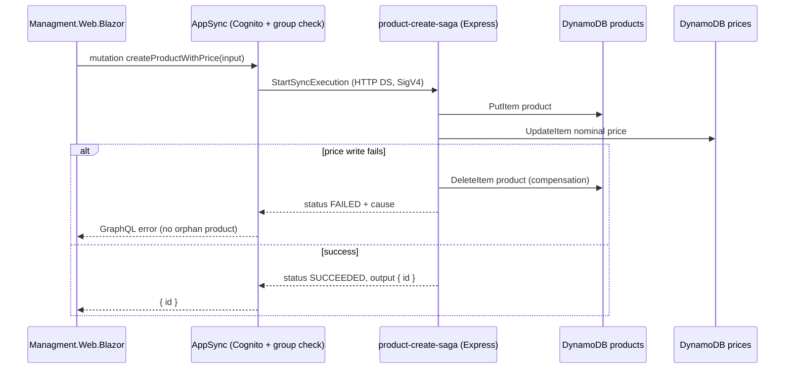

# ADR-0032: Product Creation With Price as a Step Functions Express Saga Behind AppSync

## Status
**Proposed** — July 2026

---

## Context

Since ADR-0026 split nominal price out of Catalog, creating a sellable product is **two writes in
two bounded contexts**: a `createProduct` PutItem on Catalog's `products` table and a
`setNominalPrice` UpdateItem on Pricing's `prices` table. The Blazor management app (the only
create-product client) issued the two mutations sequentially from the browser, which has concrete
failure modes:

- If `setNominalPrice` fails after `createProduct` succeeds, the product exists **without a
  price** — invisible to pricing-dependent flows but present in the catalog.
- The natural user reaction — resubmitting the create form — runs `createProduct` again and
  creates a **duplicate product**, because the client has no memory of the half-completed attempt.
- Every future admin client would have to reimplement the same two-call choreography and its
  partial-failure handling.

Constraints that bound the solution space:

- **ADR-0023**: AppSync is the only client entry point, in every environment. A dedicated
  admin BFF/controller in front of the two mutations would be a second self-hosted entry point —
  exactly what ADR-0023 removed. Fixing this server-side must happen **behind** AppSync.
- **ADR-0026**: `products` and `prices` belong to different bounded contexts (Catalog, Pricing).
  A single `TransactWriteItems` spanning both tables would work mechanically, but couples the two
  contexts' storage at the transaction level and hides the cross-context write inside one resolver.
- **ADR-0009**: resolver selection is direct-DynamoDB-first, Lambda only as a justified
  escalation. Neither option expresses "two writes with compensation": a direct resolver targets
  one data source, and a Lambda would be bespoke orchestration code to own forever.

---

## Decision

**`createProductWithPrice(input)` is a single AppSync mutation resolved by an HTTP data source
that synchronously executes a Step Functions Express Workflow implementing the saga pattern:
write the product, write the price, and compensate (delete the product) if the price write
fails.** This is the repo's first Step Functions state machine and first AppSync HTTP data source.



### 1. Invocation MUST stay behind AppSync

The state machine is invoked only by the AppSync resolver
(`graphql/resolvers/products/mutations/Mutation.createProductWithPrice.js`) through an HTTP data
source signed for the `states` service against the **`sync-states.<region>`** endpoint (the
dedicated `StartSyncExecution` endpoint; the regular `states.` endpoint rejects that action). No
new client-facing endpoint exists — ADR-0023's single-entry-point rule holds. Authorization
(Cognito + `Admin`/`Seller` group check) runs in the resolver's `request()` exactly like the other
admin mutations.

### 2. Express + synchronous execution, not Standard

The workflow is `EXPRESS` and called via `StartSyncExecution`: the saga is two short writes, the
client needs the result in the same GraphQL response, and Express is the only type that supports
synchronous execution. A Standard workflow would force polling or subscriptions onto a simple
create form. Timeout is explicit (10s) — well under AppSync's HTTP resolver ceiling.

### 3. Compensation, not TransactWriteItems

The saga undoes the product with a compensating `DeleteItem` instead of wrapping both writes in a
cross-context transaction. Catalog and Pricing remain free to change their storage independently
(ADR-0026); the coupling lives in one visible state machine, not in a transaction hidden inside a
resolver. The price step reuses the exact `setNominalPrice` update expression, so both write paths
produce identical items and the same `PriceChangedEvent` CDC off the `prices` stream.

### 4. Saga input contract — N values travel as strings

DynamoDB's wire format requires `N` attribute values to be JSON strings. The resolver therefore
stringifies `stock`/`price`/`cost` in the execution input, and the CDK tasks map them with
`DynamoAttributeValue.numberFromString(...)`.

```js
// Correct — resolver stringifies, state machine maps with numberFromString
const sagaInput = { id, name, ..., stock: `${stock}`, price: `${price}`, cost: `${cost}` }
```

```ts
// Incorrect — synthesizes fine, fails at runtime (N must be a string; aws-cdk#12456)
Stock: tasks.DynamoAttributeValue.fromNumber(sfn.JsonPath.numberAt('$.stock'))
```

### 5. Response handling MUST branch on execution status

`StartSyncExecution` returns **HTTP 200 even for a FAILED execution** — the resolver's
`response()` must check `execution.status === 'SUCCEEDED'` and surface `cause` as a GraphQL error
otherwise. The execution `output` is a JSON *string* (double parse).

### 6. Existing mutations stay; local dev simulates the saga

- `createProduct` and `setNominalPrice` remain (ADR-0009 direct-first): the Blazor **update** flow
  and any seeding path still use them. `createProductWithPrice` is additive.
- The local graphql-yoga backend (`app/api/graphql/local.ts`) has no Step Functions; it simulates
  the saga with the same two writes and a compensating delete in a `try/catch`.

---

## Applies To

- `infra/constructs/product-create-saga.ts` (state machine)
- `infra/constructs/appsync-api.ts` (HTTP data source, resolver registration, ARN placeholder
  substitution in the resolver helper)
- `graphql/schema.graphql` (repo root, ADR-0033), SPA `graphql/types.ts`
- `graphql/resolvers/products/mutations/Mutation.createProductWithPrice.js`
- `src/WebApps/Shopping.Web.SPA.React/app/api/graphql/local.ts`
- `src/WebApps/Managment.Web.Blazor/Services/ProductAdminService.cs`

---

## Consequences

### Positive

- No duplicate products on retry: the client sends one mutation, and a failed saga leaves no
  orphan (the compensation deletes the product before the error reaches the form).
- The cross-context write choreography lives server-side in one place, reusable by any future
  admin client — none of them reimplements the two-call dance.
- Introduces the managed-orchestration pattern (Step Functions) with the smallest possible
  footprint: two DynamoDB service integrations, no orchestration Lambda code to own.
- ADR-0023 intact: AppSync remains the only entry point; the state machine is not reachable by
  clients.

### Negative / Costs

- **The compensating delete can itself fail**, leaving a product without a price — the same
  end state the old flow produced, but in a much narrower window (one DeleteItem after an
  already-failed write, retriable and visible in the workflow's CloudWatch error logs).
- A third resolver kind (HTTP → Step Functions) joins ADR-0009's direct/Lambda taxonomy — one
  more pattern for readers to learn, mitigated by this ADR and the resolver-file comments.
- The saga is not simulated faithfully locally (yoga does sequential writes, not ASL), so
  state-machine-specific behavior (timeouts, ASL mapping errors) only surfaces on AWS.
- Express Workflows bill per execution + duration — negligible at this project's scale, but a
  new cost line nonetheless.

### Mitigation Strategies

- Orphan-on-failed-compensation is detectable: the Express workflow logs ERROR-level events to
  `/aws/states/product-create-saga`; a failed `CompensateDeleteProduct` state names the product id.
- ASL-level changes should be validated with `cdk synth` (inspect `"N.$"`/`"SS.$"` mappings and
  `ResultPath: null`) and a manual console execution before relying on the AppSync path.

### Future Constraints

- New multi-context write operations behind AppSync SHOULD follow this shape (HTTP data source →
  Express saga) rather than adding orchestration Lambdas or cross-context transactions — or
  supersede this ADR.

---

## References

- [ADR-0009: AppSync Resolver Selection — Direct-First](./0009-appsync-resolver-selection-direct-first-lambda-for-complex-logic.md)
- [ADR-0023: Decommission the YARP Gateway and Complete the Angular SPA Removal](./0023-decommission-yarp-gateway-and-angular-spa.md)
- [ADR-0026: Pricing Bounded Context — Price and Campaign Ownership](./0026-pricing-bounded-context-price-and-campaign-ownership.md)
- aws-cdk issue #12456 — `DynamoAttributeValue.fromNumber` with a JSON path renders an invalid
  numeric `N` value at runtime
