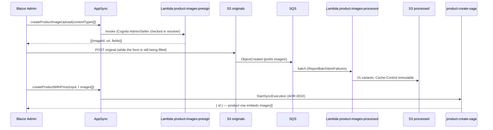

---
tags:
  - status/accepted
  - domain/product-images
---

# ADR-0034: Product Image Pipeline — Presigned POST Upload, S3→SQS Processing, and Immutable CloudFront Serving

## Status
**Accepted** — July 2026

Supersedes [ADR-0018](./0018-product-images-dedicated-s3-bucket-cloudfront-bypass-optimizer.md): the
"dedicated bucket via CloudFront, bypassing the Next.js optimizer" decision is preserved and
strengthened; the "images uploaded already web-ready, no pipeline" part is replaced by the
processing pipeline below, exactly the revision ADR-0018's Future Constraints anticipated.

---

## Context

Product images do not really exist in DuckStore today:

- `Product.imageUrl` is a free-form string. The seeder writes the same-origin path
  `/product-images/duck.jpg` (ADR-0018's convention), but the bucket and CloudFront behavior
  ADR-0018 described lived in the hand-rolled CDK SPA stack (ADR-0014) that the SST migration
  replaced — **no image bucket or CDN exists in the deployed system**.
- The Blazor management app (the only product-creation client) has no way to upload an image;
  `imageUrl` is a text field the admin fills by hand.
- A product needs one **main** image plus several angle shots, in modern formats (AVIF/WebP)
  and multiple resolutions — none of which a hand-uploaded single URL provides.

Constraints that bound the solution:

- **ADR-0023**: AppSync is the only client entry point — no dedicated upload endpoint/BFF.
- **ADR-0009**: direct resolvers first; Lambda only where APPSYNC_JS cannot express the logic.
- **ADR-0032**: product creation is already a Step Functions Express saga
  (`createProductWithPrice`); image metadata must ride that write, not add a second
  choreography for clients to get wrong.
- **ADR-0018 Future Constraints**: product images must never route back through the Next.js
  image optimizer.

---

## Decision

Images are uploaded by the browser straight to S3 with presigned POSTs, processed
asynchronously into a fixed matrix of variants, and served as immutable CDN content. The
database stores **metadata only** — never URLs.



### 1. Upload: batch presigned POST, not multipart

`createProductImageUpload(input: { contentTypes: [String!]! }): [PresignedImageUpload!]!` is a
Cognito-only AppSync mutation (Admin/Seller group checked in the resolver) backed by a Lambda
resolver — a justified ADR-0009 escalation, since SigV4 signing is impossible in APPSYNC_JS.

- The Lambda is **stateless**: it generates a ULID `imageId` per entry, the key
  `images/{imageId}/original.{ext}`, and a presigned POST. It writes nothing to any database.
- POST policy conditions — the reason POST is used instead of PUT or multipart:
  `content-length-range` 1..8MB, exact `Content-Type` (allowlist `image/jpeg|png|webp|avif`),
  exact key. Multipart Upload is rejected: it exists for >100MB objects, costs three calls and
  upload state, and cannot enforce a size cap in the policy.
- Batch: up to 12 entries per call; URLs expire in 15 minutes.
- The originals bucket carries a CORS rule for the admin origins (the browser POSTs
  cross-origin).

### 2. Processing: S3 → SQS → Lambda (sharp)

The originals bucket notifies **SQS directly** (prefix `images/`) — not EventBridge. This
deliberately diverges from the CDC/EventBridge norm (ADR-0005): this is a point-to-point
work queue with exactly one consumer, not a domain event anyone else may subscribe to; the
queue is what provides buffering, retry, and DLQ semantics.

- Queue: visibility timeout 6× the Lambda timeout, DLQ with `maxReceiveCount` 4, CloudWatch
  alarm on any visible DLQ message.
- Consumer: Node.js **arm64** Lambda (1024MB, tune later with Lambda Power Tuning) using
  **sharp** — the first Node.js Lambda in `infra/` (see §6). Batch size 5 with
  `ReportBatchItemFailures`.
- Per original: validate magic bytes (the POST policy's Content-Type is declarative, not
  proof); invalid files are moved to `quarantine/` and acknowledged (no retry). Valid files
  are decoded once per resolution — thumb 160, 320, 640, 1024, 1600 — and each resized buffer
  is encoded to **AVIF, WebP, and JPEG** (15 variants). `rotate()` applies EXIF orientation
  and re-encoding strips metadata (camera GPS never reaches the CDN).
- Output keys are **deterministic**: `images/{imageId}/{size}.{format}` in the processed
  bucket — reprocessing overwrites the same objects, so the pipeline is idempotent with no
  bookkeeping. Every variant is written with
  `Cache-Control: public, max-age=31536000, immutable` on the object itself.
- The processor **never touches a database**. There is no `status` field anywhere: variant
  URLs are deterministic, the CloudFront error-caching TTL is short (§4), and clients render a
  placeholder until the variant responds.

### 3. Data model: metadata only, embedded in the product

`Product.imageUrl` is **removed everywhere** — schema, Catalog domain, `ProductSyncedEvent`,
CatalogView, seeders, both frontends. It is replaced by an embedded list:

```graphql
type ProductImage { imageId: ID!, isMain: Boolean!, order: Int! }
type Product { ..., images: [ProductImage!]! }
```

- Stored as a `List` of `Map`s (`Images`) on the product item; propagated to CatalogView
  through the existing `ProductSyncedEvent` CDC unchanged in shape.
- Invariants enforced in the mutation resolvers: `imageId` matches the ULID alphabet
  (`^[0-9A-HJKMNP-TV-Z]{26}$`), ≤ 12 images, **exactly one** `isMain`.
- **Clients build URLs**: `{CDN base}/{imageId key path}` from configuration
  (`NEXT_PUBLIC_IMAGE_CDN_URL` in the SPA, `ImageCdn:BaseUrl` in Blazor). The database never
  stores a URL — swapping bucket or CDN is a config change, not a data migration.
- The Basket's per-item denormalized `imageUrl` string becomes a nullable `imageId` (the main
  image's id at add-to-cart time); persisted carts predating the field render a placeholder.

### 4. Serving: immutable objects behind CloudFront, format negotiation in HTML

- Processed bucket is private (`BlockPublicAccess.BLOCK_ALL`) behind CloudFront with **OAC**,
  `CACHING_OPTIMIZED`, and 403/404 **error-caching TTL of 5 seconds** — a product page visited
  in the seconds between saga commit and variant landing must not pin a cached error.
- Because a replaced image gets a **new `imageId`** (originals are never overwritten), every
  object is immutable and cacheable forever; cache invalidation does not exist in this design.
- Format selection happens in the **HTML**, not at the edge: `<picture>` with AVIF and WebP
  `<source>` sets and a JPEG `` fallback. No CloudFront Function, no `Accept` sniffing,
  maximum cache hit ratio. Per ADR-0018's constraint, product images stay off the Next.js
  optimizer — plain ``/`<picture>`, no custom loader.

### 5. Saga integration: images ride the existing PutProduct

`CreateProductWithPriceInput` gains `images: [ProductImageInput!]!`. The
`Mutation.createProductWithPrice.js` resolver validates the invariants and passes the list to
the saga **already in DynamoDB wire format** (consistent with the existing N-as-string
convention of ADR-0032's input contract):

```js
images: input.images.map((i) => ({
  M: { ImageId: { S: i.imageId }, IsMain: { BOOL: i.isMain }, Order: { N: `${i.order}` } },
}))
```

The saga's existing `PutProduct` state writes it via
`DynamoAttributeValue.listFromJsonPath('$.images')` — **no new state** in the state machine.
The upload happens while the admin fills the form; submit does not wait for processing. The
existing compensation (product delete) undoes the association for free.

### 6. First Node.js Lambda in `infra/`

Every Lambda in `infra/` is .NET on Docker images. The two image Lambdas are **Node.js**
(`src/Services/ProductImages/`): sharp is the industry-standard AVIF/WebP encoder and .NET has
no mature AVIF path (ImageSharp does not support it). Bundling: `NodejsFunction`; the
processor uses `bundling: { nodeModules: ['sharp'], forceDockerBundling: true }` on arm64 so
the linux-arm64 prebuilt binary is installed; the presign function is plain esbuild.

### 7. Orphans and lifecycle

- Originals: `images/` transitions to `STANDARD_IA` after 30 days — **never expires** (age
  cannot distinguish an orphan from a live product's original). `quarantine/` expires after
  30 days.
- Orphaned uploads (form abandoned after upload) are cleaned by a **manual sweep script**
  (`scripts/sweep-orphan-images.ts`, dry-run by default): scans `products` for referenced
  `imageId`s and deletes unreferenced prefixes whose ULID timestamp is older than 7 days. No
  cron, no event consumer — the ULID gives the age for free and the sweep also covers uploads
  that never had a delete event to react to.

### 8. Dev and testing happen on real AWS

There is no local S3/CloudFront (no LocalStack/MinIO — explicit decision). The Blazor admin in
dev already talks to the real dev AppSync, so upload works unchanged (the bucket CORS includes
`https://localhost:7300`). The SPA's local BFF (`local.ts`) implements
`createProductImageUpload` by presigning against the real dev bucket using ambient AWS
credentials and `IMAGE_ORIGINALS_BUCKET` from `.env.local`, failing with a clear message when
unconfigured. `NEXT_PUBLIC_IMAGE_CDN_URL` points at the real dev distribution.

---

## Applies To

- `infra/stacks/product-images-stack.ts` (new), `infra/bin/app.ts`, `infra/constructs/appsync-api.ts`, `infra/constructs/product-create-saga.ts`
- `src/Services/ProductImages/` (new — presign + processor Lambdas)
- `graphql/schema.graphql`, `graphql/resolvers/products/*`, `graphql/resolvers/basket/*`
- `src/Services/Catalog/*` (Product entity, repository, CDC publisher, seeder)
- `src/BuildingBlocks/BuildingBlocks.Messaging` (`ProductSyncedEvent`)
- `src/Services/CatalogView/*` (SearchDocument, index, consumer, backfill)
- `src/Services/Basket/*` (ShoppingCartItem `imageUrl` → `imageId`)
- `src/WebApps/Shopping.Web.SPA.React` (types, fragments, gallery, cart, `local.ts`)
- `src/WebApps/Managment.Web.Blazor` (upload UI, models, service)
- `.github/workflows/deploy-product-images-cdk.yml` (new), `scripts/sweep-orphan-images.ts` (new)

---

## Consequences

### Positive

- Admins upload images from the browser with no server proxying bytes; the product and its
  image metadata are written atomically by the existing saga.
- Read path is pure CDN: no Lambda per image, immutable objects, near-perfect hit ratio, and
  AVIF cuts egress — the dominant cost — by 30–50% versus JPEG.
- The database stores keys, never URLs; CDN/bucket are swappable configuration.
- No status bookkeeping, no cache invalidation, idempotent processing — the design has almost
  no state to corrupt.

### Negative / Costs

- **~19 objects per image** (original + 15 variants + quarantine potential) — storage is
  multiplied, mitigated by variant sizes being small and lifecycle on originals.
- A product page visited seconds after creation may render placeholders until variants land
  (no status field to hide the product until ready).
- Two runtimes in `infra/` — Node.js joins .NET; contributors need the Docker-bundling flow
  for sharp.
- Legacy data loses images: existing products get `images: []` (placeholder) and old basket
  items lose their thumbnail. Accepted for a study project.
- If the compensating saga delete fires, already-uploaded originals become orphans until the
  sweep runs (same residual as any saga without compensation retry).

### Mitigation Strategies

- CloudFront error-caching TTL of 5s + client-side `` retry/placeholder covers the
  processing window without any backend state.
- The DLQ alarm is the safety net for poison images; quarantine keeps them inspectable for
  30 days.
- If a hard "ready" signal ever becomes necessary (e.g. gating ISR revalidation on variants
  existing), add a `product-images` DynamoDB table updated by the processor and denormalized
  into CatalogView via CDC — the ADR-0030 pattern — without changing this pipeline.

### Future Constraints

- Product-image consumers MUST build URLs from configuration + `imageId`; storing a full URL
  in any database or event is NOT ALLOWED.
- Objects under `images/` in the processed bucket are immutable: replacing an image MUST mint
  a new `imageId`; overwriting variants of a live `imageId` breaks the infinite-cache
  contract.
- The processor MUST stay database-free; any new post-processing side effect goes through a
  new consumer of the same queue or a DynamoDB write by a different component.

---

## Related Documentation

- [ADR-0018: Serve Product Catalog Images from a Dedicated S3 Bucket via CloudFront](./0018-product-images-dedicated-s3-bucket-cloudfront-bypass-optimizer.md) (superseded by this ADR)
- [ADR-0032: Product Creation With Price as a Step Functions Express Saga](./0032-create-product-with-price-step-functions-express-saga.md)
- [ADR-0023: Decommission the YARP Gateway](./0023-decommission-yarp-gateway-and-angular-spa.md)
- [ADR-0009: AppSync Resolver Selection — Direct-First](./0009-appsync-resolver-selection-direct-first-lambda-for-complex-logic.md)
- [ADR-0005: Removal of In-Process Domain Events; CDC via DynamoDB Streams](./0005-remove-domain-events-cdc-via-dynamodb-streams.md)

## References

- Amazon S3 presigned POST policies (`content-length-range`, condition matching)
- AWS Lambda + SQS event source: `ReportBatchItemFailures`, visibility timeout guidance
- sharp — AVIF/WebP encoding, `rotate()` EXIF handling
- CloudFront Origin Access Control and error caching (`ErrorCachingMinTTL`)
