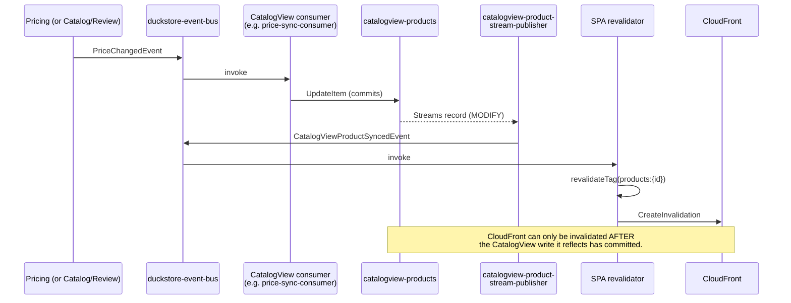

# ADR-0035: CatalogView-Owned CDC Events Drive SPA Cache Revalidation

## Status
**Proposed** — July 2026

Amends [ADR-0031](./0031-cdc-events-named-after-domain-occurrence-no-changetype-discriminator.md)
§"Applies To" (the SPA revalidator entry) and the stale inline code sample in
[ADR-0020](./0020-migrate-spa-deploy-to-sst.md). Reverses the "no stream — nothing downstream of
CatalogView reads this table via CDC; it's the read-side leaf" design consequence of
[ADR-0030](./0030-catalogview-dynamodb-drop-opensearch.md) — CatalogView keeps everything else
ADR-0030 decided (DynamoDB-backed, direct AppSync resolvers for `products`/`product`); only the
"no stream" implementation detail changes.

---

## Context

The SPA's `revalidator` Lambda (`src/WebApps/Shopping.Web.SPA.React/revalidator/index.mjs`, wired
via `sst.aws.Bus.subscribe` in `sst.config.ts`) is what keeps the ISR pages `/` and
`/products/[id]` from serving stale HTML forever — those routes are cached at the CloudFront edge
for up to a year (`s-maxage=31536000`), so `revalidateTag()` alone (which only marks Next.js's
tag-cache stale) is not enough; the revalidator also calls `CreateInvalidation` on the CloudFront
distribution.

Before this ADR, the revalidator subscribed directly to the source-bounded-context events that
happen to affect what these pages render: `ProductCreatedEvent`/`ProductUpdatedEvent`/
`ProductDeletedEvent` (Catalog) and `ReviewCreatedEvent`/`ReviewUpdatedEvent` (Review). Two
problems fell out of that design:

1. **A silent coverage gap.** `PriceChangedEvent` (Pricing's CDC stream publisher, ADR-0026) was
   never in the subscription list. CatalogView's `catalogview-price-sync-consumer` correctly
   folded the new price into `catalogview-products` (ADR-0030), but the revalidator had no idea a
   price had changed, so CloudFront kept serving the old price indefinitely.

2. **A structural race condition** (the actual root cause once investigated, not just the missing
   event). `/` and `/products/[id]` read exclusively from `catalogview-products` via AppSync direct
   DynamoDB resolvers (ADR-0030) — CatalogView, not Catalog/Pricing/Review, is the actual data
   source for these pages. But the revalidator and CatalogView's six EventBridge-triggered consumer
   Lambdas (`infra/constructs/catalogview-lambdas.ts`) both subscribed to the *same* source-BC
   events, in parallel, with no ordering guarantee between them. Nothing prevented this sequence:

   ```
   ProductUpdatedEvent published
     ├─▶ catalogview-product-sync-consumer starts writing catalogview-products (in flight)
     └─▶ revalidator invalidates CloudFront + calls revalidateTag() (fires immediately)
            └─▶ next request regenerates the ISR page from catalogview-products
                   — but the consumer's write above hasn't landed yet
                   └─▶ page is cached with the OLD data, for up to another year
   ```

   Because DynamoDB Streams was never enabled on `catalogview-products`
   (`infra/constructs/catalogview-dynamodb.ts` stated outright: *"No stream — nothing downstream
   of CatalogView reads this table via CDC; it's the read-side leaf"*), there was no
   CatalogView-native signal the revalidator could depend on instead — it had nothing to subscribe
   to but the upstream events, which is what produced both problems above.

---

## Decision

**Give CatalogView its own DynamoDB Streams-based CDC publisher**, so it becomes a first-class
event source instead of a pure read-side sink, and **repoint the revalidator's product/price/rating
subscription onto CatalogView's own events** instead of the upstream events that feed it.

### 1. `catalogview-products` gains a stream

`infra/constructs/catalogview-dynamodb.ts` now sets
`stream: dynamodb.StreamViewType.NEW_AND_OLD_IMAGES` on the table. `NEW_AND_OLD_IMAGES` (not just
`NEW_IMAGE`, which is all Pricing's single-rule publisher needs) is required because a `REMOVE`
record carries only `OldImage` — the delete rule needs `Old.Id` to know which product was removed.

### 2. Two new, occurrence-named, id-only events

Per ADR-0031's rule-per-occurrence discipline (no `ChangeType`/`EventName` discriminator), a
publisher reacting to 2+ distinct occurrences (upsert vs delete) splits into one
`IStreamRule<TImage>` per occurrence:

```csharp
// CatalogView.Function/Modules/Products/EventsIntegration/Publishers/Rules/CatalogViewProductSyncedRule.cs
public sealed class CatalogViewProductSyncedRule : IStreamRule<CatalogViewProductStreamImage>
{
    public bool Match(StreamContext<CatalogViewProductStreamImage> context) =>
        (context.EventName == "INSERT" || context.EventName == "MODIFY")
        && !string.IsNullOrEmpty(context.New?.Id);

    public Task<PublishInstruction> BuildAsync(
        StreamContext<CatalogViewProductStreamImage> context, CancellationToken ct = default) =>
        Task.FromResult(new PublishInstruction(
            nameof(CatalogViewProductSyncedEvent),
            new CatalogViewProductSyncedEvent { ProductId = context.New!.Id }));
}
```

`CatalogViewProductDeletedRule` is the `REMOVE`-matching sibling, publishing
`CatalogViewProductDeletedEvent`. Both events carry only `ProductId` — the revalidator only ever
needs the id to derive tags, and a thin shared event stays easy to keep correct (ADR-0031's
"Mitigation Strategies").

`CatalogViewProductStreamPublisherFunction` (`Functions.CatalogViewProductStreamPublisher`) is a
thin `[LambdaFunction]` dispatcher — mirrors Ordering's `OrderStreamPublisherFunction` exactly,
projecting each Streams record into a `StreamContext<CatalogViewProductStreamImage>` and handing it
to `StreamRuleDispatcher<CatalogViewProductStreamImage>`. CatalogView previously had no
`IEventPublisher` registration at all (it was consumer-only); `ServiceRegistration.cs` now calls
`AddEventBridgeMessaging(configuration)` alongside the two rule registrations and the dispatcher.

### 3. CDK wiring — a DynamoDB-Streams trigger, not an EventBridge rule

`infra/constructs/catalogview-lambdas.ts` adds a 7th Lambda,
`catalogview-product-stream-publisher`, triggered by `lambdaEventSources.DynamoEventSource` on
`catalogViewProductsTable` (`TRIM_HORIZON`, batch size 10, `bisectBatchOnError`, failures routed to
the context's shared `ContextDlq` via `SqsDlq`) — the same shape as Pricing's
`priceStreamPublisher` in `infra/constructs/pricing-lambdas.ts`, not the `ruleFor(...)` helper used
by CatalogView's six *inbound* EventBridge consumers. `eventBus.grantPutEventsTo(...)` grants the
outbound `PutEvents` permission.

### 4. The revalidator repoints its product/price/rating subscription

`sst.config.ts`'s `Revalidator` subscription changes from:

```ts
detailType: ["ProductCreatedEvent", "ProductUpdatedEvent", "ProductDeletedEvent", "ReviewCreatedEvent", "ReviewUpdatedEvent"]
```

to:

```ts
detailType: ["CatalogViewProductSyncedEvent", "CatalogViewProductDeletedEvent", "ReviewCreatedEvent", "ReviewUpdatedEvent"]
```

`ReviewCreatedEvent`/`ReviewUpdatedEvent` are **kept, not replaced** — they still drive the
`reviews:{id}` tag directly, unchanged. The `reviews:{id}` tag covers the raw review list, which
`app/products/[id]/page.tsx` fetches from Review's own bounded-context store
(`features/reviews/services/reviews.service.ts` → `getReviewsByProduct`), not from
`catalogview-products` — CatalogView folds in only the aggregate rating (`AverageRating`/
`RatingCount`), never individual review content. There is therefore no CatalogView event that could
stand in for that tag, and no race to fix on that path: Review's own CDC event already fires only
after Review's write commits, exactly as before this ADR.

In `revalidator/index.mjs`, `tagsForEvent()`'s product branch now matches
`CatalogViewProductSyncedEvent`/`CatalogViewProductDeletedEvent` instead of
`ProductCreatedEvent`/`ProductUpdatedEvent`/`ProductDeletedEvent`, still producing
`['products', 'products:{id}']` (or `['products']` with no id). The review branch is untouched.
`pathsForTag()` is untouched — the tag→path mapping doesn't care which event produced the tag.



### Why this fixes both problems

- **The race is closed by construction.** The revalidator no longer has any subscription that can
  fire before CatalogView's own write commits — `CatalogViewProductSyncedEvent`/
  `CatalogViewProductDeletedEvent` are emitted *from* that commit (DynamoDB Streams only delivers a
  record after the write is durable), not in parallel with it.
- **The price-change gap closes automatically, without special-casing it.** Any write to
  `catalogview-products` — regardless of whether it came from Catalog, Pricing, or Review — now
  produces one of these two events. The revalidator no longer needs to enumerate every upstream
  event that happens to touch CatalogView; it only needs to know CatalogView changed.

---

## Applies To

- `src/BuildingBlocks/BuildingBlocks.Messaging/Events/` — new `CatalogViewProductSyncedEvent`,
  `CatalogViewProductDeletedEvent`.
- `src/Services/CatalogView/CatalogView.Function/Modules/Products/EventsIntegration/Publishers/`
  (new) — `CatalogViewProductStreamImage`, `CatalogViewProductStreamPublisherFunction`,
  `Rules/CatalogViewProductSyncedRule`, `Rules/CatalogViewProductDeletedRule`.
- `src/Services/CatalogView/CatalogView.Function/Shared/Configuration/ServiceRegistration.cs` —
  `AddEventBridgeMessaging`, the two `IStreamRule<CatalogViewProductStreamImage>` registrations,
  `StreamRuleDispatcher<CatalogViewProductStreamImage>`.
- `infra/constructs/catalogview-dynamodb.ts` — `catalogViewProductsTable` stream enabled.
- `infra/constructs/catalogview-lambdas.ts` — new `catalogview-product-stream-publisher` Lambda
  (DynamoDB Streams-triggered, not an EventBridge rule).
- `infra/stacks/catalogview-stack.ts` — `ProductStreamPublisherArn` output.
- `src/WebApps/Shopping.Web.SPA.React/sst.config.ts` — `Revalidator` subscription's `detailType`.
- `src/WebApps/Shopping.Web.SPA.React/revalidator/index.mjs` — `tagsForEvent()` product branch.
- `docs/adr/0031-cdc-events-named-after-domain-occurrence-no-changetype-discriminator.md` —
  §"Applies To" SPA-revalidator bullet updated to reference `CatalogViewProductSyncedEvent`/
  `CatalogViewProductDeletedEvent` for the product/price/rating path (ReviewCreatedEvent/
  ReviewUpdatedEvent unchanged for `reviews:{id}`).
- `docs/adr/0020-migrate-spa-deploy-to-sst.md` — stale inline `sst.config.ts` sample (still showing
  pre-ADR-0031 `CatalogUpdatedEvent`/bare `ReviewCreatedEvent`) corrected to the current
  subscription while this area is being touched (drive-by fix, not a new decision).

---

## Consequences

### Positive

- **Causal correctness by construction.** The revalidator now depends on exactly the data it
  serves (CatalogView's own post-commit event), not on a same-instant sibling of the write it needs
  to be downstream of. The race described in Context cannot recur for the product/price/rating path.
- **One dependency instead of three.** The revalidator no longer needs to track every upstream
  bounded context that happens to write into CatalogView (Catalog, Pricing, and any future
  contributor) — it depends on CatalogView alone.
- **Price changes are covered without a special case.** Closes the `PriceChangedEvent` gap as a
  side effect of the general fix, not a one-off patch.
- **Consistent with existing precedent.** Reuses the exact `IStreamRule`/`StreamRuleDispatcher`/
  `PublishInstruction` machinery (ADR-0019) and rule-per-occurrence discipline (ADR-0031) already
  used by Ordering and Catalog — no new publishing pattern introduced.

### Negative / Costs

- **One more async hop.** The path from "CatalogView write committed" to "CloudFront invalidated"
  now goes through an additional DynamoDB Streams → Lambda → EventBridge round trip before reaching
  the revalidator, adding latency (typically low hundreds of milliseconds for a Streams-triggered
  Lambda) on top of what was previously a direct subscription. Accepted: this is strictly better
  than the alternatives it replaces — indefinitely stale HTML for price changes (no invalidation at
  all), or a non-deterministic race that could leave stale HTML cached for up to a year with no
  automatic recovery mechanism.
- **A 7th Lambda and a new stream to operate.** More CloudWatch log groups, one more entry in the
  `catalogview` context's shared DLQ/alarm surface, one more moving part when reasoning about
  CatalogView's event flow.
- **`catalogview-products` is no longer a pure read-side leaf.** Any future consumer of
  `CatalogViewProductSyncedEvent`/`CatalogViewProductDeletedEvent` couples itself to CatalogView's
  write cadence — a cost ADR-0030 deliberately avoided by keeping CatalogView stream-free. This ADR
  accepts that cost for the SPA revalidation use case specifically, not as a general invitation to
  fan more consumers off CatalogView without justification.

### Mitigation Strategies

- Keep `CatalogViewProductSyncedEvent`/`CatalogViewProductDeletedEvent` id-only, same as
  `ProductDeletedEvent` — any future consumer needing more than the id should get its own
  purpose-built event rather than widening these.
- Monitor the `catalogview` context's DLQ (existing `ContextDlq`/`catalogview-dlq-not-empty` alarm)
  for the new publisher the same way as the other six Lambdas in that context — no new alerting
  surface needed.

### Future Constraints

- Any new consumer of `CatalogViewProductSyncedEvent`/`CatalogViewProductDeletedEvent` MUST justify
  the added coupling to CatalogView's write cadence, per the "no longer a pure read-side leaf" cost
  above.
- A CatalogView-owned CDC event MUST still follow ADR-0031's rule-per-occurrence discipline — no
  `ChangeType`/`EventName` discriminator, one `IStreamRule<CatalogViewProductStreamImage>` per
  distinct occurrence.

---

## Related Documentation

- [ADR-0005: Remove Domain Events; CDC via DynamoDB Streams](./0005-remove-domain-events-cdc-via-dynamodb-streams.md)
- [ADR-0008: Extend CDC Event Publishing — Basket ShoppingCarts Stream Publisher](./0008-extend-cdc-event-publishing-basket-shoppingcarts-stream-publisher.md)
- [ADR-0019: Module-Oriented Service Structure and Rule-Based Stream Publishers](./0019-module-oriented-service-structure-and-rule-based-stream-publishers.md)
- [ADR-0020: Migrate SPA Deploy to SST](./0020-migrate-spa-deploy-to-sst.md) (stale inline sample corrected by this ADR)
- [ADR-0026: Pricing Bounded Context — Price and Campaign Ownership](./0026-pricing-bounded-context-price-and-campaign-ownership.md)
- [ADR-0030: CatalogView Goes DynamoDB-Backed — Drop OpenSearch](./0030-catalogview-dynamodb-drop-opensearch.md) ("no stream" consequence reversed by this ADR)
- [ADR-0031: CDC Integration Events Named After the Domain Occurrence, Never a Raw ChangeType Discriminator](./0031-cdc-events-named-after-domain-occurrence-no-changetype-discriminator.md) (amended — see "Applies To" above)
- [ADR-0000: Official Architecture Decision Records Standard](./0000-official-architecture-decisios-records-standard.md)

## References

- `src/BuildingBlocks/BuildingBlocks.Messaging/Streams/{IStreamRule,StreamRuleDispatcher,StreamContext}.cs`
- `src/Services/Pricing/Pricing.Function/Modules/Prices/EventsIntegration/Publishers/PriceStreamPublisherFunction.cs` (plain-handler precedent)
- `src/Services/Ordering/Ordering.Function/Modules/Orders/EventsIntegration/Publishers/` (rule-based precedent)
