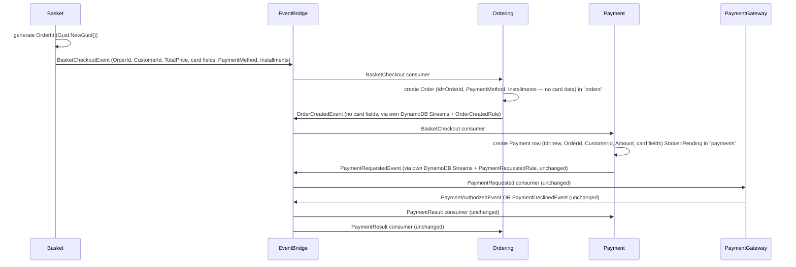

---
tags:
  - status/accepted
  - domain/ordering
  - domain/payment
---

# ADR-0038: Order Stops Persisting Card Data — Payment Sources It Directly from BasketCheckoutEvent

## Status
**Accepted** — July 2026

---

## Context

[ADR-0025](./0025-payment-bounded-context-simulated-gateway-cdc.md) §5 flagged, as a non-binding
observation, that `Ordering.Function`'s `Domain/ValueObjects/Payment.cs` value object and
`Domain/Enums/PaymentMethod.cs` become redundant once `Payment.Function` exists as the real owner
of the payment lifecycle and card data. That ADR explicitly left "simplifying or removing
Ordering's copy" out of scope, as a follow-up decision. This ADR is that follow-up.

Tracing the actual data flow shows the redundancy is not just a duplicated type — it is a live
data-ownership problem:

- `Order.Payment` carries `CardName`/`CardNumber`/`Expiration`/`Cvv`/`PaymentMethod`/`Installments`.
- `DynamoOrderRepository.ToItem` persists all of it, including the card fields, permanently in the
  `orders` table — even though `Order`'s own domain logic never reads `CardNumber`/`Expiration`/
  `Cvv` for anything; they are pure passthrough.
- `OrderCreatedRule` republishes those same card fields onto `OrderCreatedEvent`, which is how
  `Payment.Function`'s `OrderCreated` consumer currently learns the card details needed to build a
  `Payment` row and, downstream, the `PaymentRequestedEvent` sent to `PaymentGateway.Function`.

So card data is not just duplicated — it transits three services (Basket → Ordering → Payment) and
sits indefinitely in a table (`orders`) owned by a bounded context that has no legitimate reason to
store it, per [ADR-0025](./0025-payment-bounded-context-simulated-gateway-cdc.md)'s own framing of
`Payment.Function` as the real owner of card data.

The reason this was never simply deleted in ADR-0025: this repo's CDC model
([ADR-0005](./0005-remove-domain-events-cdc-via-dynamodb-streams.md),
[ADR-0019](./0019-module-oriented-service-structure-and-rule-based-stream-publishers.md)) publishes
integration events from a **DynamoDB Streams image of already-persisted state** — a stream-rule
rehydrates the aggregate via `GetByIdAsync` and republishes from what's in the table. That means
`OrderCreatedEvent` can only carry a field if `Order` persists it first. Removing `Order.Payment`
without giving `Payment.Function` another way to receive card data would silently break payment
processing. Fixing the data-ownership problem therefore requires moving the *transport*, not just
deleting a type.

---

## Decision

### 1. `BasketCheckoutEvent` gains `OrderId` — a client-side-generated correlation ID

`Basket.Function`'s `CheckoutBasket` handler generates the `OrderId` (`Guid.NewGuid()`) at checkout
time and adds it to `BasketCheckoutEvent`, alongside the card fields the event already carries
(`CardName`/`CardNumber`/`Expiration`/`Cvv`/`PaymentMethod`/`Installments`, `TotalPrice`,
`CustomerId`). This `OrderId` becomes the single correlation ID threaded through the whole checkout
flow — Basket generates it once; Ordering and Payment both key off the same value instead of each
minting their own.

### 2. Ordering uses the incoming `OrderId` instead of minting its own

`Ordering.Function`'s `BasketCheckout` consumer (`BasketCheckoutMapper` /
`CreateOrderHandler.CreateNewOrder`) passes `evt.Detail.OrderId` into `Order.Create`/
`CreateFromCheckout` instead of calling `OrderId.Of(Guid.NewGuid())` internally. The order's
identity is now decided at the point of checkout, not at the point Ordering happens to process the
event.

### 3. `Order` drops all card fields — keeps only `PaymentMethod` and `Installments`

`Order`'s payment-related state is reduced to `PaymentMethod` and `Installments` — both non-
sensitive, both legitimately needed by `Order` for receipt/order-history display ("paid by credit
card, 3x"). `CardName`, `CardNumber`, `Expiration`, `Cvv` are removed from the `Payment` value
object (or the value object is dropped entirely in favor of two plain properties on `Order` — an
implementation-level call, not an architectural one). `DynamoOrderRepository` stops writing and
reading those fields; `orders` no longer stores card data.

### 4. `OrderCreatedEvent` drops the card fields it never needed to carry

`OrderCreatedEvent` (`BuildingBlocks.Messaging/Events/OrderCreatedEvent.cs`) removes `CardName`,
`CardNumber`, `Expiration`, `Cvv`. It keeps `PaymentMethod` (non-sensitive, and still meaningful to
any future consumer that only needs to know *how* the order was paid, not the card itself).

### 5. `Payment.Function` sources card data from `BasketCheckoutEvent` directly, not `OrderCreatedEvent`

`Payment.Function`'s existing `OrderCreated` consumer is removed and replaced with a new
`BasketCheckout` consumer that subscribes to `BasketCheckoutEvent` — the same event `Ordering`
already consumes. `Ordering` and `Payment` become independent, parallel subscribers of one event,
each building its own aggregate from it. This mirrors the "one event, N independent consumers"
shape ADR-0025 §3 already established for `OrderCreatedEvent` (consumed separately by `Payment`'s
own `PaymentResult` consumer and `Ordering`'s `PaymentResult` consumer) — no new integration pattern
is introduced, just the same one applied one hop earlier in the flow.

`BasketCheckoutEvent` already carries everything the new consumer needs: `OrderId` (§1),
`CustomerId`, `TotalPrice` (as `Amount`), and the card fields. The `Payment` row is created exactly
as before (`Status=Pending`, idempotent via the `payment-processed-events` inbox) — only the event
it is built from changes.

### 6. Event flow

`OrderCreatedEvent`'s only remaining job downstream of Payment is what it already did before ADR-
0025 existed — announcing that an order was created — plus whatever future consumers want
`PaymentMethod` for display purposes. It is no longer Payment's data source.

### 7. What does not change

`PaymentRequestedRule`, `PaymentGateway.Function`, and `Ordering.Function`'s `PaymentResult`
consumer are untouched — the redesign is scoped entirely to *how card data reaches
`Payment.Function`*, not to anything downstream of the `Payment` row already existing.

---

## Applies To

- `src/BuildingBlocks/BuildingBlocks.Messaging/Events/BasketCheckoutEvent.cs` (new `OrderId` field)
- `src/BuildingBlocks/BuildingBlocks.Messaging/Events/OrderCreatedEvent.cs` (drop card fields)
- `src/Services/Basket/Basket.Function` (`Features/CheckoutBasket` — generate and set `OrderId`)
- `src/Services/Ordering/Ordering.Function` (`Modules/Orders/Domain/ValueObjects/Payment.cs` or its
  replacement, `Domain/Entities/Order.cs`, `Data/DynamoOrderRepository.cs`,
  `EventsIntegration/Consumers/BasketCheckout/*`, `EventsIntegration/Publishers/Rules/OrderCreatedRule.cs`)
- `src/Services/Payment/Payment.Function` (remove `EventsIntegration/Consumers/OrderCreated/*`, add
  `EventsIntegration/Consumers/BasketCheckout/*`)
- `src/AppHost/PaymentExtensions.cs` (Lambda registration: `payment-order-created-consumer` →
  `payment-basket-checkout-consumer`, new generated handler name)
- Test projects: `Ordering.UnitTests`, `Payment.UnitTests`, `Ordering.FunctionalTests`

---

## Consequences

### Positive
- Card data (`CardNumber`, `Cvv`, `Expiration`) is no longer persisted outside `Payment.Function`'s
  own `payments` table — `Ordering` stops being an unnecessary long-term store and CDC relay for
  PCI-adjacent data it never uses.
- `Ordering` and `Payment` becoming sibling consumers of `BasketCheckoutEvent` is a direct reuse of
  this repo's established "one event, N consumers" pattern — no new integration shape.
- Resolves ADR-0025 §5's open observation instead of leaving it permanently unresolved.

### Negative / Costs
- `Payment.Function` now depends on `BasketCheckoutEvent` (a Basket-owned contract) instead of
  `OrderCreatedEvent` (an Ordering-owned contract) — a cross-context coupling shift that must be
  remembered if `BasketCheckoutEvent`'s shape changes later.
- `Payment`'s row can now be created before `Ordering`'s `Order` row lands (both are independent,
  parallel consumers of the same event, with no ordering guarantee between them). This is
  acceptable: neither aggregate has a foreign-key dependency on the other existing yet, and
  `Ordering`'s `PaymentResult` consumer only needs the `Order` row to exist by the time payment
  results arrive, which is always later.
- `OrderId` is now generated by `Basket.Function`, one hop earlier than before — any code that
  assumed `Ordering` was the sole authority for minting order identities needs to account for this.

### Mitigation Strategies
- Document `OrderId` as a checkout-time correlation ID, not an Ordering-internal identity, in the
  `BasketCheckoutEvent` type itself (XML doc / inline comment) so future readers don't assume
  Ordering owns its generation.
- Keep `Payment.Function`'s new `BasketCheckout` consumer idempotent via the same
  `payment-processed-events` inbox pattern already in place, so a duplicate `BasketCheckoutEvent`
  delivery — now consumed one hop earlier than before — is still safe.

---

## References
- [ADR-0000: Official Architecture Decision Records Standard](./0000-official-architecture-decisios-records-standard.md)
- [ADR-0005: Remove Domain Events — CDC via DynamoDB Streams](./0005-remove-domain-events-cdc-via-dynamodb-streams.md)
- [ADR-0012: Merge Discount into Basket — Coupon as an In-Process Entity](./0012-merge-discount-into-basket-coupon-as-in-process-entity.md)
- [ADR-0019: Module-Oriented Service Structure and Rule-Based Stream Publishers](./0019-module-oriented-service-structure-and-rule-based-stream-publishers.md)
- [ADR-0025: Payment Bounded Context — Simulated Gateway via Fully Async EventBridge/CDC](./0025-payment-bounded-context-simulated-gateway-cdc.md)
