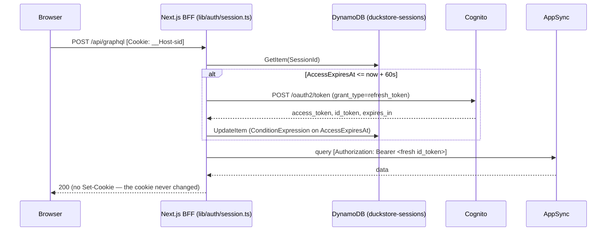

# ADR-0041: BFF-Owned Opaque Server-Side Sessions — Centralized Cognito Token Refresh

## Status
**Proposed** — July 2026

This ADR **amends** [ADR-0016](./0016-guest-basket-owner-id-identity-api-key-and-ttl.md) §2: the rule
("the BFF is the only place that resolves identity") is unchanged and reinforced, but the
*mechanism* for the authenticated branch changes — `resolveOwner()` no longer reads the
`access_token` cookie. The guest branch (`guest_id` cookie → `GUEST#<guestId>`) is untouched.

---

## Context

The SPA authenticates through the Cognito Hosted UI PKCE flow ([ADR-0017](./0017-user-bounded-context-cognito-idp-only-lazy-provisioning.md) §5).
`/api/auth/callback` exchanges the code for three tokens and stores each in its own httpOnly
cookie, with `Max-Age` copied from the token's own lifetime
(`app/api/auth/callback/route.ts:106-128`). The `SpaClient` user pool client issues
**1h access/id tokens and a 30-day refresh token** (`infra/constructs/appsync-auth.ts:176-178`).

**Users are being logged out after exactly one hour, despite a valid 30-day refresh token.**

The root cause is not a missing call — it is that *session lifetime and credential lifetime were
conflated*. The browser's cookie jar became the session state machine: "is there a 1h cookie?" is
what the app answers when asked "is this user signed in?". Silent refresh was then bolted on as a
patch in edge middleware, scoped to a single route
(`middleware.ts:31-33`, added by commit `14237c3` to stop a `Set-Cookie` from being baked into an
SSG/ISR-cached response). Every other server-side consumer of the tokens was left behind.

There are **four** independent server-side readers of the raw token cookies, and only one knows
refresh exists:

| Reader | Reads | Refreshes? | Failure after 1h |
|---|---|---|---|
| `middleware.ts:35-36` | `access_token`, `refresh_token` | Yes — but only when `pathname === '/api/graphql'` | — |
| `app/api/auth/me/route.ts:30` | `id_token` | **No** | Returns `authenticated: false`; `AuthProvider` renders the user as signed out on the next page load |
| `lib/identity.ts:32` | `access_token` | **No** | Protected only incidentally, because middleware happens to run first on that one route |
| `api/auth-provider.ts:30` | `id_token` | **No** | Silently degrades to `x-api-key`, serving public/guest data to a signed-in user |

Three further defects follow from the same design:

- **Refresh is triggered by cookie *absence*, not token *expiry*.** Proactive renewal is therefore
  impossible, and `resolveOwner()` never checks `exp` at all (`lib/identity.ts:35-37`) — an expired
  but still-present access token would resolve to a valid `USER#` identity. Latent today only
  because `Max-Age` makes the cookie vanish at roughly the same moment.
- **Identity is derived from an unverified JWT.** `subFromJwt()` base64-decodes the payload and
  trusts `sub` (`lib/identity.ts:19-28`), and that `sub` becomes the `OwnerId` scoping cart data in
  DynamoDB. The cookies carry no `__Host-` prefix, so a compromised sibling subdomain could shadow
  them (cookie tossing) — narrow, but it is horizontal privilege escalation on the cart.
- **The highest-value credential in the system lives in the browser.** A 30-day refresh token in a
  cookie, alongside ~3–4 KB of JWTs shipped on *every* request through CloudFront → Lambda.

Patching `/api/auth/me` alone fixes one symptom of a defect class: any fifth reader added later
inherits the same bug, silently.

---

## Decision

The BFF becomes a **token-mediating backend**: it holds the Cognito tokens server-side and the
browser holds a single opaque session identifier. This is the OAuth 2.0 for Browser-Based Apps
(BCP) recommendation for a JavaScript app with a server-side component, and it reuses a pattern
DuckStore already runs — DynamoDB with TTL as expirable server state
([ADR-0016](./0016-guest-basket-owner-id-identity-api-key-and-ttl.md) §4).

### 1. The session — not the credential — is the unit of authentication

A session's lifetime is the refresh token's lifetime (30 days). Access/id tokens are short-lived
*derived* credentials, refreshed transparently, and their expiry MUST NOT be observable as a
change in authentication state.

The browser receives exactly one auth cookie:

| Cookie | Value | Attributes |
|---|---|---|
| `__Host-sid` | Opaque 256-bit id, base64url (`crypto.randomUUID()` is NOT sufficient — use `crypto.getRandomValues`) | `httpOnly`, `Secure`, `SameSite=Lax`, `Path=/`, `Max-Age` = 30 days |

The `__Host-` prefix is load-bearing, not cosmetic: it forces `Secure` + `Path=/` and forbids a
`Domain` attribute, which is what makes the cookie un-shadowable from a sibling subdomain — closing
the cookie-tossing vector described in Context. `access_token`, `id_token`, and `refresh_token`
cookies are **removed**; no Cognito token is ever sent to the browser again.

### 2. `duckstore-sessions` DynamoDB table

| Attribute | Purpose |
|---|---|
| `SessionId` (PK) | The opaque cookie value |
| `Sub`, `Email`, `Name` | Claims captured and validated once, at session creation |
| `AccessToken`, `IdToken`, `RefreshToken` | Cognito credentials, server-side only |
| `AccessExpiresAt` | Epoch seconds — drives refresh (§4) |
| `CreatedAt` | Absolute session start, for the cap in §7 |
| `ExpiresAt` | DynamoDB TTL attribute — `CreatedAt + refreshTokenValidity` |

The table is declared in `sst.config.ts` as an `sst.aws.Dynamo` component linked to the `Nextjs`
component, **not** under `infra/`: it is BFF-private state with no bounded-context owner (no
service reads it), and [ADR-0020](./0020-migrate-spa-deploy-to-sst.md) moved SPA-owned
infrastructure to SST. TTL reaping mirrors ADR-0016 §4 — expiry is enforced by DynamoDB, at no
compute cost.

Locally the table is created against DynamoDB Local; the SPA already receives
`AWS_ENDPOINT_URL_DYNAMODB` from Aspire's `WithReference(dynamoDb)` (`src/AppHost/Program.cs:54`).

### 3. `lib/auth/session.ts` is the only module permitted to touch auth state

```ts
export type Session = {
  sessionId: string
  sub: string
  email: string
  name?: string
  accessToken: string   // always unexpired when handed out
  idToken: string
}

export async function getSession(): Promise<Session | null>  // reads + refreshes if stale
export async function requireSession(): Promise<Session>     // throws 401 when absent
export async function createSession(tokens: CognitoTokens): Promise<string>
export async function destroySession(): Promise<void>
```

Binding rules:

- Reading `access_token` / `id_token` / `refresh_token` from `cookies()` outside `lib/auth/` is
  **NOT ALLOWED**. This MUST be enforced mechanically by an ESLint `no-restricted-syntax` rule, not
  by review convention — the defect in Context is a *class*, and a class needs a mechanical guard.
- Every consumer MUST resolve identity through `getSession()`:
  `app/api/auth/me/route.ts`, `lib/identity.ts` (`resolveOwner()`), `api/auth-provider.ts`
  (`getAuthHeaders()`).
- `getSession()` MUST memoize per request (React `cache()`), so N callers in one request perform one
  `GetItem`.
- `getPublicAuthHeaders()` (`api/auth-provider.ts:48-52`) MUST NOT call it — it deliberately stays
  cookie-free so `/` and `/products/[id]` remain statically generable.

### 4. Refresh is driven by token expiry, never by cookie absence — and rotates the refresh token

`getSession()` refreshes when `AccessExpiresAt <= now + 60s`. The 60-second skew absorbs clock drift
and in-flight requests, and makes renewal *proactive* — a request never carries a token that expires
mid-flight at AppSync.

**Correct** — expiry-driven, single-flight, session-record-based:

```ts
// lib/auth/session.ts
if (record.AccessExpiresAt <= nowEpoch() + REFRESH_SKEW_SECONDS) {
  const refreshed = await refreshAccessToken(record.RefreshToken)
  if (!refreshed) { await destroySession(); return null }
  if (subFromValidatedToken(refreshed.idToken) !== record.Sub) { await destroySession(); return null }
  // ConditionExpression: only the request that still sees the stale expiry writes.
  // Losers of the race re-read and use the winner's tokens.
  await conditionalPutTokens(record.SessionId, refreshed, record.AccessExpiresAt)
}
```

**Incorrect** — the current shape, keyed on cookie presence, in one route's middleware:

```ts
// ⛔ "no cookie" conflates "expired credential" with "no session", and only the
//    one route this middleware is scoped to ever gets the fix.
if (!request.cookies.has(ACCESS_TOKEN_COOKIE) && refreshToken) { /* refresh */ }
```

Concurrent Lambda instances MUST NOT stampede Cognito: the write-back is a conditional update on
`AccessExpiresAt`. The loser re-reads rather than issuing a second `grant_type=refresh_token`.

**Refresh token rotation MUST be enabled** on `SpaClient`
(`refreshTokenRotationGracePeriod: cdk.Duration.seconds(30)` — available in the pinned
`aws-cdk-lib@2.260.0`, **disabled by default**, which is the current state). Rotation is the one
item of AWS's own Cognito session-management guidance this design was otherwise silent on, and it
is only safe *because* of the two rules above:

- Rotation and browser-held refresh tokens are fundamentally in tension — two concurrent requests
  both refresh, one receives the rotated token, the other is left holding an invalidated one, and
  the session dies. The single-flight conditional write makes exactly one caller rotate; Cognito's
  grace period covers the loser's in-flight retry.
- `refreshAccessToken()` (`lib/cognito-refresh.ts:35-41`) currently **discards** `refresh_token`
  from the token response. With rotation on, Cognito returns a new refresh token on every renewal;
  it MUST be captured and persisted to `RefreshToken` in the same conditional write as the
  access/id pair. Dropping it kills the session once the grace period lapses.

`ExpiresAt` (the session TTL) MUST NOT be extended on rotation — the absolute cap in §7 is measured
from `CreatedAt`, not from the newest refresh token.

### 4.1 The Cognito client stays public

`generateSecret: false` is retained. Once the BFF is the only party calling `/oauth2/token`, the
client *could* become confidential, and the OAuth BCP does favour that for a token-mediating
backend. It is deliberately not adopted here: PKCE already binds the authorization code to the
initiating client, the code is redeemed server-side over TLS, and a client secret would add a
rotation obligation (AWS's own guidance: *"regularly rotate client secrets and credentials"*)
for a marginal gain. This is recorded as a decision, not an oversight — revisit it if the BFF ever
needs a grant that requires a confidential client, such as client credentials.

### 5. Refreshing MUST NOT emit `Set-Cookie`

Because the tokens live in the session record and the cookie value never changes, renewal mutates
no cookie. This **structurally** eliminates the cache-poisoning hazard that commit `14237c3`'s
route-scoping was containing: there is no `Set-Cookie` left to be baked into an SSG/ISR response.

Consequently `middleware.ts` reverts to a single responsibility — the CloudFront `x-origin-verify`
guard (`middleware.ts:16-19`). The refresh block and the `pathname !== '/api/graphql'` gate are
**deleted**, and with them the rule that a future contributor had to know but couldn't discover.



### 6. Identity comes from the session record, never from a decoded token

At `createSession()` the ID token's `iss`, `aud`, and `exp` MUST be validated before `Sub` is
persisted. Signature verification MAY be omitted **only** because the token arrives over TLS in a
direct server-to-server call to Cognito's token endpoint (OIDC Core §3.1.3.7); any token obtained
by another path MUST be verified against the JWKS.

After that, `sub` is read from the session record. `subFromJwt()` (`lib/identity.ts:19-28`) is
**deleted** — no code path derives identity by base64-decoding a JWT. `resolveOwner()` keeps its
ADR-0016 §2 contract and only swaps its authenticated branch:

```ts
const session = await getSession()
if (session) return { ownerId: `USER#${session.sub}`, type: 'user', guestId, isNewGuest: false }
// guest branch unchanged (ADR-0016 §2)
```

The `access_token`/`id_token` split between `resolveOwner()` and `getAuthHeaders()` disappears —
both read one typed `Session`, each taking the field it needs.

### 7. Logout and session lifetime are server-authoritative

`destroySession()` performs `DeleteItem` **and** the Cognito `/oauth2/revoke` call. Revocation stops
depending on the browser honoring three `cookies.delete()` calls
(`app/api/auth/logout/route.ts:37-39`); a deleted session record cannot be refreshed regardless of
what the client kept.

An **absolute** session cap of 30 days is enforced from `CreatedAt` — a session MUST NOT be extended
indefinitely by activity alone.

---

## Applies To

- `src/WebApps/Shopping.Web.SPA.React/lib/auth/session.ts` — **new**, the sole auth-state module.
- `src/WebApps/Shopping.Web.SPA.React/lib/cognito-refresh.ts` — cookie-name constants removed;
  `refreshAccessToken()` kept as the Cognito HTTP call, now called only from `lib/auth/`, and
  extended to return the rotated `refresh_token` it currently discards (§4).
- `infra/constructs/appsync-auth.ts` — `refreshTokenRotationGracePeriod` on `SpaClient` (§4).
  Token validity values are unchanged.
- `src/WebApps/Shopping.Web.SPA.React/middleware.ts` — refresh block and route gate deleted; keeps
  only the `x-origin-verify` guard.
- `src/WebApps/Shopping.Web.SPA.React/app/api/auth/{callback,logout,me}/route.ts` —
  `createSession()` / `destroySession()` / `getSession()`. `mergeGuestCart()`'s synthesized
  `Cookie: access_token=…; id_token=…` header (`callback/route.ts:38`) becomes `__Host-sid=<sid>`.
- `src/WebApps/Shopping.Web.SPA.React/lib/identity.ts` — `subFromJwt()` deleted; authenticated
  branch reads the session.
- `src/WebApps/Shopping.Web.SPA.React/api/auth-provider.ts` — `getAuthHeaders()` reads
  `session.idToken`; `getPublicAuthHeaders()` unchanged.
- `src/WebApps/Shopping.Web.SPA.React/sst.config.ts` — `sst.aws.Dynamo` session table linked to the
  `Nextjs` component.
- `src/WebApps/Shopping.Web.SPA.React/eslint.config.mjs` — the `no-restricted-syntax` rule of §3.
- `src/WebApps/Shopping.Web.SPA.React/scripts/ensure-session-table.mjs` — **new**, idempotent table
  creation against DynamoDB Local, chained explicitly into the `dev` script (pnpm disables implicit
  `pre`/`post` scripts, so a `predev` hook would silently never run). Plain `.mjs` because the SPA
  has no TypeScript script runner. `src/AppHost` needs no change: the SPA is an `AddNpmApp` that
  already receives `AWS_ENDPOINT_URL_DYNAMODB` via `WithReference(dynamoDb)` and waits on it
  (`src/AppHost/Program.cs:48-54`).

No new Lambda, no .NET project, and no AppSync/EventBridge wiring: every change above is
TypeScript inside the SPA and its two infrastructure definitions.

---

## Consequences

### Positive

- **The 1h logout is fixed at the root, not per-route.** Session state stops being a function of a
  1h cookie's presence, so no consumer can be "the one that forgot to refresh".
- **The defect class is closed mechanically.** A fifth reader of the token cookies cannot compile
  past lint; new server entry points get correct behavior by construction.
- **The cache-poisoning hazard stops being a rule to remember and becomes impossible** (§5) — the
  constraint commit `14237c3` encoded as a route check is now enforced by the shape of the design.
- **The 30-day refresh token leaves the browser.** XSS, cookie theft, and a leaked CDN cache entry
  can no longer yield a long-lived credential — only an opaque id that the server can revoke.
- **Revocation becomes deterministic** — `DeleteItem`, not best-effort cookie deletion.
- **Refresh token rotation becomes safe to enable** (§4). It is impractical with browser-held
  refresh tokens under concurrent requests, and it is the remaining item of AWS's Cognito
  session-management guidance the current design does not satisfy. A stolen refresh token now has a
  useful life bounded by the next renewal rather than 30 days.
- **~3–4 KB of JWT stops travelling on every request** through CloudFront → Lambda, replaced by a
  ~44-byte identifier.
- **Identity is no longer derived from an unverified JWT**, and `__Host-` closes the cookie-tossing
  vector — both without changing ADR-0016's rule that the BFF is the sole identity resolver.

### Negative / Costs

- **A DynamoDB round trip (~5 ms) on every request needing identity.** Bounded by per-request
  memoization (§3) and traded against the cookie bytes no longer shipped. Public catalog pages are
  unaffected — they stay cookie-free and statically generated.
- **New stateful dependency for authentication.** A `duckstore-sessions` outage logs everyone out,
  where cookie-borne tokens would have kept working until expiry. Accepted: the same table class
  already backs the cart, and the SPA is unusable without DynamoDB regardless.
- **More moving parts than a cookie.** A table, a TTL, and a refresh race to reason about, versus
  `Set-Cookie`.
- **Local dev needs the session table provisioned** in DynamoDB Local before the SPA starts.
- **Sessions survive a Cognito-side password change or admin disable** until the refresh call fails.
  Inherent to any session cache in front of an IdP, bounded by the ≤1h refresh interval.

### Mitigation Strategies

- Land §3's module boundary **first**, still cookie-backed if convenient: it is the same interface
  the table-backed implementation satisfies, so the storage swap is contained behind
  `lib/auth/session.ts` and the risky part ships incrementally.
- Ship the ESLint rule in the same PR as the module — without it the boundary decays.
- Unit-test the refresh race (two concurrent `getSession()` calls on a stale record ⇒ exactly one
  Cognito call) and the `Sub`-mismatch rejection in §4.
- `__Host-` requires `Secure`, and browsers treat `http://localhost` as a secure context, so it
  works in local dev; if a target browser proves otherwise, the prefix MAY be dropped when
  `NODE_ENV !== 'production'` — never in a deployed stage.
- Keep `duckstore-sessions` encrypted at rest and out of every log/trace: tokens MUST NOT appear in
  structured logs, and the table MUST NOT be added to any CDC/stream pipeline
  ([ADR-0005](./0005-remove-domain-events-cdc-via-dynamodb-streams.md)).

### Future Constraints

- A new server-side entry point needing user identity MUST call `getSession()`/`requireSession()`.
  Reading a Cognito token cookie directly is a policy violation — there are no such cookies.
- Cognito token TTLs (`infra/constructs/appsync-auth.ts:176-178`) become a tuning knob with no
  user-visible effect. Shortening `accessTokenValidity` MUST NOT require any SPA change; changing
  `refreshTokenValidity` MUST be mirrored in the session TTL and the §7 absolute cap.
- The Management Blazor app ([ADR-0020](./0020-migrate-spa-deploy-to-sst.md)) is **out of scope** —
  it is a WASM client with no BFF and keeps its OIDC library's own token handling. Giving it a BFF
  would be a separate ADR.
- Server-side sessions MUST NOT accumulate application state (cart contents, preferences). The
  record holds identity and credentials only; the cart stays in Basket
  ([ADR-0016](./0016-guest-basket-owner-id-identity-api-key-and-ttl.md)).

---

## Related Documentation

- [ADR-0016: Guest Shopping Carts — Unified `ownerId` Identity, API_KEY, and TTL](./0016-guest-basket-owner-id-identity-api-key-and-ttl.md) — §2's "BFF is the only identity resolver" rule is preserved; its `access_token`-cookie mechanism is amended by §6 here. The guest branch and §4's TTL pattern are unchanged and reused.
- [ADR-0017: User Bounded Context — Cognito as IdP-Only, Lazy Provisioning](./0017-user-bounded-context-cognito-idp-only-lazy-provisioning.md) — establishes the Hosted UI PKCE flow this ADR changes the token storage of. Cognito stays IdP-only.
- [ADR-0003: Adoption of Zero-Trust Security Model](./0003-adoption-of-zero-trust-security-model.md) — the trust boundary this ADR tightens by removing long-lived credentials from the client.
- [ADR-0020: Migrate SPA Deploy to SST](./0020-migrate-spa-deploy-to-sst.md) — why the session table is declared in `sst.config.ts` rather than under `infra/`.
- [ADR-0007: AppSync GraphQL — Direct DynamoDB Resolvers, Lambda for Business Logic](./0007-appsync-graphql-with-direct-dynamodb-resolvers.md) — AppSync remains the only client entry point; the BFF keeps forwarding a Cognito Bearer token, now always a fresh one.
- [ADR-0000: Official Architecture Decision Records Standard](./0000-official-architecture-decisios-records-standard.md)

## References

- AWS Security Blog — [How to use OAuth 2.0 in Amazon Cognito: learn about the different OAuth 2.0 grants](https://aws.amazon.com/blogs/security/how-to-use-oauth-2-0-in-amazon-cognito-learn-about-the-different-oauth-2-0-grants/). Confirms the grant this ADR leaves unchanged (authorization code + PKCE for public clients such as SPAs) and states the session-management guidance §1–§7 implement: *"managing access token lifetimes, storing tokens, rotating refresh tokens, implementing token revocations and providing easy logout mechanisms."* Rotation (§4) was added to this ADR from that guidance.
- IETF `draft-ietf-oauth-browser-based-apps` — OAuth 2.0 for Browser-Based Apps, the token-mediating backend (BFF) pattern. Goes beyond the AWS post above, which selects a grant but does not address where tokens live afterwards.
- OpenID Connect Core 1.0 §3.1.3.7 — ID Token validation; the TLS/direct-communication allowance relied on in §6.
- RFC 6265bis §4.1.3 — the `__Host-` cookie name prefix.
- OAuth 2.0 Security Best Current Practice — refresh token handling for public clients.
- Amazon Cognito — `/oauth2/token` (`grant_type=refresh_token`), `/oauth2/revoke`.
- Amazon DynamoDB — Time to Live (TTL); conditional writes for single-flight refresh.
- `infra/constructs/appsync-auth.ts:162-180` — `SpaClient` token validity settings.
- Commit `14237c3` — `fix(middleware): restrict refresh token handling to /api/graphql route to prevent token leakage`, the containment this ADR makes unnecessary.
