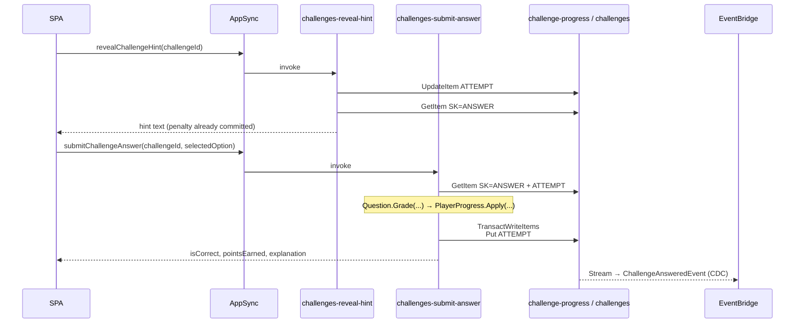

# ADR-0045: Challenges Bounded Context — Server-Side Grading and Answer-Key Isolation

## Status
**Accepted** — July 2026. Implemented: `Challenges.Function` (`src/Services/Challenges`), wired into
the AppHost and its own CDK stack.

Introduces a new bounded context. Companion to
[ADR-0046](./0046-challenge-points-redeem-into-pricing-customer-discount.md), which turns the points
this ADR produces into money and is the reason server-side grading is mandatory rather than merely
tidy.

---

## Context

The code-challenges feature lives entirely in the SPA
(`src/WebApps/Shopping.Web.SPA.React/features/challenges/`). There is no service, no table and no
schema field behind it:

| Concern | Where it lives today |
|---|---|
| Question bank | `data/challenges.data.ts` — 294 lines compiled into the JS bundle |
| Answer key | the same object literal: `correctAnswer`, `explanation`, `hints` |
| Grading | `challenge-options.tsx` compares the clicked index client-side |
| Hint penalty | `constants.ts` → `HINT_PENALTY = 25`, applied by `score-context.tsx` |
| Score / completed | `context/score-context.tsx` — `useState`, no persistence |

The concrete pains:

- **The answer key ships to the browser.** `Challenge.correctAnswer` is in the bundle. Anyone can read
  it from DevTools, or simply call `addScore` from the console. Today that buys bragging rights;
  under [ADR-0046](./0046-challenge-points-redeem-into-pricing-customer-discount.md) it buys a
  discount, so it becomes a monetary fraud path.
- **The hint penalty is honor-system.** `spendHint` mutates local state. A client that never calls it
  pays no penalty, and the server has no record either way.
- **Score does not survive a refresh.** `useState(0)` with no storage and no sync. The `/challenges`
  page is SSG precisely because there is nothing per-user to fetch.
- **No attempt history exists.** Nothing records which questions a customer answered, what they chose,
  whether they were right, or how many hints they burned — so no KPI can be computed, per user or
  globally.
- **Adding a question is a front-end deploy.** The bank is source code, not data, so content changes
  require a full SPA build and release.

A split into two services — a `Questions` service owning the bank and a `Gamification` service owning
attempts and score — was considered and rejected. Grading needs the answer key, so every submitted
answer would become a synchronous cross-service Lambda invoke. That is exactly the pattern
[ADR-0012](./0012-merge-discount-into-basket-coupon-as-in-process-entity.md) removed and
[ADR-0026](./0026-pricing-bounded-context-price-and-campaign-ownership.md) §3 explicitly reaffirmed as
prohibited. The alternative — replicating the answer key into the second service via CDC — would put a
second copy of the secret on the bus and in a second table, which is the opposite of what §2 below is
for.

---

## Decision

### 1. A single new bounded context: `Challenges.Function`

`src/Services/Challenges/Challenges.Function`, module-per-aggregate per
[ADR-0019](./0019-module-oriented-service-structure-and-rule-based-stream-publishers.md):

| Module | Aggregate | Owns | Table |
|---|---|---|---|
| `Modules/Questions` | `Question` | statement, options, language, difficulty, base points, **answer key**, hints | `challenges` |
| `Modules/Progress` | `PlayerProgress` | attempts, score, KPIs, redemption ledger | `challenge-progress` |

Challenges MUST NOT own any notion of money. It knows points; what a point is worth is Pricing's, per
[ADR-0046](./0046-challenge-points-redeem-into-pricing-customer-discount.md) §1.

### 2. Every question is two items, and the answer key is invisible to the read path

`challenges` — PK `QuestionId`, SK discriminated:

| SK | Attributes |
|---|---|
| `PUBLIC` | `Title`, `Description`, `Code`, `Options[]`, `Language`, `Difficulty`, `Points`, `HintCount`, `GSI1PK`, `GSI1SK` |
| `ANSWER` | `CorrectAnswer`, `Explanation`, `Hints[]` — **no GSI attributes** |

`GSI1` is `GSI1PK = Language`, `GSI1SK = Difficulty#QuestionId`. Because the `ANSWER` item carries no
`GSI1PK`, it is **not present in the index at all** — DynamoDB indexes only items that have the key
attributes. The public listing therefore cannot leak the answer key even if a resolver is written
carelessly, which is a structural guarantee rather than a review-time one.

Binding rules:

- The public read path (`challenges`, `challenge`) MUST read through `GSI1` or with an explicit
  `SK = "PUBLIC"` condition. Reading the base table without an SK condition is NOT ALLOWED.
- Only `challenges-submit-answer` and `challenges-reveal-hint` may read `SK = "ANSWER"`.
- `CorrectAnswer`, `Explanation` and `Hints` MUST NOT appear on any GraphQL type reachable before the
  answer is submitted. `Explanation` is returned by the grading mutation's result, not by the question.

```graphql
# Correct — the public type has no answer key
type Challenge {
  id: ID!
  title: String!
  code: String!
  options: [String!]!
  difficulty: Difficulty!
  language: String!
  points: Int!
  hintCount: Int!        # how many hints exist, never their text
}

# NOT ALLOWED
type Challenge {
  correctAnswer: Int!    # ships the answer to the browser
  hints: [String!]!      # ships every hint, penalty-free
}
```

### 3. Grading happens on the server, in the domain

`Question.Grade(selectedOption, hintsRevealed)` returns an `AttemptResult`; `PlayerProgress.Apply`
folds it into the score and KPIs. The handler only loads, delegates and saves — per the
`thin-handlers-rich-domain` policy, the point arithmetic is a business rule and belongs in the entity.

```csharp
// Modules/Questions/Domain/Entities/Question.cs
public AttemptResult Grade(int selectedOption, int hintsRevealed)
{
    var isCorrect = selectedOption == _answerKey.CorrectAnswer;
    var earned = isCorrect
        ? Math.Max(0, Points - (hintsRevealed * HintPenalty))
        : 0;

    return new AttemptResult(Id, isCorrect, selectedOption, hintsRevealed, earned);
}
```

The mutation accepts `challengeId` and `selectedOption` only. Accepting `points`, `isCorrect` or
`hintsUsed` from the client is NOT ALLOWED — `hintsRevealed` is read from the stored attempt, never
from the request. `HINT_PENALTY` moves out of the SPA's `constants.ts`; the SPA may still display the
figure, but it is no longer the one that is applied.

### 4. One attempt per `(player, question)`, enforced by a conditional write

The attempt is written with `attribute_not_exists(SK)`. A conditional-check failure is not an error to
surface: the handler re-reads the stored attempt and returns it. Double-clicks, retries and a replayed
mutation therefore score exactly once, which is the invariant `score-context.addScore` was reaching for
with its `completedChallenges.includes(...)` guard.

### 5. `challenge-progress` is one table with a discriminated sort key

PK `OwnerId` (`USER#<cognito-sub>`), SK:

| SK | Item |
|---|---|
| `PROFILE` | `Score`, `PointsSpent`, `Completed`, `CorrectCount`, `WrongCount`, `HintsUsed`, `ByLanguage`, `CurrentStreak`, `LastAnsweredAt` |
| `ATTEMPT#<questionId>` | `IsCorrect`, `SelectedOption`, `HintsRevealed`, `PointsEarned`, `AnsweredAt` |
| `REDEMPTION#<redemptionId>` | `PointsSpent`, `Status`, `CreatedAt` (see ADR-0046) |

This is a deliberate departure from the table-per-aggregate shape used elsewhere in the codebase
(`prices`, `campaigns`, `orders`), and it buys two specific things:

- **One `Query` hydrates the whole page.** `/challenges` needs the score *and* every attempt; under two
  tables that is two round-trips for one render.
- **The attempt and the KPI update are one `TransactWriteItems` under one partition key.** The score can
  never disagree with the attempts that produced it.

`PlayerProgress` is the aggregate root and the attempts are its entities, but the repository MUST NOT
load-modify-save the whole aggregate: it writes the delta (`Put` the attempt, `ADD` the counters). A
player with hundreds of attempts must not read hundreds of items to answer one question.

Streams are enabled (`NEW_AND_OLD_IMAGES`) for the CDC path in §9 and ADR-0046 §3.

### 6. A hint is a write before it is a read

`challenges-reveal-hint` MUST persist the penalty before returning the text:

1. `UpdateItem` on `ATTEMPT#<questionId>` — `ADD HintsRevealed :one`, conditional on the attempt not
   being answered yet and `HintsRevealed < HintCount`.
2. Only if that write succeeded, `GetItem` `SK = "ANSWER"` and return `Hints[HintsRevealed - 1]`.

Returning a hint whose penalty was not committed is NOT ALLOWED. The failure mode is deliberate: a
crash between the two steps costs the player a hint they did not read, never the reverse.

### 7. Identity is the Cognito `sub`; guests play but do not score

`OwnerId` is `USER#<cognito-sub>`, derived from `ctx.identity` in the resolver and never accepted from
the client — the same ruling
[ADR-0037](./0037-review-key-cognito-userid-not-client-username.md) made for Review.

The question bank is public (`@aws_api_key`), so a visitor can read and attempt challenges in the UI,
but every scoring mutation requires Cognito. Guest scoring with a `GUEST#` key and a merge on login is
**not** in scope; if it is wanted later, the Basket merge
([ADR-0016](./0016-guest-basket-owner-id-identity-api-key-and-ttl.md)) is the precedent to copy,
not a new mechanism.

### 8. Resolver classification (ADR-0009)

| Field | Kind | Resolver | Escalation criterion |
|---|---|---|---|
| `challenges(language, difficulty, pageSize, nextToken)` | Query | Direct | none — `Query` on GSI1, `Scan` when unfiltered |
| `challenge(id)` | Query | Direct | none — `GetItem` with `SK = "PUBLIC"` |
| `myChallengeProgress` | Query | Direct | none — `Query` on PK |
| `createChallenge` / `updateChallenge` / `deleteChallenge` | Mutation | Direct | none — `TransactWriteItems` over two items of the **same** aggregate root |
| `submitChallengeAnswer` | Mutation | **Lambda** `challenges-submit-answer` | complex business validation + cross-item transaction |
| `revealChallengeHint` | Mutation | **Lambda** `challenges-reveal-hint` | conditional write whose result gates the response (§6) |

`revealChallengeHint` is the borderline case and is recorded as such: an APPSYNC_JS pipeline could
technically chain the update and the read (the review upsert already does something similar). It is
escalated because the rules it enforces — no hint after answering, cap at `HintCount`, penalty
arithmetic — are domain invariants, and per `thin-handlers-rich-domain` they belong in `Question`, not
in a resolver script.

### 9. KPIs run in two lanes

| Lane | Metrics | Path | Freshness |
|---|---|---|---|
| Hot, per player | score, completed, correct/wrong, streak, per-language progress | `PROFILE` item, same transaction as the attempt | immediate |
| Analytical, global | pass rate per question, hardest question, hint usage, redemption funnel | `ChallengeAnsweredEvent` → EventBridge → Firehose → S3 ([ADR-0039](./0039-order-analytics-pipeline-eventbridge-firehose-s3.md)) | minutes |

Per-question counters (`TimesAnswered`, `TimesCorrect`) MUST NOT be maintained on the question item. It
is a single item shared by every player, so live counters turn each popular question into a write
hot-spot for data that is statistical and tolerates minutes of lag.

`challenges-progress-stream-publisher` follows ADR-0019's rule-based shape: one rule per published
occurrence, named after the occurrence per
[ADR-0031](./0031-cdc-events-named-after-domain-occurrence-no-changetype-discriminator.md)
(`ChallengeAnsweredEvent`, `PointsRedeemedEvent`), never a single event with a `changeType`
discriminator.

### 10. The SPA's data file is migrated, then deleted

`Challenges.DevelopmentDataSeeder` creates the tables and seeds them from the content currently in
`challenges.data.ts` (`DynamoTableInitializer`, same shape as the Pricing/Review seeders).
`features/challenges/data/challenges.data.ts` is then **deleted** — leaving it in place would keep the
answer key in the bundle, which is the defect this ADR exists to close. `/challenges` moves from SSG to
SSR, since progress is per-user.

### Flow



---

## Consequences

### Positive

- The answer key never leaves the service, and the sparse GSI makes leaking it a schema change rather
  than a coding slip.
- Score, hint penalties and completion become facts the business owns, so they can back a monetary
  reward (ADR-0046) without inviting fraud.
- Progress survives refreshes, devices and sessions.
- Content becomes data: adding a question is a `createChallenge` mutation, not an SPA release.
- KPIs exist for the first time, at both the per-player and the catalog level.
- No new architectural patterns — module-per-aggregate (ADR-0019), CDC (ADR-0005), inbox idempotency
  and the direct-resolver default (ADR-0009) are all reused as-is.

### Negative / Costs

- A tenth .NET service: another stack, another workflow, another set of AppHost wiring and cold starts.
- Answering a challenge becomes a network round-trip. What was instant client-side feedback now pays
  Lambda latency, and the UI must handle failure.
- `challenge-progress` mixes three item kinds in one table, so every reader needs SK discipline and the
  repository carries mapping code the single-shape tables elsewhere do not.
- `PlayerProgress` is an aggregate that is never fully loaded, so its invariants are enforced by
  DynamoDB condition expressions as much as by the entity — the domain model is thinner than the name
  suggests.
- Deleting `challenges.data.ts` is a breaking change for the `/challenges` page; SPA and service must
  ship together.

### Mitigation Strategies

- The SPA keeps optimistic local feedback for the *selected option* while the grading call is in
  flight, and reconciles with the server result — the server stays authoritative for points.
- The repository is the only place allowed to build `challenge-progress` keys; SK literals MUST NOT be
  spelled anywhere else in the service.
- Seed and deploy the service first, verify `challenges` returns the bank, then ship the SPA change
  that removes the local data file.

### Future Constraints

- Any new field exposing question content MUST be classified against §2 before implementation. A field
  that returns `Hints` or `CorrectAnswer` outside the two Lambdas named in §2 is a policy violation, not
  a design choice.
- Should a second producer of challenge-related CDC events appear, the consumer grouping rules of
  [ADR-0040](./0040-catalogview-consumers-consolidated-by-producer-strategy-dispatch.md) apply — group by
  producer bounded context behind a strategy interface, never an in-handler `switch`.
- If guest scoring is added later it MUST reuse the ADR-0016 guest-id and merge mechanism; a second
  identity scheme for one feature is NOT ALLOWED.

---

## Applies To

- `src/Services/Challenges/Challenges.Function` *(new)*
- `src/Services/Challenges/Challenges.DevelopmentDataSeeder` *(new)*
- `src/AppHost/ChallengesExtensions.cs` *(new)*
- `infra/constructs/challenges-dynamodb.ts`, `infra/constructs/challenges-lambdas.ts`,
  `ChallengesStack` *(new)*
- `graphql/schema.graphql`, `graphql/resolvers/challenges/**` *(new)*
- `src/WebApps/Shopping.Web.SPA.React/features/challenges/**` *(rewritten against GraphQL)*

---

## References

- [ADR-0005: Remove Domain Events — CDC via DynamoDB Streams](./0005-remove-domain-events-cdc-via-dynamodb-streams.md)
- [ADR-0009: AppSync Resolver Selection — Direct First, Lambda for Complex Logic](./0009-appsync-resolver-selection-direct-first-lambda-for-complex-logic.md)
- [ADR-0012: Merge Discount into Basket — Coupon as In-Process Entity](./0012-merge-discount-into-basket-coupon-as-in-process-entity.md)
- [ADR-0016: Guest Basket OwnerId — Identity, API Key and TTL](./0016-guest-basket-owner-id-identity-api-key-and-ttl.md)
- [ADR-0019: Module-Oriented Service Structure and Rule-Based Stream Publishers](./0019-module-oriented-service-structure-and-rule-based-stream-publishers.md)
- [ADR-0026: Pricing Bounded Context — Price and Campaign Ownership](./0026-pricing-bounded-context-price-and-campaign-ownership.md)
- [ADR-0031: CDC Events Named After the Domain Occurrence](./0031-cdc-events-named-after-domain-occurrence-no-changetype-discriminator.md)
- [ADR-0037: Review Keyed by Cognito UserId, Not Client Username](./0037-review-key-cognito-userid-not-client-username.md)
- [ADR-0039: Order Analytics Pipeline — EventBridge, Firehose, S3](./0039-order-analytics-pipeline-eventbridge-firehose-s3.md)
- [ADR-0046: Challenge Points Redeem into a Pricing Customer Discount](./0046-challenge-points-redeem-into-pricing-customer-discount.md)
