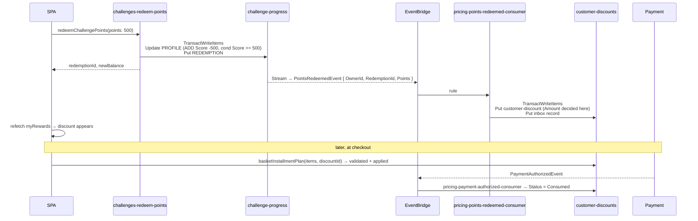

---
tags:
  - status/accepted
  - domain/challenges
  - domain/pricing
---

# ADR-0046: Challenge Points Redeem into a Pricing Customer Discount via CDC

## Status
**Accepted** — July 2026. Implemented alongside [ADR-0045](./0045-challenges-bounded-context-server-side-grading.md).

Extends [ADR-0026](./0026-pricing-bounded-context-price-and-campaign-ownership.md) with a second
discount shape (customer-scoped) without reopening its ownership ruling. Depends on
[ADR-0045](./0045-challenges-bounded-context-server-side-grading.md), which produces the points this
ADR spends.

---

## Context

The challenges feature is meant to pay: a customer who solves challenges accumulates points, and those
points become a discount at checkout. [ADR-0045](./0045-challenges-bounded-context-server-side-grading.md)
makes the points trustworthy. This ADR decides who turns them into money.

Two constraints collide.

- **[ADR-0026](./0026-pricing-bounded-context-price-and-campaign-ownership.md) made Pricing the single
  source of truth for discount.** It deleted `Coupon`, `ICouponRepository`, the `coupons` table and the
  `couponFor` resolver from Basket, and stated that Basket has *zero* discount responsibility. A
  `Challenges` service that mints its own coupon re-creates precisely the split the ADR removed — a
  second service deciding what a customer pays.
- **[ADR-0026](./0026-pricing-bounded-context-price-and-campaign-ownership.md) §3 reaffirmed the ban on
  synchronous cross-service invokes in the write path.** So Challenges cannot call Pricing during
  redemption to ask what 500 points are worth, and Pricing cannot call Challenges to debit a balance.

There is also a modelling problem underneath the plumbing. Pricing's existing discount is
**product-scoped**: `product-discounts` is keyed by `ProductId`, and a campaign enrols a set of
products (ADR-0026 §6, [ADR-0044](./0044-campaign-cdc-product-discounts-stream-and-ttl.md)). A reward
earned by a customer is **customer-scoped** and applies to a cart regardless of what is in it. It is a
new shape, not a campaign with one member.

A third temptation, recorded because it looks harmless: let Challenges hold a reward catalogue
("500 pts = R$50 off") and publish the money amount. That puts a pricing decision in a gamification
service — the discount value would be versioned, reviewed and deployed by the team that owns quiz
content.

---

## Decision

### 1. Challenges owns the balance; Pricing owns the conversion and the discount

The boundary is drawn at the unit:

| Fact | Owner | Never known by |
|---|---|---|
| How many points a player has, earned, spent | Challenges | Pricing |
| What a point is worth in currency | Pricing | Challenges |
| Whether a discount exists, its amount, validity, consumption | Pricing | Challenges |

Challenges MUST NOT store, compute or transmit a currency amount. The wire contract between the two
contexts is a **point quantity**. Pricing applies its own conversion and mints its own discount, which
keeps ADR-0026's ruling intact: exactly one service decides what a customer pays.

The SPA still needs to show "500 points → R$50" *before* the customer commits. That is a read from
Pricing (`rewardConversion`, a direct resolver), not a value Challenges holds.

### 2. Redemption is a conditional debit plus a ledger entry, in one transaction

`challenges-redeem-points` writes both items of `challenge-progress` under the same partition key:

```csharp
new TransactWriteItemsRequest
{
    TransactItems =
    [
        new() { Update = new Update   // PROFILE
        {
            TableName = "challenge-progress",
            Key = Key(ownerId, "PROFILE"),
            UpdateExpression = "ADD Score :neg, PointsSpent :pts",
            ConditionExpression = "Score >= :pts",
            // ...
        }},
        new() { Put = new Put         // REDEMPTION#<id>
        {
            TableName = "challenge-progress",
            Item = redemptionItem,
            ConditionExpression = "attribute_not_exists(SK)"
        }}
    ]
}
```

The `Score >= :pts` condition is the only place the balance invariant is enforced, and it is enforced
by the database. A failed condition surfaces as a domain error ("insufficient points"), never as a
retry.

The debit is durable the moment the mutation returns. The discount that results from it is not — see
§3.

### 3. `PointsRedeemedEvent` crosses the boundary by CDC, not by an invoke

`challenges-progress-stream-publisher` ([ADR-0045](./0045-challenges-bounded-context-server-side-grading.md) §9)
gains a rule matching `INSERT` of `REDEMPTION#` items and publishes:

```csharp
public record PointsRedeemedEvent : IntegrationEvent
{
    public string OwnerId { get; init; } = string.Empty;     // USER#<cognito-sub>
    public string RedemptionId { get; init; } = string.Empty;
    public int Points { get; init; }
}
```

No currency field, per §1. The trigger is the committed write, per
[ADR-0005](./0005-remove-domain-events-cdc-via-dynamodb-streams.md) — publishing inline from the
redemption handler is NOT ALLOWED.

### 4. Pricing mints `customer-discounts`, idempotently

A new module `Pricing.Function/Modules/CustomerDiscounts` and a consumer
`pricing-points-redeemed-consumer` on its own EventBridge rule. The handler converts points to an
amount, then writes the discount and the inbox record (`pricing-processed-events`) in one
`TransactWriteItems` — the same idempotency shape Ordering and Payment already use.

`customer-discounts` — PK `OwnerId`, SK `DiscountId`:

| Attribute | Purpose |
|---|---|
| `Amount` | currency value, decided here and nowhere else |
| `Status` | `Issued` \| `Consumed` |
| `ExpiresAt` | unix seconds, TTL attribute |
| `SourceRedemptionId` | traceability back to the Challenges ledger |

TTL follows the [ADR-0044](./0044-campaign-cdc-product-discounts-stream-and-ttl.md) precedent: expiry is
checked at read time and is authoritative; the TTL delete only keeps the table from accumulating dead
rows. Correctness MUST NOT depend on TTL firing.

### 5. The discount is applied in `basketInstallmentPlan`, after campaign allocation

Basket stays untouched — ADR-0026's "zero discount responsibility" is not reopened. The customer picks
a discount in the cart, the SPA passes its `discountId`, and Pricing's existing
`GetBasketInstallmentPlan` query validates it (owner match, `Status = Issued`, not expired) and applies
it.

Order of application, binding:

1. Campaign discounts are allocated across cart lines by `CartDiscountAllocation`
   ([ADR-0043](./0043-cart-discount-allocation-policy.md)).
2. The customer discount is then subtracted from the resulting cart total, floored at zero.

The two therefore **stack**, and the customer discount is cart-level: it is never allocated per line and
never influences a product page price. Applying it before the campaign allocation is NOT ALLOWED — it
would feed a reduced figure into a policy whose stated property is that a single-unit cart matches the
product page exactly.

### 6. The discount is burned on `PaymentAuthorizedEvent`

A second consumer, `pricing-payment-authorized-consumer`, flips the discount with a conditional
`UpdateItem` (`Status = Issued` → `Consumed`).

Burning at checkout time instead was rejected: a declined payment would leave the customer without both
the coupon and the order. Payment authorization is the first moment the discount has actually been
used, and Payment already publishes that fact
([ADR-0025](./0025-payment-bounded-context-simulated-gateway-cdc.md)), so no new event is introduced. A
declined payment leaves the discount `Issued` and reusable, which is the correct business outcome.

### 7. A Step Functions saga is rejected for this flow

[ADR-0032](./0032-create-product-with-price-step-functions-express-saga.md) established the Express saga
for a two-context write that must answer synchronously. Redemption has the same shape and is still not a
saga, for two reasons: the coupon is not needed in the same request (nothing downstream blocks on it for
seconds), and CDC already gives the atomicity that matters — the debit is atomic within Challenges, and
the mint is idempotent within Pricing.

If the coupon later must exist before the mutation returns, escalating to the ADR-0032 saga with a
point-refund compensation is the sanctioned path, and it requires an amendment to this section.

### 8. v1 conversion is a constant; a tier catalogue is a later projection

Pricing converts with a fixed rate held in its configuration (e.g. 100 points → R$10) and a minimum
redeemable quantity. The client sends a point quantity, not a product-like "reward id".

A tier catalogue ("Bronze/Silver/Gold") is deferred. When it arrives, Challenges MUST NOT read Pricing's
catalogue synchronously to validate a tier: the tier's **point cost** is projected into Challenges by
CDC — the same shape as `product-discounts` — while the money value stays in Pricing. §1 holds either
way.

### Flow



---

## Consequences

### Positive

- ADR-0026's ownership ruling survives contact with a second discount shape: still exactly one service
  deciding what a customer pays.
- No synchronous cross-service call anywhere in the redemption path; the contexts share one event and no
  types beyond it.
- The balance invariant is enforced by a DynamoDB condition, so concurrent redemptions cannot overdraw.
- Repricing the reward (changing what a point is worth) is a Pricing change alone — no deploy of the
  challenges service, no migration of issued discounts.
- Reuses the inbox, CDC, TTL and EventBridge-rule patterns already in the codebase; the only new artefact
  is a table and two consumers.

### Negative / Costs

- The coupon appears asynchronously. Between the debit and the mint, the customer has fewer points and no
  discount — a visible, if brief, inconsistency.
- If the mint consumer fails permanently, points are gone and nothing was issued. The failure is
  recoverable but not automatic.
- The customer discount is a second discount concept in Pricing, with its own table, validity rules and
  interaction with campaigns — more surface than "campaigns only".
- A double-spend window exists: two concurrent checkouts can both read the discount as `Issued` before
  either is authorized.
- The redemption ledger lives in Challenges and the issued discount in Pricing, so answering "what
  happened to my 500 points?" spans two tables.

### Mitigation Strategies

- The redemption mutation returns `redemptionId` immediately and the SPA shows a pending state, polling
  or refetching `myRewards` — the debit is already durable, so nothing is lost.
- `pricing-points-redeemed-consumer` gets a DLQ with an alarm on the shared `duckstore-alerts` topic,
  like every other consumer; a message on that queue is a replayable mint, not lost money.
- The double-spend window is closed at burn time by the conditional `Status = Issued` update: the second
  authorization simply fails to consume an already-consumed discount. For a demo the residual exposure
  (one cart briefly priced with a discount that another checkout consumed) is accepted, not solved.
- `SourceRedemptionId` on the discount and `RedemptionId` in the ledger make the two tables joinable for
  support and for the analytics lane.

### Future Constraints

- Any future reward type (free shipping, gift, tier status) MUST follow §1: Challenges publishes what was
  spent, the owning context decides what it grants. Adding a currency field to `PointsRedeemedEvent` is
  NOT ALLOWED.
- Basket MUST NOT gain knowledge of customer discounts. If cart-level discount display needs more than
  `basketInstallmentPlan` returns, extend the Pricing query, not the Basket aggregate.
- A per-order cap, stacking limit, or "one discount per cart" rule belongs in Pricing's domain, and this
  ADR must be amended when one is introduced — the stacking rule in §5 is currently unbounded.

---

## Applies To

- `src/Services/Pricing/Pricing.Function/Modules/CustomerDiscounts` *(new)*
- `src/Services/Pricing/Pricing.Function/Modules/Prices/Features/GetBasketInstallmentPlan` *(amended)*
- `src/Services/Challenges/Challenges.Function/Modules/Progress` *(redemption feature + stream rule)*
- `infra/constructs/pricing-dynamodb.ts`, `infra/constructs/pricing-lambdas.ts`
- `graphql/schema.graphql`, `graphql/resolvers/pricing/**`, `graphql/resolvers/challenges/**`

---

## References

- [ADR-0005: Remove Domain Events — CDC via DynamoDB Streams](./0005-remove-domain-events-cdc-via-dynamodb-streams.md)
- [ADR-0012: Merge Discount into Basket — Coupon as In-Process Entity](./0012-merge-discount-into-basket-coupon-as-in-process-entity.md)
- [ADR-0025: Payment Bounded Context — Simulated Gateway and CDC](./0025-payment-bounded-context-simulated-gateway-cdc.md)
- [ADR-0026: Pricing Bounded Context — Price and Campaign Ownership](./0026-pricing-bounded-context-price-and-campaign-ownership.md)
- [ADR-0032: createProductWithPrice — Step Functions Express Saga](./0032-create-product-with-price-step-functions-express-saga.md)
- [ADR-0043: Cart Discount Allocation Policy](./0043-cart-discount-allocation-policy.md)
- [ADR-0044: Campaign Changes Reach CatalogView via a `product-discounts` Stream and TTL](./0044-campaign-cdc-product-discounts-stream-and-ttl.md)
- [ADR-0045: Challenges Bounded Context — Server-Side Grading and Answer-Key Isolation](./0045-challenges-bounded-context-server-side-grading.md)
