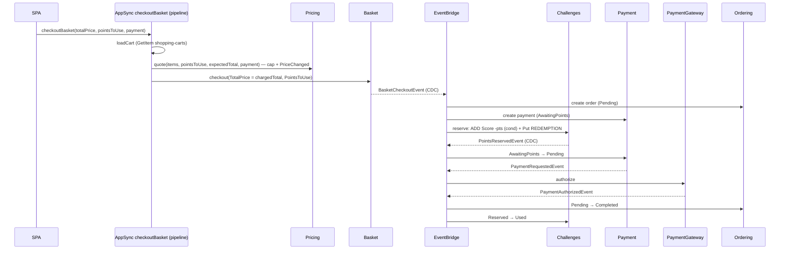

---
tags:
  - status/accepted
  - domain/challenges
  - domain/pricing
  - domain/payment
  - domain/basket
---

# ADR-0048: Points Transactions Ledger and In-Cart Points Redemption

## Status
**Accepted** — October 2026

Amends:

| ADR | What changes | What stands |
|---|---|---|
| [ADR-0046](./0046-challenge-points-redeem-into-pricing-customer-discount.md) | §2–§8, the Flow and the Future Constraints are replaced by in-cart redemption (§3–§7 here). §1 row 3 becomes: *Pricing computes the points discount per quote and persists none; Challenges tracks the redemption lifecycle, in points.* | §1 rows 1–2 (Challenges owns the balance; Pricing owns the conversion), the principle that cross-context facts travel by CDC, and §5's binding order — campaign allocation first, then the cart-level points discount, floored at zero — with `discountId` replaced by `pointsToUse` |
| [ADR-0045](./0045-challenges-bounded-context-server-side-grading.md) | §1/§5: redemption rows leave `challenge-progress` for a new `points-transactions` ledger. §9: `PointsRedeemedEvent` is removed and `challenges-points-transactions-stream-publisher` is added. Challenges gains inbound consumers (§8 here) | Server-side grading, answer-key isolation, `challenge-progress` for profile and attempts |
| [ADR-0026](./0026-pricing-bounded-context-price-and-campaign-ownership.md) | §3's second sentence: the `checkoutBasket` **mutation** now depends synchronously on a Pricing **read**, orchestrated by AppSync (§4 here) | Basket's Lambdas never call Pricing; Basket has zero discount responsibility |
| [ADR-0025](./0025-payment-bounded-context-simulated-gateway-cdc.md) | §1/§3: Payment also publishes `PaymentDeclinedEvent`, for `InsufficientPoints` only, and `PaymentRequestedRule` also matches MODIFY `AwaitingPoints → Pending` (§6 here) | PaymentGateway decides every card authorization/decline |

Specs (committed with the implementing PR): [SPEC.md](../../SPEC.md),
[SPEC-points-ledger.md](../../SPEC-points-ledger.md),
[SPEC-review-points.md](../../SPEC-review-points.md),
[SPEC-cart-points-redemption.md](../../SPEC-cart-points-redemption.md).

---

## Context

ADR-0046 shipped the backend for turning challenge points into a discount, but the business rules that
have now been set do not fit its shape:

| Rule (business, v1) | ADR-0046 as built |
|---|---|
| 100 points = R$ 1,00 | 100 points = R$ 10,00 (`reward-config.ts`) |
| The customer types how many points to use, **in the cart** | Points are redeemed up front into a coupon, before any cart exists |
| Discount capped at 20% of the order | No cap; ADR-0046 Future Constraints says the stacking rule is unbounded |
| Points never expire | The coupon expires after 90 days |
| History: date, reason (challenge, review, redemption), amount | No ledger; `ATTEMPT#` and `REDEMPTION#` rows only, no reason for a balance change |
| If the order's payment fails, the points come back | A declined payment leaves the coupon `Issued`; nothing returns points |

There are also three concrete gaps in the current code:

- **The cap can't be enforced against a pre-minted coupon.** The coupon is minted before the cart
  exists, so a 20%-of-the-cart rule could only clip it at apply time and strand the remainder.
- **`checkoutBasket` forwards the client's `totalPrice` verbatim.** The amount Ordering and Payment
  record is whatever the browser sent. A cap checked only at quote time (`basketInstallmentPlan`) can
  be bypassed by skipping the quote and posting the checkout directly.
- **Reservation and payment would race.** If points are debited asynchronously after checkout,
  Payment can authorize (at the discounted price) before Challenges discovers the balance is short.

---

## Decision

### 1. A `points-transactions` ledger, owned by Challenges

Every change to a customer's balance is a row in a new table owned by Challenges (ADR-0046 §1 —
Challenges owns the balance):

| Key / index | Value |
|---|---|
| PK | `OwnerId` (`USER#<cognito-sub>`) |
| SK | `TransactionId`, **deterministic** per source |
| LSI1 | `OwnerId` + `CreatedAt` (ISO-8601) — history ordered by date |
| GSI1 | `OrderId`, **sparse** (redemption rows only) — lets payment/order events find the row |
| Stream | `NEW_AND_OLD_IMAGES` |
| TTL | **none** — the ledger is permanent |

| `Type` | `TransactionId` | `Points` |
|---|---|---|
| `ChallengeCredit` | `CHALLENGE#<questionId>` | positive |
| `ReviewCredit` | `REVIEW#<productId>` | positive (15) |
| `Redemption` | `REDEMPTION#<orderId>` | negative (the amount requested, also on `Failed` rows) |

The deterministic `TransactionId`, written with `attribute_not_exists(TransactionId)`, IS the
idempotency mechanism. It MUST NOT be replaced by an inbox table or by a status on another context's
row (e.g. a review's status — a review can be deleted and republished, or expire by TTL; the ledger
row cannot).

Rows MUST NOT carry a currency amount (ADR-0046 §1). The SPA renders `Points` with Pricing's
`rewardConversion` when it needs a money value. History shows `Failed` rows with their status; they
never moved the balance.

`PointsTransaction` is an entity of the `Progress` module, not a new module: it is the successor of the
`REDEMPTION#` rows ADR-0045 §5 already kept there, and every write to it moves `PlayerProgress.Score`.

### 2. The balance stays on `challenge-progress` PROFILE `Score`

The ledger explains the balance; it does not replace it. Every ledger write that moves points is in
the **same `TransactWriteItems`** as the `ADD Score` on PROFILE:

```csharp
// Correct — balance and ledger move together, or not at all
TransactItems =
[
    attemptUpdate,                                   // ATTEMPT#<questionId>
    profileUpdate,                                   // ADD Score :earned
    new() { Put = new Put {
        TableName = PointsTransactionsSchema.TableName,
        Item = ChallengeCreditItem(ownerId, questionId, earned),
        ConditionExpression = "attribute_not_exists(TransactionId)" } }
]

// Incorrect — computing the balance by summing the ledger on read
var balance = (await QueryLedger(ownerId)).Sum(t => t.Points);   // O(n), and Score >= :pts needs one item
```

### 3. Pricing owns the conversion, the cap and the charged total

`basketInstallmentPlan(items, pointsToUse)` replaces `discountId`. Pricing applies, in order:

1. Campaign allocation (`CartDiscountAllocation`, ADR-0043) → the post-campaign cart price.
2. `maxRedeemablePoints = floor(price × MaxDiscountPercent / 100 × PointsPerUnit / CurrencyPerUnit)`.
3. `pointsToUse > maxRedeemablePoints` → **rejected** (`PointsAboveCap`). Pricing MUST NOT silently
   clip the value.
4. `pointsDiscount = pointsToUse × CurrencyPerUnit / PointsPerUnit`, applied through the existing
   cart-level customer-discount step (after campaigns, cash price included — ADR-0046 §5 order kept).

The response carries `maxRedeemablePoints` and `pointsDiscount`, so the SPA bounds its input with
Pricing's own number instead of re-implementing the cap. v1 values: 100 points = R$ 1,00, cap 20%,
no expiry.

When the caller also sends `expectedTotal`, `paymentMethod` and `installments` (the checkout does,
§4), Pricing picks the total for that payment choice — `cashPrice`, or `installments[N].totalValue` —
compares it with `expectedTotal` in cents, and **rejects** a mismatch with `PriceChanged`
(`serverTotal` in the error). On a match it returns that total as `chargedTotal`. Choosing the total
and deciding it differs is a pricing rule, so it lives in Pricing, not in resolver JS (ADR-0009).

Pricing still never knows the balance. The balance is checked in the SPA (UX only) and at reservation
(authoritative, §5).

### 4. The checkout total is always the server's

`checkoutBasket` changes from a single Lambda resolver to an AppSync **pipeline resolver** and runs for
**every** checkout. Classification under [ADR-0009](./0009-appsync-resolver-selection-direct-first-lambda-for-complex-logic.md):
escalation **criterion 2** (multi-service orchestration). The JS steps only map arguments, results
and errors; every rule is in a Lambda.

| Step (`graphql/resolvers/basket/mutations/`) | Data source | Operation |
|---|---|---|
| `Mutation.checkoutBasket.loadCart.js` | DynamoDB `shopping-carts` | `GetItem` the caller's cart (`USER#<sub>`), parse `Data` |
| `Mutation.checkoutBasket.quote.js` | Lambda `GetBasketInstallmentPlan` (Pricing) | The **stored** cart items, `pointsToUse`, `expectedTotal = input.totalPrice`, `paymentMethod`, `installments` → `chargedTotal`, or `PointsAboveCap` / `PriceChanged` |
| `Mutation.checkoutBasket.checkout.js` | Lambda Basket checkout | `TotalPrice = chargedTotal`, `PointsToUse` |

A mismatch is **rejected, not substituted**: charging an amount the customer did not see — even a
lower one — is not allowed. The client's `totalPrice` survives in the schema only as "the amount the
customer confirmed".

This amends ADR-0026 §3's second sentence: Basket's Lambdas still never call Pricing, but the
`checkoutBasket` mutation now fails if Pricing is unavailable, because it depends synchronously on a
Pricing **read** orchestrated by AppSync. It is not a saga ([ADR-0032](./0032-create-product-with-price-step-functions-express-saga.md),
ADR-0046 §7) because only one step writes.

Basket keeps zero discount responsibility (ADR-0026): it passes `PointsToUse` through to
`BasketCheckoutEvent` without reading it. **No currency amount is added to Basket's contract** — the
discount is already inside `TotalPrice`, and `BasketCheckoutEvent` is also consumed by Challenges,
which MUST NOT receive currency (ADR-0046 §1).

`appsync-api.ts`'s `pipelineResolver()` takes one data source for every step today; it gains a variant
with one data source per step.

### 5. Redemption is a reservation with a status machine

`challenges-basket-checkout-consumer` handles `BasketCheckoutEvent` with `PointsToUse > 0`:

- `TransactWriteItems`: `ADD Score -pts` on PROFILE with `ConditionExpression: Score >= :pts`, plus
  `Put REDEMPTION#<orderId>` with `Status = Reserved`, `OrderId` set (GSI1), `attribute_not_exists`.
- Cancelled by the balance condition → `Put REDEMPTION#<orderId>` with `Status = Failed`, no debit.
- Cancelled by the Put condition → duplicate delivery, no-op.

```
            BasketCheckout (PointsToUse > 0)
                     │
      Score >= pts ──┴── Score < pts
           │                 │
       Reserved            Failed ──(terminal, nothing was debited)
           │
           ├── PaymentAuthorized ──> Used ── OrderCancelled ──> Refunded (+pts)
           └── OrderCancelled ─────> Released (+pts)
```

Every transition is a conditional `Update` on the ledger row (`Status = <source>`). `Released` and
`Refunded` put it in the same `TransactWriteItems` as `ADD Score :pts` on PROFILE. The amount returned
is read from the ledger row, never from the event.

**Missing target vs. failed condition.** A consumer that finds **no** target row — the payment not yet
created, or a GSI1 lookup that misses because the index is eventually consistent — MUST throw, so
EventBridge retries and an exhausted event lands in the DLQ. It MUST NOT no-op. A no-op is correct only
when the row exists and its conditional status check fails (a duplicate or already-settled event).

Settlement keys off `OrderCancelledEvent` (new, published by Ordering's existing
`ordering-stream-publisher` on any transition into `Cancelled`), not `PaymentDeclinedEvent`: a
declined payment already cancels the order, so one consumer covers both "declined" and "cancelled
after payment", and `PaymentDeclinedEvent` does not carry the owner. v1 ships no action to cancel a paid
order; `Used → Refunded` is wired and unit-tested but has no production trigger yet.

### 6. Payment waits for the reservation when points are in play

To close the race in Context:

- Payment's `BasketCheckout` consumer creates the payment in a new status **`AwaitingPoints`** when
  `PointsToUse > 0`. `PaymentRequestedRule` matches INSERT `Pending` only, so the gateway is not
  called.
- `PointsReservedEvent` → `AwaitingPoints → Pending`. `PaymentRequestedRule` also matches this
  MODIFY, and the existing gateway flow runs unchanged.
- `PointsReservationFailedEvent` → `AwaitingPoints → Declined` (reason `InsufficientPoints`).
  `PaymentDeclinedEvent` is otherwise published by PaymentGateway, so a new
  `PaymentDeclinedInsufficientPointsRule` on `payment-payments-stream-publisher` publishes it on this
  transition, and Ordering cancels the order through its existing consumer. The event contract is
  unchanged. Payment's own `PaymentResult` consumer also receives this event (its rule matches
  `source` + `detail-type`) and no-ops it through the `Status != Pending` guard. This is intentional.
- Both events are consumed in one `Consumers/PointsReservation/` slice with two `[LambdaFunction]`
  entry points and one EventBridge rule per detail-type — the same shape as `PaymentResult/`. ADR-0040
  strategy dispatch is scoped to CatalogView and is not required here.
- Without points, Payment behaves exactly as today.

`PointsReservedEvent` and `PointsReservationFailedEvent` are published by a new
`challenges-points-transactions-stream-publisher` (rule-based, ADR-0019) on INSERT of `Reserved` and
`Failed` rows. Neither carries currency.

### 7. The coupon model is removed

`redeemChallengePoints`, the `RedeemPoints` feature, `REDEMPTION#` rows in `challenge-progress`,
`PointsRedeemedEvent` and its rule, Pricing's `CustomerDiscounts` module (`customer-discounts` table
and both consumers), `myRewards`, and every `DiscountId` field are removed once in-cart redemption works
end to end. `rewardConversion` stays (without `expiryDays`).

### 8. Challenges gains inbound consumers (amends ADR-0045)

Challenges now consumes four events, each from a different producer, so each is a plain 1:1 consumer
(`EventsIntegration/Consumers/<Event>/`, EventBridge rule, DLQ alarmed on `duckstore-alerts`). They
write only to Challenges' own tables.

| Lambda | Event | Producer |
|---|---|---|
| `challenges-basket-checkout-consumer` | `BasketCheckoutEvent` | Basket |
| `challenges-payment-authorized-consumer` | `PaymentAuthorizedEvent` | PaymentGateway |
| `challenges-order-cancelled-consumer` | `OrderCancelledEvent` | Ordering |
| `challenges-review-created-consumer` | `ReviewCreatedEvent` | Review (credit rules in SPEC-review-points) |

New publishers and their sources:

| Lambda / rule | Source |
|---|---|
| `challenges-points-transactions-stream-publisher` | `points-transactions` stream; `onFailure` SQS DLQ on its `DynamoEventSource` (ADR-0015 §1) |
| `OrderCancelledRule` | existing `ordering-stream-publisher` |
| `PaymentDeclinedInsufficientPointsRule` | existing `payment-payments-stream-publisher` |
| `payment-points-reservation-consumer` | Payment, consumes `PointsReservedEvent` + `PointsReservationFailedEvent` |

### Flow



---

## Consequences

### Positive

- The cap is enforced where the money is known (Pricing) and cannot be bypassed by skipping the quote.
- The amount charged is always computed server-side — this also closes the pre-existing
  client-`totalPrice` gap for orders without points.
- No double-spend window: the debit is conditional and happens before payment is requested.
- Points come back automatically when an order is cancelled, with an auditable status trail.
- One ledger answers "where did my points go?" without joining two contexts' tables (an ADR-0046
  negative).
- ADR-0046 §1's ownership split survives: still one service deciding what a customer pays, and no
  currency ever crosses into Challenges.

### Negative / Costs

- Every checkout now runs a three-step pipeline (cart read + Pricing invoke) before Basket — added
  latency on the happy path, including orders without points — and fails if Pricing is unavailable.
- A legitimate price change between quote and checkout now fails the checkout (`PriceChanged`) and asks
  the customer to confirm again.
- Checkouts with points take a longer asynchronous path (reservation → event → Payment) before the
  gateway is called.
- Six new event-driven Lambdas (Challenges: 4 consumers + 1 publisher; Payment: 1 consumer), each with
  a rule or stream source, DLQ and alarm, plus two new rules on existing publishers.
- Payment's own `PaymentResult` consumer receives the `PaymentDeclinedEvent` Payment now publishes — an
  extra invocation and inbox write that no-ops by design.
- Existing dev balances have no ledger rows; history starts at deploy.

### Mitigation Strategies

- The checkout's `PriceChanged` check and the quote shown to the customer come from the **same** Pricing
  Lambda, compared in cents — a mismatch means a real price change or a tampered input, not rounding.
- The SPA handles `PriceChanged` by re-quoting and highlighting the new total; it never resubmits on
  its own.
- `Ordering.FunctionalTests` guards the no-points checkout path after the pipeline lands.
- Every new consumer and publisher has a DLQ alarmed on `duckstore-alerts`. A dead-lettered
  reservation leaves the payment in `AwaitingPoints` (visible, replayable), never charged at a discount
  without points.

### Future Constraints

- A redemption-affecting rule (new cap, minimum, per-order limit) belongs in Pricing's quote. It then
  applies to both `basketInstallmentPlan` and the `checkoutBasket` pipeline, because they call the
  same Lambda.
- Any new way to earn points MUST write a `points-transactions` row with a deterministic
  `TransactionId` in the same transaction as the balance change.
- Basket's checkout contract MUST NOT gain a currency field derived from points.
- Adding an action to cancel a paid order requires no change here — it only has to move the order to
  `Cancelled`.

---

## Applies To

- `src/Services/Challenges/Challenges.Function/Modules/Progress` (ledger, reservation, settlement, publisher)
- `src/Services/Pricing/Pricing.Function/Modules/Prices/Features/GetBasketInstallmentPlan`
- `src/Services/Pricing/Pricing.Function/Modules/CustomerDiscounts` *(removed)*
- `src/Services/Payment/Payment.Function/Modules/Payments` (`AwaitingPoints`, `PointsReservation` consumer, decline rule)
- `src/Services/Ordering/Ordering.Function/Modules/Orders/EventsIntegration/Publishers` (`OrderCancelledRule`)
- `src/Services/Basket/Basket.Function` (pass-through of `PointsToUse` only)
- `src/BuildingBlocks/BuildingBlocks.Messaging/Events`
- `graphql/schema.graphql`, `graphql/resolvers/{basket,pricing,challenges}/**`
- `infra/constructs/appsync-api.ts` (multi-data-source `pipelineResolver`), `infra/constructs/{challenges,pricing,payment,ordering}-*.ts`, `infra/constructs/reward-config.ts`

---

## References

- [ADR-0005: Remove Domain Events — CDC via DynamoDB Streams](./0005-remove-domain-events-cdc-via-dynamodb-streams.md)
- [ADR-0009: Resolver selection — direct first, Lambda for complex logic](./0009-appsync-resolver-selection-direct-first-lambda-for-complex-logic.md)
- [ADR-0019: Module-oriented service structure and rule-based stream publishers](./0019-module-oriented-service-structure-and-rule-based-stream-publishers.md)
- [ADR-0025: Payment Bounded Context — Simulated Gateway and CDC](./0025-payment-bounded-context-simulated-gateway-cdc.md) *(amended)*
- [ADR-0026: Pricing Bounded Context — Price and Campaign Ownership](./0026-pricing-bounded-context-price-and-campaign-ownership.md) *(amended)*
- [ADR-0032: createProductWithPrice — Step Functions Express Saga](./0032-create-product-with-price-step-functions-express-saga.md)
- [ADR-0043: Cart Discount Allocation Policy](./0043-cart-discount-allocation-policy.md)
- [ADR-0045: Challenges Bounded Context — Server-Side Grading](./0045-challenges-bounded-context-server-side-grading.md) *(amended)*
- [ADR-0046: Challenge Points Redeem into a Pricing Customer Discount](./0046-challenge-points-redeem-into-pricing-customer-discount.md) *(amended)*
