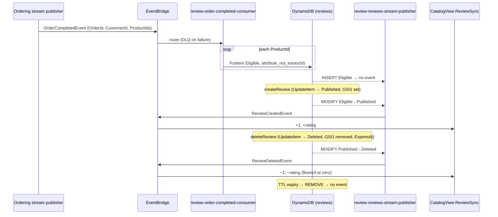

---
tags:
  - status/proposed
  - domain/review
  - domain/ordering
  - domain/catalogview
---

# ADR-0049: Review Status — Purchase Eligibility, Sparse GSI1, TTL on Delete and `ReviewDeleted`

## Status
**Proposed** — October 2026

Amends, on acceptance:

- [ADR-0011](./0011-review-bounded-context-rating-aggregation-via-cdc.md) §1–§3 — a `reviews` row
  is no longer always a public review: it carries a `Status`, only `Published` rows are in GSI1, the
  table gains TTL on `ExpiresAt`, and Review gets its first inbound consumer (`OrderCompletedEvent`).
- [ADR-0029](./0029-review-upsert-composite-key-and-rating-delta.md) §3–§4 — `createReview` stops
  being an upsert that can create a row (it now requires an existing row and becomes an
  `UpdateItem`), and the publisher rules fire on **status transitions** instead of on
  `INSERT`/`MODIFY`. Adds `ReviewDeletedEvent`.

Specified by [SPEC-review-eligibility.md](../../SPEC-review-eligibility.md).

---

## Context

Today anyone with a Cognito session can review any product: `createReview` (ADR-0029) is a pipeline
upsert keyed by `${productId}#${sub}` (ADR-0037) that creates the row if it doesn't exist. The
business now requires **"only customers who bought a product can review it"**, plus a customer must
be able to see, edit and delete their own review.

Constraints from existing ADRs:

- **Context ownership** — Ordering knows who bought what; Review owns `reviews`. Review MUST NOT read
  the `ordering` table, and Ordering MUST NOT write `reviews`. The fact "order completed" has to
  reach Review as an integration event via CDC (ADR-0005, ADR-0019).
- **Resolver selection** (ADR-0009) — every new field starts Direct; the eligibility check is a
  same-table read (does my row exist?), which fits the pipeline shape ADR-0029 §6 already ruled Direct.
- **Rating aggregation** (ADR-0029/ADR-0030) — CatalogView keeps `RatingCount`/`RatingSum`/
  `RatingDistribution` by deltas. Anything that is not a public review must never reach those deltas,
  and removing a public review must subtract it exactly once.
- **ISR revalidation** (ADR-0029 §7) — `ReviewUpdatedEvent` invalidates the product page's review
  list, including comment-only edits.

Concrete pains of the current model:

- No purchase gate: `createReview` writes a row for any product id.
- No delete: a customer cannot withdraw a review, and the aggregate has no "minus one" path.
- `reviewsByProduct` lists every row in GSI1; any non-public row added to the table would leak into
  the public list and the average unless every reader filters it.

---

## Decision

The eligibility to review **is a row**. When an order completes, Review creates one row per product
with `Status = Eligible`. `createReview` may only transition an existing row to `Published`.
`deleteReview` transitions it to `Deleted` with a 5-day TTL. Visibility is enforced **structurally**
by a sparse GSI1, and the publisher emits integration events by **status transition**.

### 1. Review status

| Status | Created/changed by | GSI1 (`reviewsByProduct`) | Counts in average and histogram |
|---|---|---|---|
| `Eligible` | `review-order-completed-consumer` (§3) | **no** `GSI1PK`/`GSI1SK` | no |
| `Published` | `createReview` | `GSI1PK = ProductId`, `GSI1SK = CreatedAt` | yes |
| `Deleted` | `deleteReview` | **no** `GSI1PK`/`GSI1SK`; `ExpiresAt = now + 5 days` | no (removed by `ReviewDeleted`) |

A row **without** `Status` (written before this ADR) is treated as `Published` everywhere — by the
publisher (`ReviewSchema.EffectiveStatus`), by the resolvers (`status` defaults to `Published`) and
by `deleteReview`'s condition. Those rows are already in GSI1, so no migration or backfill is needed.

Allowed transitions:

```
(none) ──OrderCompleted──> Eligible ──createReview──> Published ──deleteReview──> Deleted
                                                         ^  │ createReview (edit)      │
                                                         │  └──────────┘              │
                                                         └──────── createReview ──────┘ (re-publish removes ExpiresAt)
Deleted ──TTL 5d──> (row removed)
```

### 2. Sparse GSI1 is the only visibility mechanism

Only `Published` rows carry `GSI1PK`/`GSI1SK`. `reviewsByProduct` therefore **structurally** cannot
return `Eligible` or `Deleted` rows — no `FilterExpression`, no status check in the resolver (same
technique as the Challenges answer-key sparse GSI, ADR-0045). Writers MUST maintain the invariant:

- The consumer (§3) MUST NOT write `GSI1PK`/`GSI1SK`.
- `createReview` MUST `SET GSI1PK, GSI1SK`; `deleteReview` MUST `REMOVE GSI1PK, GSI1SK`.
- Readers MUST NOT add a status filter to compensate for a writer that broke the invariant.

### 3. Ordering publishes `OrderCompletedEvent`; Review consumes it

- **Ordering** — a new `OrderCompletedRule` on the existing `ordering-stream-publisher`
  (ADR-0019) matches `MODIFY` with `Old.Status != Completed` and `New.Status == Completed`. Matching
  the transition (not the state) means a re-delivered or unrelated `MODIFY` of an already-completed
  order publishes nothing. Payload: `{ OrderId, CustomerId, ProductIds }` with `ProductIds` distinct.
  `CustomerId` is the Cognito sub (checkout is Cognito-only). Declined/cancelled orders never reach
  `Completed`, so they never create eligibility.
- **Review** — the first inbound consumer of the context, `review-order-completed-consumer`
  (`Modules/Reviews/EventsIntegration/Consumers/OrderCompleted/`), issues **one individual
  `PutItem` per product**: `Id = ${productId}#${customerId}`, `ProductId`, `UserId`,
  `Status = Eligible`, `CreatedAt` — no `Rating`, `Comment` or GSI1 attributes — with
  `ConditionExpression: attribute_not_exists(Id)`. `ConditionalCheckFailedException` is a no-op.

  It deliberately uses **neither `TransactWriteItems` nor a `processed-events` inbox**: the per-item
  condition is already idempotent (a redelivery hits the same keys), and in a transaction a single
  product the customer already has a row for (bought before, already reviewed) would cancel the
  eligibility of every other product in the order. Buying again therefore never alters an
  existing row, whatever its status.

### 4. GraphQL surface (all Direct — ADR-0009)

| Field | Shape | Rule |
|---|---|---|
| `myReview(productId: ID!): Review` | `GetItem` on `productId#sub` | `null` when no row; returns the row with its `status` |
| `createReview(input)` | pipeline `checkExisting` → `upsert` (ADR-0029) | `checkExisting` calls `util.unauthorized()` when the row doesn't exist. `upsert` becomes `UpdateItem`: `SET Status = Published, Rating, Comment, UserName, UpdatedAt, GSI1PK, GSI1SK, CreatedAt` (preserved), `REMOVE ExpiresAt`, condition `attribute_exists(Id)` |
| `deleteReview(productId: ID!): Review!` | `UpdateItem` | `SET Status = Deleted, ExpiresAt = now + 5d (epoch seconds) REMOVE GSI1PK, GSI1SK`, condition `Status = Published OR attribute_not_exists(Status)` |

The owner always comes from `ctx.identity.sub`, never from input (ADR-0037). `createReview` MUST NOT
create a row that doesn't exist — the `attribute_exists(Id)` condition backs up the pipeline check
against a TTL deletion between the two functions.

### 5. Publisher rules by status transition

The `reviews` publisher (`review-reviews-stream-publisher`) decides by transition, not by row
existence. Legacy rows without `Status` count as `Published`.

| Stream record | Event | CatalogView effect |
|---|---|---|
| `INSERT` `Eligible` | none | — |
| `Eligible` → `Published` | `ReviewCreatedEvent` | +1 review, +rating |
| `Deleted` → `Published` | `ReviewCreatedEvent` | +1 review, +rating |
| `Published` → `Published` | `ReviewUpdatedEvent` | rating delta (zero for comment-only edits — still fires, for ISR) |
| `Published` → `Deleted` | **`ReviewDeletedEvent`** (new) | −1 review, −old rating, histogram bucket −1 |
| `REMOVE` (TTL expiry) | **none** | — (already subtracted on delete) |

```csharp
public record ReviewDeletedEvent : IntegrationEvent
{
    public string ReviewId { get; set; }
    public Guid ProductId { get; set; }
    public int Rating { get; set; }   // the rating being withdrawn (old image)
}
```

`ReviewCreatedEvent` gains `UserId` (the Cognito sub) for downstream consumers (review points).

**The TTL `REMOVE` MUST NOT emit an event.** The aggregate was already adjusted by
`ReviewDeletedEvent` at delete time; a second subtraction on expiry would double-count.

### 6. CatalogView applies `ReviewDeleted`

A new `ReviewDeleteStrategy` joins `Consumers/ReviewSync/` (ADR-0040 — a new strategy behind the
Review producer's dispatcher, never a `switch`), and `ReviewDeletedEvent` is added to the existing
ReviewSync EventBridge rule. It decrements `RatingCount`, `RatingSum` and the
`RatingDistribution` bucket under the same `LastRatingEventId` idempotency marker as create/update
(ADR-0030), conditioned on the count and bucket being positive so the aggregate is **floored at
zero**, then recomputes `AverageRating`.

### 7. TTL on `reviews`

The `reviews` table enables TTL on `ExpiresAt` (epoch seconds) in the CDK construct and the dev
seeder. Only `Deleted` rows carry `ExpiresAt`; re-publishing removes it. After expiry the row is
gone, and the customer can review the product again only after buying it again.



---

## Applies To

- `src/BuildingBlocks/BuildingBlocks.Messaging/Events/` — `OrderCompletedEvent`, `ReviewDeletedEvent` (new); `ReviewCreatedEvent` + `UserId`.
- `src/Services/Ordering/Ordering.Function` — `OrderCompletedRule`.
- `src/Services/Review/Review.Function` — `ReviewStatus`, `ReviewSchema`, `ReviewStreamImage`, rules, `Consumers/OrderCompleted/`.
- `src/Services/Review/Review.DevelopmentDataSeeder`, `infra/constructs/review-dynamodb.ts` — TTL on `ExpiresAt`.
- `infra/constructs/review-lambdas.ts` — consumer, EventBridge rule, DLQ.
- `src/Services/CatalogView/CatalogView.Function` — `ReviewDeleteStrategy`; `infra/constructs/catalogview-lambdas.ts`.
- `graphql/schema.graphql`, `graphql/resolvers/reviews/**`, `infra/constructs/appsync-api.ts`.
- `src/WebApps/Shopping.Web.SPA.React` — `features/reviews/**`, `app/api/graphql/local.ts`.

---

## Consequences

### Positive

- **Purchase gate enforced by data, not by a check that can be skipped** — no row, no review; the
  key still comes from the token (ADR-0037).
- **Visibility is structural** — the sparse GSI1 hides `Eligible`/`Deleted` without any reader
  needing to know about statuses.
- **Context ownership preserved** — Review learns about purchases only through `OrderCompletedEvent`.
- **Aggregate stays exact** — one event per public-visibility transition; the TTL delete is silent.

### Negative / Costs

- **Eligibility is eventually consistent** — a few seconds pass between payment authorization and
  the form appearing (Ordering stream → EventBridge → consumer).
- **No backfill** — orders completed before deployment create no eligibility; those customers can't
  review until they buy again. Legacy published reviews keep working (no `Status` = `Published`).
- **Partial eligibility on failure** — individual `PutItem`s mean a crash mid-order leaves some
  products eligible; the EventBridge retry re-runs the loop, and the conditions make that safe.
- **`ReviewDeleted` before `ReviewCreated`** under unordered delivery would be dropped by the zero
  floor, leaving the later `ReviewCreated` to add a review that no longer exists. Unlikely (the
  customer has to publish and delete within the propagation window) and not self-correcting;
  accepted for a learning project, the same trade-off ADR-0029 made for out-of-order updates.

### Mitigation Strategies

- Every row of §5 is a unit test on the publisher rules; the consumer's per-item condition and the
  CatalogView floor are unit-tested.
- The local dev GraphQL backend (`local.ts`) creates the `Eligible` rows synchronously in the local
  checkout, so the flow is exercisable without EventBridge.

### Future Constraints

- Any new writer of `reviews` MUST respect the sparse-GSI1 invariant (§2).
- Any new review state that affects public visibility MUST add a row to the §5 table and a matching
  rule; the TTL `REMOVE` stays silent.
- Changing the `reviews` key or migrating legacy rows requires a new ADR.

---

## References

- [ADR-0005: Remove In-Process Domain Events — Integration Events via DynamoDB Streams (CDC)](./0005-remove-domain-events-cdc-via-dynamodb-streams.md)
- [ADR-0009: AppSync Resolver Selection — Direct DynamoDB Resolvers as Default](./0009-appsync-resolver-selection-direct-first-lambda-for-complex-logic.md)
- [ADR-0011: Review Bounded Context — Product Ratings Aggregated into Catalog via CDC](./0011-review-bounded-context-rating-aggregation-via-cdc.md)
- [ADR-0015: SQS DLQ for CDC Publishers and EventBridge Consumers](./0015-sqs-dlq-for-cdc-publishers-and-eventbridge-consumers.md)
- [ADR-0019: Module-Oriented Service Structure and Rule-Based Stream Publishers](./0019-module-oriented-service-structure-and-rule-based-stream-publishers.md)
- [ADR-0029: Review Upsert — Composite Key and Rating-Delta Aggregation](./0029-review-upsert-composite-key-and-rating-delta.md)
- [ADR-0030: CatalogView on DynamoDB](./0030-catalogview-dynamodb-drop-opensearch.md)
- [ADR-0037: Review Key Uses the Cognito UserId](./0037-review-key-cognito-userid-not-client-username.md)
- [ADR-0040: CatalogView Consumers Consolidated by Producer — Strategy Dispatch](./0040-catalogview-consumers-consolidated-by-producer-strategy-dispatch.md)
- [ADR-0045: Challenges Bounded Context — Server-Side Grading and Answer-Key Isolation](./0045-challenges-bounded-context-server-side-grading.md)
- [ADR-0048: Points Transactions Ledger and In-Cart Points Redemption](./0048-points-transactions-ledger-and-in-cart-redemption.md)
- [SPEC-review-eligibility.md](../../SPEC-review-eligibility.md)
