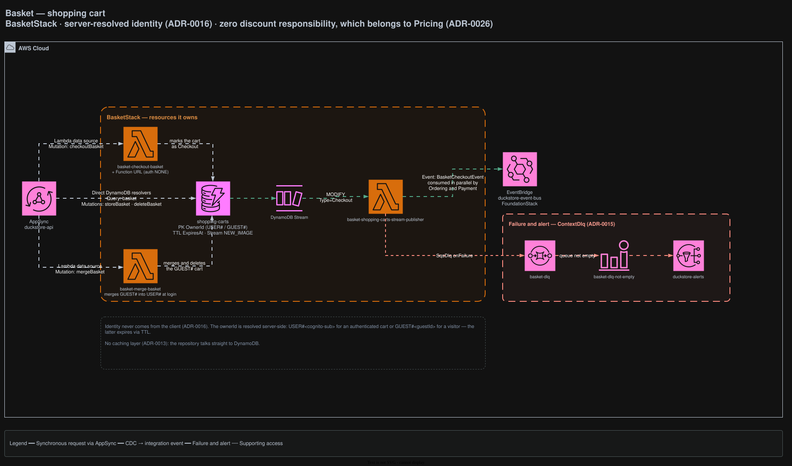

# Basket

Owns the shopping cart. Identity is resolved **server-side**, and the context has zero responsibility
for discounts.

## Architecture



<sub>Source: [`docs/duckstore-backend-improved.drawio`](../../../docs/duckstore-backend-improved.drawio), page **Basket**. Regenerate with `./scripts/export-diagrams.sh`.</sub>

## Responsibilities

- Owns `shopping-carts`; `ShoppingCart` is the aggregate root.
- Merges a guest cart into the user cart at login.
- Emits the checkout event that starts the order and payment flows.

### Two things this context deliberately does not do

- **No discount logic.** `Coupon`, `DynamoCouponRepository` and the `coupons` table were removed;
  discount and campaign ownership belongs to Pricing
  ([ADR-0026](../../../docs/adr/0026-pricing-bounded-context-price-and-campaign-ownership.md),
  superseding ADR-0012). Basket never calls Pricing — neither synchronously nor asynchronously.
- **No caching layer.** Redis and DAX were removed; the repository talks straight to DynamoDB
  ([ADR-0013](../../../docs/adr/0013-remove-basket-caching-redis-and-dax.md)).

## Data

| Table | Key | Stream | Notes |
|---|---|---|---|
| `shopping-carts` | PK `OwnerId` | `NEW_IMAGE` | TTL on `ExpiresAt` — expires guest carts |

`OwnerId` is a server-resolved prefixed key: `USER#<cognito-sub>` for an authenticated cart or
`GUEST#<guestId>` for a visitor. **Identity never comes from the client**
([ADR-0016](../../../docs/adr/0016-guest-basket-owner-id-identity-api-key-and-ttl.md)).

## API surface (AppSync)

| Field | Resolver |
|---|---|
| `Query.basket` | Direct DynamoDB |
| `Mutation.storeBasket` · `deleteBasket` | Direct DynamoDB |
| `Mutation.checkoutBasket` | Lambda — `basket-checkout-basket` (also exposed via a Function URL, auth `NONE`) |
| `Mutation.mergeBasket` | Lambda — `basket-merge-basket` |

## Integration events

**Publishes** — `basket-shopping-carts-stream-publisher`, off the `shopping-carts` stream. Checkout
marks the cart `Type=Checkout`; the resulting MODIFY record is what emits:

- `BasketCheckoutEvent` — consumed **in parallel** by Ordering and Payment

**Consumes** — nothing.

## Failure handling

`basket-dlq` receives the publisher's `SqsDlq` after bisect + retries. Non-empty →
`basket-dlq-not-empty` → `duckstore-alerts`
([ADR-0015](../../../docs/adr/0015-sqs-dlq-for-cdc-publishers-and-eventbridge-consumers.md)).

## Local development

```bash
dotnet run --project src/AppHost/AppHost.csproj
dotnet test tests/Services/Basket/Basket.UnitTests/Basket.UnitTests.csproj
```

## Related ADRs

[ADR-0005](../../../docs/adr/0005-remove-domain-events-cdc-via-dynamodb-streams.md) ·
[ADR-0013](../../../docs/adr/0013-remove-basket-caching-redis-and-dax.md) ·
[ADR-0016](../../../docs/adr/0016-guest-basket-owner-id-identity-api-key-and-ttl.md) ·
[ADR-0026](../../../docs/adr/0026-pricing-bounded-context-price-and-campaign-ownership.md)
