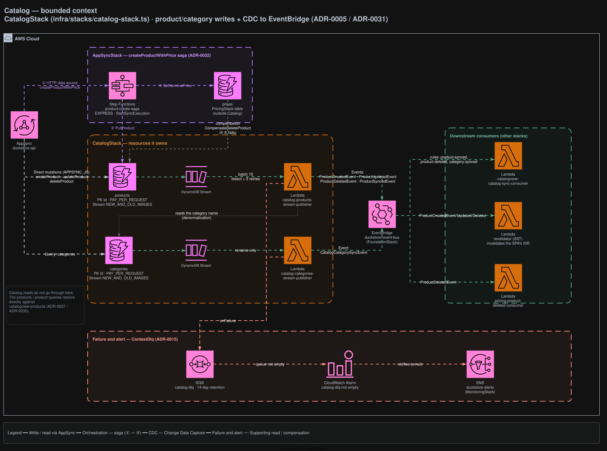

# Catalog

Owns the product and category master data. Every write to the catalog lands here; every **read**
does not — see [Reads live elsewhere](#reads-live-elsewhere).

## Architecture



<sub>Source: [`docs/duckstore-backend-improved.drawio`](../../../docs/duckstore-backend-improved.drawio), page **Catalog**. Regenerate with `./scripts/export-diagrams.sh`.</sub>

## Responsibilities

- Owns `products` and `categories` as the write model.
- Publishes catalog changes as integration events through CDC.
- Does **not** serve catalog reads, aggregate ratings, or own price.

### Reads live elsewhere

The `products` / `product` queries resolve directly against `catalogview-products`, not against this
context ([ADR-0027](../../../docs/adr/0027-catalogview-opensearch-product-search-and-rating-sync.md),
[ADR-0030](../../../docs/adr/0030-catalogview-dynamodb-drop-opensearch.md)). Rating aggregation also
left this context — the old `catalog-review-created-consumer` is gone
([ADR-0011 §4](../../../docs/adr/0011-review-bounded-context-rating-aggregation-via-cdc.md)).

## Data

| Table | Key | Stream | Notes |
|---|---|---|---|
| `products` | PK `Id` | `NEW_AND_OLD_IMAGES` | PAY_PER_REQUEST |
| `categories` | PK `Id` | `NEW_AND_OLD_IMAGES` | Read by the product publisher to denormalize the category name |

## API surface (AppSync)

| Field | Resolver |
|---|---|
| `Mutation.createProduct` · `updateProduct` · `deleteProduct` | Direct DynamoDB (APPSYNC_JS) |
| `Query.categories` | Direct DynamoDB |
| `Mutation.createProductWithPrice` | HTTP data source → Step Functions Express saga ([ADR-0032](../../../docs/adr/0032-create-product-with-price-step-functions-express-saga.md)) |

The saga writes the product here and the price in Pricing, compensating with
`CompensateDeleteProduct` if the price step fails.

## Integration events

**Publishes** — via `catalog-products-stream-publisher` and `catalog-categories-stream-publisher`,
both triggered by DynamoDB Streams ([ADR-0005](../../../docs/adr/0005-remove-domain-events-cdc-via-dynamodb-streams.md)):

- `ProductCreatedEvent` · `ProductUpdatedEvent` · `ProductDeletedEvent` · `ProductSyncedEvent`
- `CatalogCategorySyncEvent` — only on a category rename

**Consumes** — nothing. This context is CDC-out only.

Downstream: `catalogview-catalog-sync-consumer` and `pricing-product-deleted-consumer`. The SPA
revalidator does **not** subscribe here — it reacts to CatalogView's own events
([ADR-0035](../../../docs/adr/0035-catalogview-owned-cdc-events-drive-spa-revalidation.md)).

## Failure handling

Both publishers use `bisectBatchOnError` with 3 retries; exhausted records land in `catalog-dlq`
(14-day retention). A non-empty queue trips `catalog-dlq-not-empty` → `duckstore-alerts`
([ADR-0015](../../../docs/adr/0015-sqs-dlq-for-cdc-publishers-and-eventbridge-consumers.md)).

## Local development

```bash
dotnet run --project src/AppHost/AppHost.csproj          # whole system via Aspire
dotnet test tests/Services/Catalog/Catalog.UnitTests/Catalog.UnitTests.csproj
```

## Related ADRs

[ADR-0005](../../../docs/adr/0005-remove-domain-events-cdc-via-dynamodb-streams.md) ·
[ADR-0011](../../../docs/adr/0011-review-bounded-context-rating-aggregation-via-cdc.md) ·
[ADR-0031](../../../docs/adr/0031-cdc-events-named-after-domain-occurrence-no-changetype-discriminator.md) ·
[ADR-0032](../../../docs/adr/0032-create-product-with-price-step-functions-express-saga.md) ·
[ADR-0042](../../../docs/adr/0042-lambda-native-aot-zip-provided-al2023.md)
