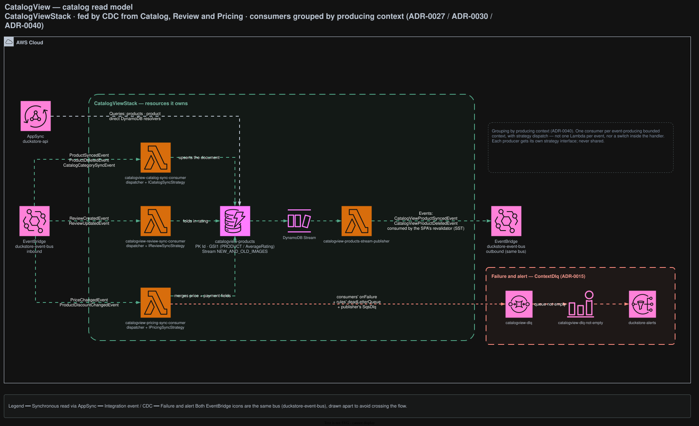

# CatalogView

The catalog read model. Every catalog read in the system resolves here — it is fed entirely by CDC
from Catalog, Review and Pricing, and owns no write API of its own.

## Architecture



<sub>Source: [`docs/duckstore-process-flow.drawio`](../../../docs/duckstore-process-flow.drawio), page **CatalogView**. Regenerate with `./scripts/export-diagrams.sh`.</sub>

## Responsibilities

- Owns `catalogview-products`, the denormalized search/read document.
- Folds in three upstream contexts: product data (Catalog), aggregate rating (Review), price and
  payment highlights (Pricing).
- Publishes its own CDC events so the SPA can invalidate ISR.

## Data

| Table | Key | Stream | Notes |
|---|---|---|---|
| `catalogview-products` | PK `Id`, GSI1 | `NEW_AND_OLD_IMAGES` | GSI1 keeps a single partition key deliberately ([ADR-0047](../../../docs/adr/0047-catalogview-gsi1-single-partition-key-kept-deliberately.md)) |

## API surface (AppSync)

| Field | Resolver |
|---|---|
| `Query.products` · `Query.product` | Direct DynamoDB — **all catalog reads come from here** |

## Integration events

**Consumes** — 7 rules into 3 consumers, grouped **by producing bounded context**, with strategy
dispatch rather than one Lambda per event
([ADR-0040](../../../docs/adr/0040-catalogview-consumers-consolidated-by-producer-strategy-dispatch.md)):

| Consumer | Rules | Events |
|---|---|---|
| `catalogview-catalog-sync-consumer` | `catalogview-product-synced-rule`, `-product-deleted-rule`, `-category-synced-rule` | `ProductSyncedEvent`, `ProductDeletedEvent`, `CatalogCategorySyncEvent` |
| `catalogview-review-sync-consumer` | `catalogview-review-created-rule`, `-review-updated-rule` | `ReviewCreatedEvent`, `ReviewUpdatedEvent` |
| `catalogview-pricing-sync-consumer` | `catalogview-price-changed-rule`, `-product-discount-changed-rule` | `PriceChangedEvent`, `ProductDiscountChangedEvent` |

Each producer gets its **own** strategy interface (`ICatalogSyncStrategy`, `IReviewSyncStrategy`,
`IPricingSyncStrategy`). Never share one across producers, and never fall back to an in-handler
`switch`.

**Publishes** — `catalogview-products-stream-publisher`, off this context's own DynamoDB stream:

- `CatalogViewProductSyncedEvent` (INSERT/MODIFY) · `CatalogViewProductDeletedEvent` (REMOVE)

These are what the SPA's SST `revalidator` Lambda subscribes to
([ADR-0035](../../../docs/adr/0035-catalogview-owned-cdc-events-drive-spa-revalidation.md)) — it no
longer listens to Catalog or Pricing directly.

## Failure handling

`catalogview-dlq` receives the consumers' `onFailure` destination, the EventBridge rule targets'
`deadLetterQueue`, and the publisher's `SqsDlq`. Non-empty → `catalogview-dlq-not-empty` →
`duckstore-alerts`.

## Local development

```bash
dotnet run --project src/AppHost/AppHost.csproj
dotnet test tests/Services/CatalogView/CatalogView.UnitTests/CatalogView.UnitTests.csproj
```

## Related ADRs

[ADR-0027](../../../docs/adr/0027-catalogview-opensearch-product-search-and-rating-sync.md) ·
[ADR-0030](../../../docs/adr/0030-catalogview-dynamodb-drop-opensearch.md) ·
[ADR-0035](../../../docs/adr/0035-catalogview-owned-cdc-events-drive-spa-revalidation.md) ·
[ADR-0040](../../../docs/adr/0040-catalogview-consumers-consolidated-by-producer-strategy-dispatch.md) ·
[ADR-0044](../../../docs/adr/0044-campaign-cdc-product-discounts-stream-and-ttl.md) ·
[ADR-0047](../../../docs/adr/0047-catalogview-gsi1-single-partition-key-kept-deliberately.md)
