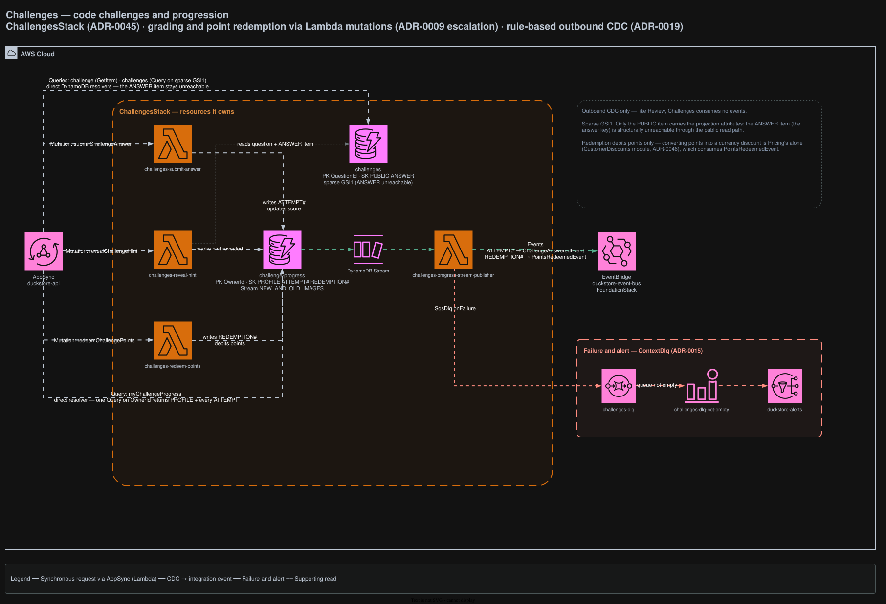

# Challenges

Server-side grading and progression for code challenges. Grading and point redemption run in Lambda
because they need transactions and domain invariants; everything read-only resolves directly.

## Architecture



<sub>Source: [`docs/duckstore-backend-improved.drawio`](../../../docs/duckstore-backend-improved.drawio), page **Challenges**. Regenerate with `./scripts/export-diagrams.sh`.</sub>

## Responsibilities

- **Questions** — the question bank and the answer key.
- **Progress** — per-player attempts, score and point redemption.

**Redemption debits points only.** Converting points into a currency discount is Pricing's job alone
(CustomerDiscounts module, [ADR-0046](../../../docs/adr/0046-challenge-points-redeem-into-pricing-customer-discount.md)),
which consumes `PointsRedeemedEvent`.

## Data

| Table | Key | Stream | Notes |
|---|---|---|---|
| `challenges` | PK `QuestionId`, SK `PUBLIC` \| `ANSWER` | — | Sparse GSI1 |
| `challenge-progress` | PK `OwnerId`, SK `PROFILE` \| `ATTEMPT#` \| `REDEMPTION#` | `NEW_AND_OLD_IMAGES` | Drives the CDC publisher |

### The sparse GSI1 is a security boundary

Only the `PUBLIC` item carries the GSI1 projection attributes. The `ANSWER` item (the answer key) is
therefore **structurally unreachable** through the public read path — not merely filtered out
([ADR-0045](../../../docs/adr/0045-challenges-bounded-context-server-side-grading.md)).

## API surface (AppSync)

| Field | Resolver |
|---|---|
| `Query.challenge` | Direct DynamoDB (`GetItem`) |
| `Query.challenges` | Direct DynamoDB (`Query` on the sparse GSI1) |
| `Query.myChallengeProgress` | Direct DynamoDB — one `Query` on `OwnerId` returns `PROFILE` and every `ATTEMPT` in a single round trip |
| `Mutation.submitChallengeAnswer` | Lambda — `challenges-submit-answer` |
| `Mutation.revealChallengeHint` | Lambda — `challenges-reveal-hint` |
| `Mutation.redeemChallengePoints` | Lambda — `challenges-redeem-points` |

The three mutations are an [ADR-0009](../../../docs/adr/0009-appsync-resolver-selection-direct-first-lambda-for-complex-logic.md)
escalation: grading transactions and domain invariants cannot be expressed in a direct resolver.

`OwnerId` always comes from the token — guests may play but never score.

`Query.myChallengeProgress` is deliberately unpaginated, and that is its ceiling: a direct resolver
cannot follow `LastEvaluatedKey`, so a player whose partition outgrows 1 MB would truncate.

## Integration events

**Publishes** — `challenges-progress-stream-publisher`, a rule-based CDC publisher
([ADR-0019](../../../docs/adr/0019-module-oriented-service-structure-and-rule-based-stream-publishers.md))
off the `challenge-progress` stream:

- `ATTEMPT#` → `ChallengeAnsweredEvent`
- `REDEMPTION#` → `PointsRedeemedEvent`

**Consumes** — nothing. Like Review, this context is CDC-out only.

## Failure handling

`challenges-dlq` receives the publisher's `SqsDlq`. Non-empty → `challenges-dlq-not-empty` →
`duckstore-alerts` ([ADR-0015](../../../docs/adr/0015-sqs-dlq-for-cdc-publishers-and-eventbridge-consumers.md)).

## Local development

```bash
dotnet run --project src/AppHost/AppHost.csproj
dotnet test tests/Services/Challenges/Challenges.UnitTests/Challenges.UnitTests.csproj
```

## Related ADRs

[ADR-0009](../../../docs/adr/0009-appsync-resolver-selection-direct-first-lambda-for-complex-logic.md) ·
[ADR-0019](../../../docs/adr/0019-module-oriented-service-structure-and-rule-based-stream-publishers.md) ·
[ADR-0045](../../../docs/adr/0045-challenges-bounded-context-server-side-grading.md) ·
[ADR-0046](../../../docs/adr/0046-challenge-points-redeem-into-pricing-customer-discount.md)
