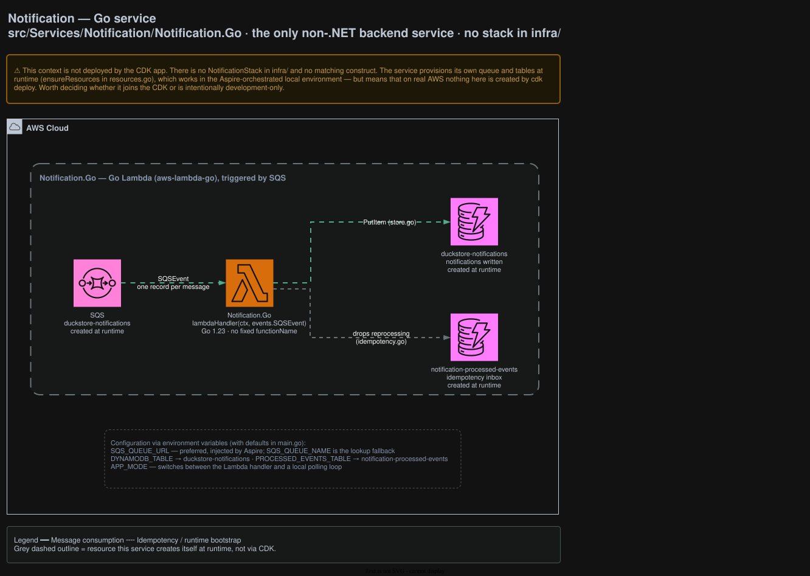

# Notification

Consumes integration events and records notifications. The only non-.NET backend service — written in
Go — and the only context **not deployed by the CDK app**.

## Architecture



<sub>Source: [`docs/duckstore-process-flow.drawio`](../../../docs/duckstore-process-flow.drawio), page **Notification**. Regenerate with `./scripts/export-diagrams.sh`.</sub>

## ⚠️ Not deployed by `cdk deploy`

There is no `NotificationStack` in [`infra/`](../../../infra) and no matching construct. The service
provisions its own queue and tables **at runtime** (`ensureResources` in `resources.go`), which works
in the Aspire-orchestrated local environment — but means that on real AWS nothing here is created by
`cdk deploy`.

Worth deciding whether this context joins the CDK app or is intentionally development-only. It is
called out on the Main diagram under *Outside this CDK app* so the gap stays visible.

## Responsibilities

- Consumes events from SQS and writes notifications to DynamoDB.
- Drops reprocessed messages using its own idempotency table.

## Data

Both tables are created by the service at runtime, not by CDK:

| Table | Purpose |
|---|---|
| `duckstore-notifications` | The notifications written |
| `notification-processed-events` | Idempotency inbox (`idempotency.go`) |

## Runtime

A Go Lambda (`aws-lambda-go`) triggered by SQS — one record per message, stored via `store.go`. It
has **no fixed `functionName`**, because no CDK stack names it.

### Configuration (defaults in `main.go`)

| Variable | Meaning |
|---|---|
| `SQS_QUEUE_URL` | Preferred; injected by Aspire |
| `SQS_QUEUE_NAME` | Fallback, resolved by lookup |
| `DYNAMODB_TABLE` | → `duckstore-notifications` |
| `PROCESSED_EVENTS_TABLE` | → `notification-processed-events` |
| `APP_MODE` | Switches between the Lambda handler and a local polling loop |

## API surface

None. This context is reached only through the queue.

## Local development

```bash
dotnet run --project src/AppHost/AppHost.csproj   # Aspire provisions the queue and tables
cd src/Services/Notification/Notification.Go && go test ./...
```

## Related ADRs

[ADR-0004](../../../docs/adr/0004-aws-first-eventbridge-over-masstransit-rabbitmq.md) ·
[ADR-0005](../../../docs/adr/0005-remove-domain-events-cdc-via-dynamodb-streams.md)
