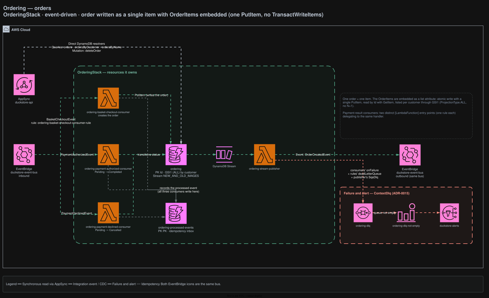

# Ordering

Owns the order lifecycle. Entirely event-driven — there is no synchronous write API; an order is
created by an event and transitioned by another.

## Architecture



<sub>Source: [`docs/duckstore-process-flow.drawio`](../../../docs/duckstore-process-flow.drawio), page **Ordering**. Regenerate with `./scripts/export-diagrams.sh`.</sub>

## Responsibilities

- Owns `ordering`, creating an order from a checkout and transitioning it on the payment result.
- Keeps DDD types internally (`Order` aggregate, value objects) while persisting to DynamoDB.

`Aggregate<TId>` / `IAggregate` are empty markers — in-process domain events were removed
([ADR-0005](../../../docs/adr/0005-remove-domain-events-cdc-via-dynamodb-streams.md)).

## Data

| Table | Key | Stream | Notes |
|---|---|---|---|
| `ordering` | PK `Id`, GSI1 (`ProjectionType.ALL`) by customer | `NEW_AND_OLD_IMAGES` | One order = one item |
| `ordering-processed-events` | PK `PK` | — | Idempotency inbox, written by all three consumers |

**One order is a single item.** `OrderItems` are embedded as a list attribute: an atomic write with
one `PutItem` (no `TransactWriteItems`), read by `Id` with `GetItem`, listed per customer through
GSI1 with no N+1.

## API surface (AppSync)

| Field | Resolver |
|---|---|
| `Query.orders` · `ordersByCustomer` · `ordersByName` | Direct DynamoDB |
| `Mutation.deleteOrder` | Direct DynamoDB |

## Integration events

**Consumes**

| Rule | Event | Effect |
|---|---|---|
| `ordering-basket-checkout-consumer-rule` | `BasketCheckoutEvent` | Creates the order (idempotent via the inbox) |
| `ordering-payment-authorized-consumer-rule` | `PaymentAuthorizedEvent` | `Pending → Completed` |
| `ordering-payment-declined-consumer-rule` | `PaymentDeclinedEvent` | `Pending → Cancelled` |

The two payment-result consumers are distinct `[LambdaFunction]` entry points (one rule each) that
delegate to the **same** handler.

**Publishes** — `ordering-stream-publisher`, off the `ordering` stream:

- `OrderCreatedEvent`

## Failure handling

`ordering-dlq` receives the consumers' `onFailure` destination, the rule targets' `deadLetterQueue`,
and the publisher's `SqsDlq`. Non-empty → `ordering-dlq-not-empty` → `duckstore-alerts`
([ADR-0015](../../../docs/adr/0015-sqs-dlq-for-cdc-publishers-and-eventbridge-consumers.md)).

## Local development

```bash
dotnet run --project src/AppHost/AppHost.csproj
dotnet test tests/Services/Ordering/Ordering.UnitTests/Ordering.UnitTests.csproj
dotnet test tests/Services/Ordering/Ordering.FunctionalTests/Ordering.FunctionalTests.csproj  # needs Docker
```

`Ordering.DevelopmentDataSeeder` creates and seeds the tables before the Lambdas start.

## Related ADRs

[ADR-0005](../../../docs/adr/0005-remove-domain-events-cdc-via-dynamodb-streams.md) ·
[ADR-0015](../../../docs/adr/0015-sqs-dlq-for-cdc-publishers-and-eventbridge-consumers.md) ·
[ADR-0019](../../../docs/adr/0019-module-oriented-service-structure-and-rule-based-stream-publishers.md) ·
[ADR-0025](../../../docs/adr/0025-payment-bounded-context-simulated-gateway-cdc.md)
