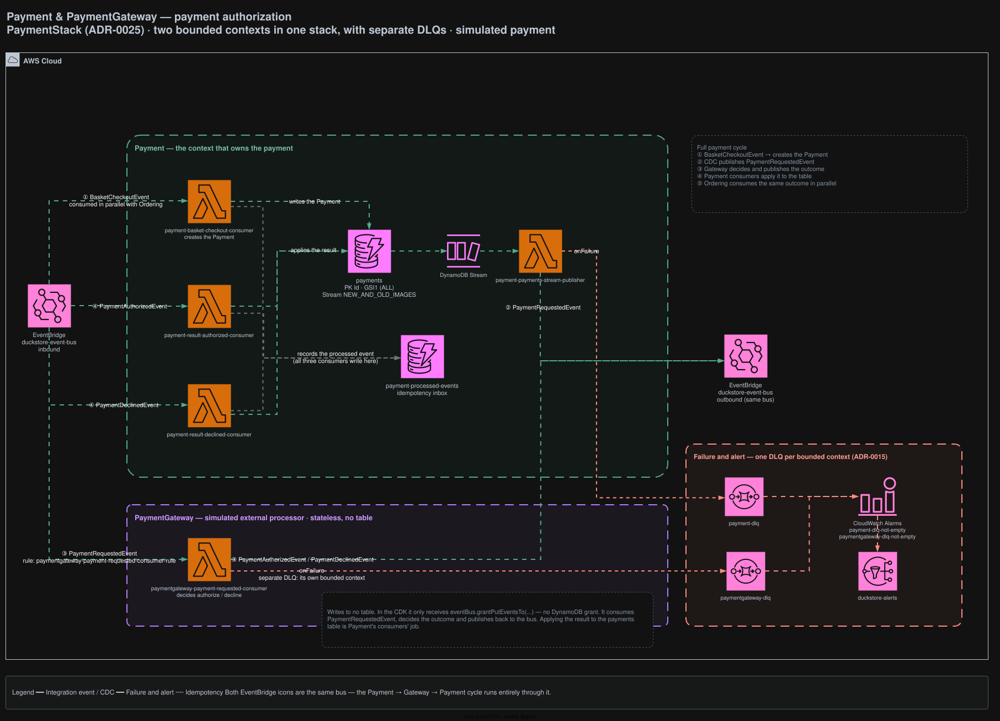

# Payment

Simulates payment authorization for orders. Two bounded contexts share this stack — **Payment**, which
owns the payment record, and **PaymentGateway**, the simulated external processor.

## Architecture



<sub>Source: [`docs/duckstore-process-flow.drawio`](../../../docs/duckstore-process-flow.drawio), page **Payment**. Regenerate with `./scripts/export-diagrams.sh`.</sub>

## Responsibilities

- **Payment** owns `payments`, creating a record from checkout and applying the gateway's outcome.
- **PaymentGateway** ([`../PaymentGateway`](../PaymentGateway)) decides authorize/decline. It is
  stateless: in the CDK it receives only `eventBus.grantPutEventsTo(...)` and **no DynamoDB grant**.

## The full cycle

The two EventBridge icons on the diagram are the same bus — the round trip runs through it.

1. `BasketCheckoutEvent` → creates the `Payment` (Ordering consumes the same event in parallel)
2. CDC publishes `PaymentRequestedEvent`
3. The gateway decides and publishes `PaymentAuthorizedEvent` / `PaymentDeclinedEvent`
4. Payment's own consumers apply the outcome to the `payments` table
5. Ordering consumes that same outcome independently

## Data

| Table | Key | Stream | Notes |
|---|---|---|---|
| `payments` | PK `Id`, GSI1 (ALL) | `NEW_AND_OLD_IMAGES` | Drives the CDC publisher |
| `payment-processed-events` | PK `PK` | — | Idempotency inbox, written by all three Payment consumers |

## API surface (AppSync)

None. This context is reached only through events.

## Integration events

**Consumes**

| Rule | Event |
|---|---|
| `payment-basket-checkout-consumer-rule` | `BasketCheckoutEvent` |
| `payment-result-authorized-consumer-rule` | `PaymentAuthorizedEvent` |
| `payment-result-declined-consumer-rule` | `PaymentDeclinedEvent` |
| `paymentgateway-payment-requested-consumer-rule` | `PaymentRequestedEvent` |

**Publishes**

- `PaymentRequestedEvent` — via `payment-payments-stream-publisher` (CDC off `payments`)
- `PaymentAuthorizedEvent` · `PaymentDeclinedEvent` — from the gateway consumer

Downstream, `PaymentAuthorizedEvent` is also consumed by Pricing, which burns the customer discount
used at checkout ([ADR-0046](../../../docs/adr/0046-challenge-points-redeem-into-pricing-customer-discount.md)).
Nothing subscribes to `PaymentDeclinedEvent` in Pricing — a decline leaves the coupon reusable.

## Failure handling

**Two DLQs, one per bounded context** — `payment-dlq` and `paymentgateway-dlq`. Keeping them separate
means a gateway failure never hides behind Payment's own backlog. Both alarm into `duckstore-alerts`
([ADR-0015](../../../docs/adr/0015-sqs-dlq-for-cdc-publishers-and-eventbridge-consumers.md)).

## Local development

```bash
dotnet run --project src/AppHost/AppHost.csproj
dotnet test tests/Services/Payment/Payment.UnitTests/Payment.UnitTests.csproj
```

## Related ADRs

[ADR-0005](../../../docs/adr/0005-remove-domain-events-cdc-via-dynamodb-streams.md) ·
[ADR-0015](../../../docs/adr/0015-sqs-dlq-for-cdc-publishers-and-eventbridge-consumers.md) ·
[ADR-0025](../../../docs/adr/0025-payment-bounded-context-simulated-gateway-cdc.md) ·
[ADR-0046](../../../docs/adr/0046-challenge-points-redeem-into-pricing-customer-discount.md)
