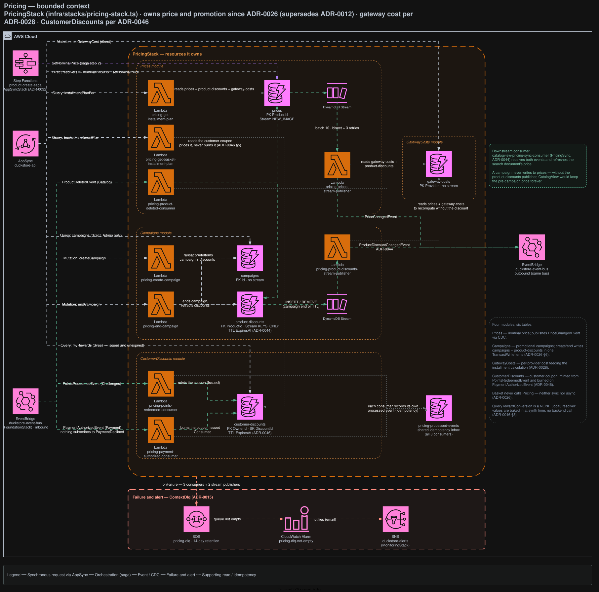

# Pricing

Owns price and promotion for the whole system: nominal price, promotional campaigns, payment-gateway
cost, and customer-scoped reward coupons. The largest context by resource count — four modules and
six tables.

## Architecture



<sub>Source: [`docs/duckstore-backend-improved.drawio`](../../../docs/duckstore-backend-improved.drawio), page **Pricing**. Regenerate with `./scripts/export-diagrams.sh`.</sub>

## Responsibilities

| Module | Owns |
|---|---|
| **Prices** | The nominal price; publishes `PriceChangedEvent` by CDC |
| **Campaigns** | Promotional campaigns; create/end writes `campaigns` + `product-discounts` in one `TransactWriteItems` |
| **GatewayCosts** | Per-provider cost, feeding the installment calculation ([ADR-0028](../../../docs/adr/0028-gateway-cost-table-and-payment-highlights.md)) |
| **CustomerDiscounts** | The customer coupon, minted from a Challenges redemption and burned at checkout ([ADR-0046](../../../docs/adr/0046-challenge-points-redeem-into-pricing-customer-discount.md)) |

**Basket never calls Pricing** — neither synchronously nor asynchronously
([ADR-0026](../../../docs/adr/0026-pricing-bounded-context-price-and-campaign-ownership.md), which
superseded ADR-0012 and moved discount ownership out of Basket entirely).

## Data

| Table | Key | Stream | TTL |
|---|---|---|---|
| `prices` | PK `ProductId` | `NEW_IMAGE` | — |
| `campaigns` | PK `Id` | — | — |
| `product-discounts` | PK `ProductId` | `KEYS_ONLY` | `ExpiresAt` |
| `gateway-costs` | PK `Provider` | — | — |
| `customer-discounts` | PK `OwnerId`, SK `DiscountId` | — | `ExpiresAt` |
| `pricing-processed-events` | PK `PK` | — | — |

### Why `product-discounts` has a stream

A campaign write never touches `prices`. Without this stream nothing would wake the CDC path, and
CatalogView would keep the pre-campaign price forever. TTL on `ExpiresAt` (the campaign's `EndsAt`)
turns a natural expiry into a REMOVE record on that same stream, so an expired campaign rolls the
catalog price back with no scheduler
([ADR-0044](../../../docs/adr/0044-campaign-cdc-product-discounts-stream-and-ttl.md)).

Expiry is checked **at read time** and is authoritative; TTL only sweeps dead rows eventually.

## API surface (AppSync)

| Field | Resolver |
|---|---|
| `Query.nominalPriceFor` · `Mutation.setNominalPrice` | Direct DynamoDB |
| `Query.campaigns` | Direct DynamoDB (Scan, `Admin` group only) |
| `Query.myRewards` | Direct DynamoDB (`Issued` and unexpired only) |
| `Mutation.setGatewayCost` | Direct DynamoDB |
| `Query.rewardConversion` | **NONE (local) resolver** — values baked in at synth time, no backend call |
| `Query.installmentPlanFor` · `basketInstallmentPlan` | Lambda ([ADR-0009](../../../docs/adr/0009-appsync-resolver-selection-direct-first-lambda-for-complex-logic.md) escalation) |
| `Mutation.createCampaign` · `endCampaign` | Lambda — transactional fan-out |

`pricing-get-basket-installment-plan` reads the customer coupon to price it, but **never burns it** —
that is `pricing-payment-authorized-consumer`'s job alone.

## Integration events

**Consumes**

| Rule | Event | Effect |
|---|---|---|
| `pricing-product-deleted-consumer-rule` | `ProductDeletedEvent` | Cleans up the deleted product's price and discount |
| `pricing-points-redeemed-consumer-rule` | `PointsRedeemedEvent` (Challenges) | Mints a coupon (`Issued`) — points→currency conversion happens **here and nowhere else** |
| `pricing-payment-authorized-consumer-rule` | `PaymentAuthorizedEvent` (Payment) | Burns the coupon `Issued → Consumed` |

Nothing subscribes to `PaymentDeclinedEvent` — a decline leaves the coupon `Issued` and reusable.

**Publishes**

- `PriceChangedEvent` — `pricing-prices-stream-publisher`
- `ProductDiscountChangedEvent` — `pricing-product-discounts-stream-publisher`

Both are consumed by `catalogview-pricing-sync-consumer`.

## Failure handling

`pricing-dlq` collects all five asynchronous paths — three consumers (`onFailure` + the rule target's
`deadLetterQueue`) and two stream publishers (after bisect + 3 retries). Non-empty →
`pricing-dlq-not-empty` → `duckstore-alerts`.

## Local development

```bash
dotnet run --project src/AppHost/AppHost.csproj
dotnet test tests/Services/Pricing/Pricing.UnitTests/Pricing.UnitTests.csproj
```

## Related ADRs

[ADR-0026](../../../docs/adr/0026-pricing-bounded-context-price-and-campaign-ownership.md) ·
[ADR-0028](../../../docs/adr/0028-gateway-cost-table-and-payment-highlights.md) ·
[ADR-0043](../../../docs/adr/0043-cart-discount-allocation-policy.md) ·
[ADR-0044](../../../docs/adr/0044-campaign-cdc-product-discounts-stream-and-ttl.md) ·
[ADR-0046](../../../docs/adr/0046-challenge-points-redeem-into-pricing-customer-discount.md)
