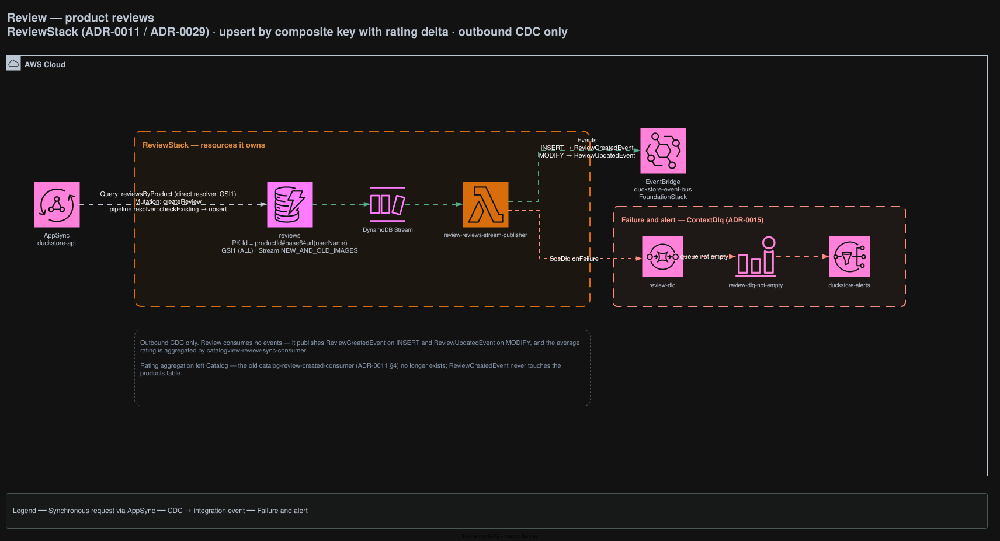

# Review

Owns product reviews and ratings. CDC-out only — this context consumes no events.

## Architecture



<sub>Source: [`docs/duckstore-backend-improved.drawio`](../../../docs/duckstore-backend-improved.drawio), page **Review**. Regenerate with `./scripts/export-diagrams.sh`.</sub>

## Responsibilities

- Owns `reviews`, upserting by composite key with a rating delta
  ([ADR-0029](../../../docs/adr/0029-review-upsert-composite-key-and-rating-delta.md)).
- Publishes review changes; it does **not** compute the average rating.

The average is folded into the read model by `catalogview-review-sync-consumer`. Rating aggregation
also used to live in Catalog — the old `catalog-review-created-consumer` no longer exists
([ADR-0011 §4](../../../docs/adr/0011-review-bounded-context-rating-aggregation-via-cdc.md)), and
`ReviewCreatedEvent` never touches the `products` table.

## Data

| Table | Key | Stream | Notes |
|---|---|---|---|
| `reviews` | PK `productId#base64url(userName)`, GSI1 (ALL) | `NEW_AND_OLD_IMAGES` | One review per user per product, enforced by the key |

## API surface (AppSync)

| Field | Resolver |
|---|---|
| `Query.reviewsByProduct` | Direct DynamoDB, through GSI1 |
| `Mutation.createReview` | Pipeline resolver: `checkExisting` → `upsert` |

## Integration events

**Publishes** — `review-reviews-stream-publisher`, off the `reviews` stream:

- `ReviewCreatedEvent` on INSERT
- `ReviewUpdatedEvent` on MODIFY

Both are consumed by `catalogview-review-sync-consumer`, and by the SPA's SST `revalidator` (the
`reviews:{id}` tag covers the raw review list, which lives here rather than in `catalogview-products`).

**Consumes** — nothing.

## Failure handling

`review-dlq` receives the publisher's `SqsDlq`. Non-empty → `review-dlq-not-empty` →
`duckstore-alerts` ([ADR-0015](../../../docs/adr/0015-sqs-dlq-for-cdc-publishers-and-eventbridge-consumers.md)).

## Local development

```bash
dotnet run --project src/AppHost/AppHost.csproj
dotnet test tests/Services/Review/Review.UnitTests/Review.UnitTests.csproj
```

## Related ADRs

[ADR-0011](../../../docs/adr/0011-review-bounded-context-rating-aggregation-via-cdc.md) ·
[ADR-0029](../../../docs/adr/0029-review-upsert-composite-key-and-rating-delta.md) ·
[ADR-0030](../../../docs/adr/0030-catalogview-dynamodb-drop-opensearch.md) ·
[ADR-0040](../../../docs/adr/0040-catalogview-consumers-consolidated-by-producer-strategy-dispatch.md)
