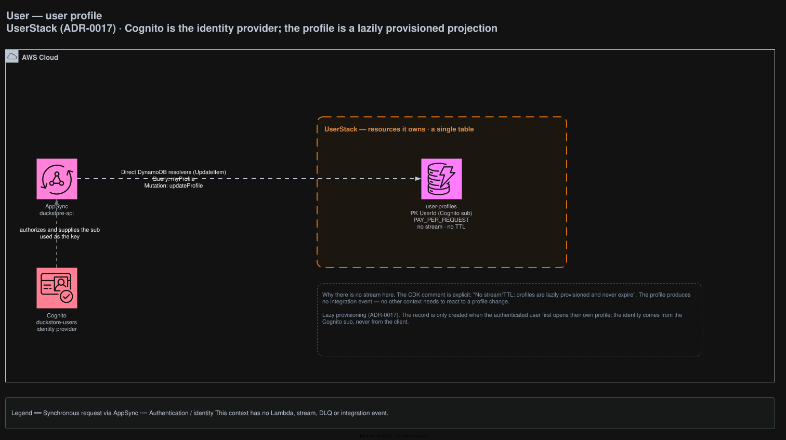

# User

The user profile. Cognito is the identity provider; the profile is a projection provisioned on
demand. The smallest context in the system — **no Lambda, no stream, no DLQ, no integration event**.

## Architecture



<sub>Source: [`docs/duckstore-backend-improved.drawio`](../../../docs/duckstore-backend-improved.drawio), page **User**. Regenerate with `./scripts/export-diagrams.sh`.</sub>

## Responsibilities

- Owns `user-profiles`, the profile projection keyed by the Cognito `sub`.
- Nothing else. Authentication itself belongs to Cognito.

## Data

| Table | Key | Stream | TTL |
|---|---|---|---|
| `user-profiles` | PK `UserId` (Cognito `sub`) | — | — |

### Why there is no stream

The CDK comment is explicit: *"No stream/TTL: profiles are lazily provisioned and never expire."*
The profile produces no integration event because no other context needs to react to a profile
change. Adding a stream here would create a publisher with no subscriber.

### Lazy provisioning

The record is created only when an authenticated user first opens their own profile
([ADR-0017](../../../docs/adr/0017-user-bounded-context-cognito-idp-only-lazy-provisioning.md)). The
identity comes from the Cognito `sub`, never from the client.

## API surface (AppSync)

| Field | Resolver |
|---|---|
| `Query.myProfile` | Direct DynamoDB |
| `Mutation.updateProfile` | Direct DynamoDB (`UpdateItem`) |

`User.Function` stays a plain class library — it is the one `*.Function` project that is not deployed
as a Lambda.

## Integration events

None, in either direction.

## Failure handling

None — there is no asynchronous path to fail, so this context has no DLQ.

## Local development

```bash
dotnet run --project src/AppHost/AppHost.csproj
dotnet test tests/Services/User/User.UnitTests/User.UnitTests.csproj
```

## Related ADRs

[ADR-0017](../../../docs/adr/0017-user-bounded-context-cognito-idp-only-lazy-provisioning.md) ·
[ADR-0009](../../../docs/adr/0009-appsync-resolver-selection-direct-first-lambda-for-complex-logic.md)
